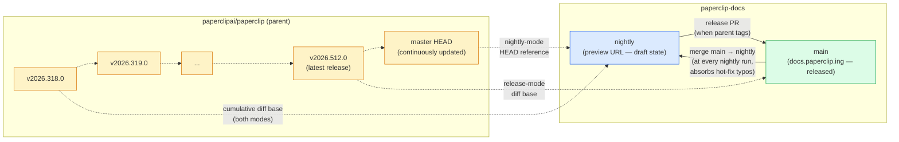

# Maintenance

Operational notes for maintainers of the Paperclip docs site. Reader-facing instructions live in [README.md](README.md).

## Repo layout

```
site/                    # Static site shell + release builder
├── index.html           # Main SPA (routing, rendering, TOC, search)
├── content.json         # Section/page manifest — source of truth for sidebar & landing (titles, icons, descriptions, pages)
└── build-release.mjs    # Produces a standalone bundle in .site/
docs/                    # Markdown content only
├── guides/              # Quickstart, Day-to-Day, Org & Agents, Projects & Workflow, Power Features
├── how-to/              # Field-tested recipes (budgets, approvals, skills, deployment troubleshooting)
├── administration/      # Company settings, plugins, CLI auth, company config
├── reference/           # API, CLI, adapters, deploy, skills (the "what" reference tier)
│   ├── api/
│   ├── cli/
│   ├── adapters/
│   ├── deploy/
│   └── skills.md
└── user-guides/         # Long-form user guides + screenshots/{light,dark}
    └── screenshots/
        └── registry.json   # Screenshot dependency tracking (see Screenshots)
scripts/
├── publish-gh-pages.sh  # Builds and pushes to the gh-pages branch fallback
├── rewrite-links.mjs    # Link-rewriting utility for builds
└── sync/                # /sync-docs skill config (anchor map, state template)
skills/                  # Claude Code skills shipped with this repo
└── sync-docs/SKILL.md   # The /sync-docs orchestrator
.sync-state.json         # Per-branch sync state (committed)
wrangler.jsonc           # Cloudflare Pages project config
.github/ISSUE_TEMPLATE/  # Support / bug / docs-feedback templates
```

## Commands

```sh
# Build the static site into .site/ using the production custom-domain base path
npm run docs:build

# Build with auto base-path detection (useful when serving from the repo root locally)
npm run docs:build:auto

# Serve .site/ on http://localhost:4321/
npm run docs:serve

# Build and deploy to Cloudflare Pages
npm run docs:publish

# Build and push to the gh-pages branch fallback
npm run docs:publish:github
```

## Base paths

`build-release.mjs` accepts `--base-path <path|auto>`:

- **Production custom domain** — use `/` (the default in `docs:build` and `docs:publish`) for `https://docs.paperclip.ing/`.
- **GitHub Pages repo subpath preview** — use `/paperclip-docs/` via `npm run docs:build:github-subpath`.
- **Local preview** — use `auto` (`docs:build:auto`). Paths resolve relative to `index.html`, so the site works under any prefix (or none).
- **Self-hosting under a different prefix** — pass an explicit path, e.g. `--base-path /docs/`.

Mismatched base paths are the most common cause of 404s after a build — if asset URLs point to `/paperclip-docs/...` but you serve at `/`, everything breaks.

## Adding or moving pages

1. Create the Markdown file in the appropriate `docs/<section>/` folder.
2. Register it in `site/content.json` under the correct section. The `file` field is relative to `site/` (typically `"../docs/<section>/<page>.md"`).
3. Page titles, section grouping, and sidebar order all derive from `content.json`. There is no filesystem-based auto-discovery.
4. Slugs are derived from the file path — `user-guides/guides/foo.md` becomes `/#/foo`, other sections keep their path.

## Section icons

Landing cards and sidebar section headers render icons via [Lucide](https://lucide.dev). The UMD build is loaded from CDN in `site/index.html`.

To set or change a section's icon, edit its `icon` field in `site/content.json`:

```json
{
  "title": "CLI",
  "icon": "terminal",
  "desc": "…",
  "pages": [ … ]
}
```

The value is any Lucide icon id in kebab-case (e.g. `rocket`, `layout-dashboard`, `settings-2`, `braces`). Browse [lucide.dev/icons](https://lucide.dev/icons) to find one. No code changes are required — `app.js` emits `<i data-lucide="<name>"></i>` placeholders and calls `lucide.createIcons()` after each nav render to swap them for inline SVG. If the name doesn't match a Lucide icon, the placeholder stays empty, so test after changing.

## Screenshots

Store UI captures under `docs/user-guides/screenshots/{light,dark}/<name>.png`. The renderer automatically swaps the correct theme variant at runtime based on the user's current theme. Always provide both.

### Registry

Every screenshot used in docs should have an entry in `docs/user-guides/screenshots/registry.json` so the sync skill can flag staleness when the underlying UI code changes:

```json
{
  "file": "screenshots/light/dashboard-issues.png",
  "route": "/issues",
  "viewport": "1440x900",
  "theme": "light",
  "captured_against": "v2026.318.0",
  "captured_sha": "<parent commit sha at capture>",
  "depends_on": [
    "server/src/routes/issues.ts",
    "ui/src/pages/Issues.tsx"
  ]
}
```

`depends_on` lists parent-repo paths whose changes likely invalidate this screenshot. The `/sync-docs` skill diffs those paths across each run window and writes any stale entries to `SCREENSHOTS_PENDING.md`. Capture is currently manual — see the [sync workflow](#sync-workflow) below.

## Per-article feedback links

Every article ends with "Suggest an edit" and "Report an issue" links. These are generated in `loadPage()` in `site/index.html` and point at:

- `github.com/paperclipai/paperclip-docs/edit/main/<path>` — GitHub web editor.
- `github.com/paperclipai/paperclip-docs/issues/new?template=03-docs-feedback.yml&...` — prefilled docs-feedback issue.

If the repo is ever renamed or mirrored, update `DOCS_REPO_SLUG` / `DOCS_REPO_BRANCH` constants near the top of `appendPageFeedback()`.

## Issue templates

`.github/ISSUE_TEMPLATE/` holds three templates:

- `01-support.yml` — end-user support questions.
- `02-bug.yml` — bug reports against the docs site itself (not product bugs).
- `03-docs-feedback.yml` — referenced by the per-article "Report an issue" link. The `docs_page` field id must stay in sync with the URL param emitted in `appendPageFeedback`.

## Publishing

Primary publishing uses Cloudflare Pages, matching the rest of the public Paperclip sites:

```sh
npm run docs:publish
```

That command builds `.site/` and runs:

```sh
wrangler pages deploy .site --project-name paperclip-docs --branch main
```

The Cloudflare Pages project name is `paperclip-docs`; production deploys use branch `main`.

### GitHub Pages fallback

`scripts/publish-gh-pages.sh` clones the repo into a tempdir, checks out (or creates) `gh-pages`, replaces its contents with a fresh build, commits, and pushes. It leaves the working tree untouched, so it's safe to run with uncommitted changes. A `.nojekyll` marker is added so GitHub Pages serves files whose names start with `_`.

By default, the publish script builds for `https://docs.paperclip.ing/` and writes a `CNAME` file containing `docs.paperclip.ing`. Override with `PAGES_BASE_PATH=/paperclip-docs/ PAGES_CUSTOM_DOMAIN= npm run docs:publish:github` only when intentionally publishing a GitHub Pages subpath preview without the custom domain.

## Sync workflow

These docs follow the parent **paperclipai/paperclip** repo automatically via the [`/sync-docs`](skills/sync-docs/SKILL.md) skill. The skill detects code-surface changes (CLI commands, env vars, REST routes, adapters, plugin SDK, schemas) and produces edits in our friendly-tutorial voice.

> Our docs are **not** a translation of the parent's docs. The parent's *code* is the source of truth; its release notes and inline docs are reference data for understanding intent.

### Architecture

Two diagrams summarise the sync workflow. The first shows the **branch model** — how the parent repo's releases and HEAD relate to this repo's `main` and `nightly` branches. The second shows the **per-run flow** of a single `/sync-docs` invocation.

#### Branch model



Key invariant: **`base_release_tag` in `.sync-state.json` only changes on a successful release merge to `main`** — that's what keeps cumulative diffs stable.

#### Per-run flow

```mermaid
flowchart TD
    Start(["/sync-docs invocation"]) --> Pre

    subgraph Pre["Preconditions"]
        direction TB
        P1["gh auth OK"]
        P2["Working tree clean"]
        P3["JSON files parse:<br/>.sync-state, anchor-map, registry"]
        P4["Resolve parent default branch<br/>gh api ... .default_branch → master"]
        P5["Preflight non-glob watcher paths<br/>(404 → warn, don't fail)"]
        P1 --> P2 --> P3 --> P4 --> P5
    end

    Pre --> ModeCheck{New parent<br/>release tag?}
    ModeCheck -->|yes| RM["Release Mode<br/>checkout docs main"]
    ModeCheck -->|no| NM["Nightly Mode<br/>checkout docs nightly<br/>merge main into nightly"]
    RM --> Phase15
    NM --> Phase15

    subgraph Phase15["Phase 1.5 — Drift check (independent of window)"]
        D1["node scripts/sync/check-drift.mjs<br/>--against master"]
        D1 --> DR[("4 drift kinds:<br/>parent-path · cli-command<br/>env-var · rest-route")]
    end

    Phase15 --> Phase2

    subgraph Phase2["Phase 2 — Cumulative diff (recursive bisection)"]
        direction TB
        CW["node scripts/sync/compare-window.mjs<br/>base_release_tag → target --json"]
        CW --> Trunc{Response<br/>truncated?<br/>files=300 OR<br/>commits&lt;total}
        Trunc -->|yes| Split["Split at median SHA<br/>recurse on each half<br/>cache leaves"]
        Split --> CW
        Trunc -->|no| Merge["Union leaves<br/>status-merge rules:<br/>added+removed → drop<br/>added+modified → modified<br/>renamed wins"]
        Merge --> DiffOut[("changed file list<br/>1,726 files · 22 leaves<br/>truncated=0")]
    end

    Phase2 --> Phase3

    subgraph Phase3["Phase 3 — Build manifest"]
        WatchLoop["For each of 12 watchers<br/>in anchor-map.json"]
        WatchLoop --> Intersect["Intersect parent_paths<br/>globs vs changed files"]
        Intersect --> Classify["Apply detect rule<br/>tier: auto-merge / PR / context-only"]
        Classify --> ManOut[("manifest.yaml<br/>+ PENDING.md regenerated<br/>+ manifest_hash")]
    end

    Phase3 --> Phase35

    subgraph Phase35["Phase 3.5 — Reconciliation"]
        Hash{"manifest_hash ==<br/>last_applied_manifest_hash?"}
        Hash -->|yes| Skip["No changes — skip to Phase 6"]
        Hash -->|no| Delta["Compute delta:<br/>new entries vs<br/>DISAPPEARED entries"]
        Delta --> ReconFlag["⚠ Disappeared = previously<br/>applied edit whose parent<br/>commit was reverted<br/>Surface for human review,<br/>never auto-undo"]
    end

    Phase35 --> Phase4

    Phase4{"--dry-run?"} -->|yes| PrintExit["Print summary:<br/>manifest by tier<br/>+ drift + reconcile<br/>+ screenshot staleness<br/>EXIT"]
    Phase4 -->|no| Phase5

    subgraph Phase5["Phase 5 — Apply edits"]
        direction TB
        Entry["For each manifest entry"]
        Entry --> Tier{Tier?}
        Tier -->|auto-merge| Safety{"auto_merge_safety<br/>passes?<br/>not removed/renamed<br/>≤1 file · ≤50 lines"}
        Safety -->|yes| Direct["Direct mechanical edit<br/>(append env-var row, etc.)"]
        Safety -->|no| ToPR["Demote to PR tier"]
        Tier -->|PR| Sub["Spawn subagent<br/>with voice rules +<br/>neighbour page for tone"]
        ToPR --> Sub
        Sub --> Return["Returns:<br/>files + nav_addition"]
        Direct --> Collect["Orchestrator collects<br/>nav_additions"]
        Return --> Collect
        Collect --> ContentMerge["Single coordinated<br/>content.json edit<br/>(no parallel race)"]
    end

    Phase5 --> Phase6

    subgraph Phase6["Phase 6 — Screenshot staleness"]
        Reg["registry.json depends_on<br/>vs changed files"]
        Reg --> StaleOut[("SCREENSHOTS_PENDING.md<br/>regenerated (not appended)")]
    end

    Phase6 --> Phase7

    subgraph Phase7["Phase 7 — Verify & commit"]
        Build["npm run docs:build"]
        Build --> Check["npm run sync:check<br/>lint-links + verify-nav + check-drift"]
        Check --> Result{Pass?}
        Result -->|no| Fail["Roll back edits<br/>report failed entry"]
        Result -->|yes| Commit["Commit:<br/>nightly auto-merge → nightly branch<br/>nightly PR-tier → nightly-draft/* PR<br/>release → release/vX.Y.Z PR to main"]
        Commit --> StateBump["Update .sync-state.json<br/>last_applied_manifest_hash<br/>last_run_at, outcome"]
    end

    Phase7 --> Phase8

    Phase8["Phase 8 — Print summary<br/>(branch, commits, PRs,<br/>drift, reconcile flags,<br/>stale screenshots)<br/>Ask: push? open PR?"] --> End(["End — user decides<br/>never push without asking"])

    classDef helper fill:#e0e7ff,stroke:#4f46e5
    classDef data fill:#fef3c7,stroke:#d97706
    classDef warn fill:#fee2e2,stroke:#dc2626
    class D1,CW,Build,Check helper
    class DR,DiffOut,ManOut,StaleOut data
    class ReconFlag,Fail warn
```



**Reading the per-run flow:**

- **Blue/indigo boxes** are deterministic Node helper scripts under `scripts/sync/` — unit-tested, no LLM tokens consumed when they run, the orchestrator just invokes them.
- **Yellow cylinders** are data artifacts: `.sync-state.json`, `anchor-map.json`, `registry.json`, `PENDING.md`, `SCREENSHOTS_PENDING.md`. `PENDING.md` and `SCREENSHOTS_PENDING.md` are regenerated each run, never appended.
- **Red boxes** are warning paths surfaced for human review — drift candidates and reconciliation flags are never auto-resolved. The skill is fundamentally additive; it does not delete pages or undo prose without explicit confirmation.

### Branch model

| Branch | Tracks | Deploys to | Audience |
|---|---|---|---|
| `main` | Latest parent **release tag** (e.g. `v2026.512.0`) | `docs.paperclip.ing` (production) | Everyone — end users to devs |
| `nightly` | Parent's `main` HEAD | Cloudflare Pages branch preview | Early adopters, contributors |

End users on the latest *released* paperclip must never see docs for unreleased features. That's why nightly drafts live on a separate branch and never touch `main` until a parent release tag drops.

### Two modes

Both modes use **cumulative diffs** — always from `base_release_tag` in `.sync-state.json`, never incrementally from yesterday. This makes reverts auto-cancel (net-zero in the cumulative window) and lets `nightly` be safely regenerated.

**Nightly mode** — runs daily.
- Diffs `base_release_tag → parent default-branch HEAD` (currently `master`) via `scripts/sync/compare-window.mjs`.
- Auto-commits trivial mechanical edits (e.g. appending a new env var to the env-vars reference) directly to `nightly`.
- Opens PRs against `nightly` for judgment-call rewrites.
- Updates `PENDING.md` so you can see the accumulating doc backlog.

**Release mode** — runs when a new parent release tag appears.
- Diffs `base_release_tag → new_tag`.
- Most of the work is already done by nightly drafts; this mode mainly verifies completeness, stamps `paperclip_version` frontmatter, and opens a single PR: `Release docs for paperclip vX.Y.Z` (merges `nightly` → `main`).
- On merge to `main`, tag this repo `docs/vX.Y.Z`, Cloudflare deploys live.

### Running the skill

```sh
# Auto-detect mode (nightly unless a new parent tag exists)
/sync-docs

# Force a mode
/sync-docs --nightly
/sync-docs --release

# Triage only — no edits, no commits, no PRs
/sync-docs --dry-run

# Override starting point (useful after manual interventions)
/sync-docs --since v2026.318.0

# Release mode: produce one PR per intermediate tag (use for big gaps)
/sync-docs --release --batched
```

Recommended cadence: `/loop 24h /sync-docs` for nightly. Release mode is auto-detected on the next run after a parent tag drops.

### Config files

| File | Purpose |
|---|---|
| `scripts/sync/anchor-map.json` | Maps parent-repo paths → docs paths. Edit when adding new doc sections or new product surfaces. |
| `scripts/sync/state.example.json` | Template for `.sync-state.json`. |
| `.sync-state.json` | Per-branch sync state (committed). Schema: `branch_mode`, `base_release_tag`, `base_release_sha`, `last_seen_parent_sha`, `last_applied_manifest_hash`. `base_release_tag` is the diff base for both modes — cumulative diff, only bumps on a successful release merge. |
| `docs/user-guides/screenshots/registry.json` | Screenshot dependency tracking — see [Screenshots](#screenshots). |

### Helper scripts

The full list with example invocations lives in [Runbook → Helper scripts (full list)](#helper-scripts-full-list). Two behaviours worth noting at the design layer:

- `sync:lint-links` skips external URLs, absolute SPA routes (`/...`), and template placeholders (`${...}`, `{id}`) — anything that isn't a real filesystem path. Exit 1 on any broken link.
- `sync:verify-nav` reports two classes of issue: **dangling** nav entries (in `content.json` but not on disk — error, exit 1) and **orphan** files (on disk but missing from `content.json` — warning, exit 0). Pass `--strict` to fail on orphans too.

See [`skills/sync-docs/SKILL.md`](skills/sync-docs/SKILL.md) for the full operational playbook.

### Hot-fixes on released docs

If you spot a typo or broken example on `main` (released docs), fix it on `main` directly — it deploys to `docs.paperclip.ing` on merge. The sync skill merges `main` back into `nightly` at the start of every nightly run, so the fix isn't lost.

### Screenshots in the sync flow

The skill **flags** stale screenshots based on `registry.json` `depends_on` paths but does **not** capture them. When `SCREENSHOTS_PENDING.md` lists stale entries, capture light + dark variants manually and update `captured_against` + `captured_sha` in `registry.json`. Playwright-based automated capture may come later — it requires a reproducible seeded demo state in the parent repo.

See [Runbook → First-time setup](#first-time-setup) for installing the skill locally and seeding `.sync-state.json`. See [Runbook → Helper scripts (full list)](#helper-scripts-full-list) for every `sync:*` script with example invocations.

## Runbook

The Sync workflow section above describes the *design*. This section is the *operations* guide — what to actually type to bootstrap, run, review, and recover.

### First-time setup

Assumes you've just cloned the repo and want to enable the sync workflow on your machine.

**Prerequisites**

- Node 20+ and `npm`.
- `gh` CLI installed and authenticated:
  ```sh
  gh auth login   # GitHub.com, HTTPS, web browser
  gh auth status  # confirm
  ```
- `wrangler` if you'll deploy to Cloudflare Pages:
  ```sh
  npm i -g wrangler
  wrangler login
  ```

**Install the skill**

```sh
mkdir -p ~/.claude/skills
ln -s "$PWD/skills/sync-docs" ~/.claude/skills/sync-docs
```

A symlink (not a copy) is intentional — edits to `skills/sync-docs/SKILL.md` in the repo take effect immediately in every Claude Code session.

**Seed `.sync-state.json`**

The file is already committed on `main`, so a fresh clone needs nothing. If you're re-baselining or setting up a new branch, copy the template:

```sh
cp scripts/sync/state.example.json .sync-state.json
```

Schema (all fields required):

| Field | Meaning |
|---|---|
| `branch_mode` | `"release"` on `main`, `"nightly"` on `nightly`. |
| `base_release_tag` | Parent release tag the docs are currently aligned to (e.g. `v2026.512.0`). Diff base for both modes. Only bumps on a successful release merge. |
| `base_release_sha` | Commit sha of `base_release_tag` in the parent repo. |
| `last_seen_parent_sha` | Parent HEAD at the last successful run. |
| `last_applied_manifest_hash` | Hash of the manifest applied in the last run — used for reconciliation. |

**Verify the install**

```sh
npm install
npm run sync:test            # 26 unit + 1 integration, should all pass
npm run sync:check           # lint-links + verify-nav + check-drift
node scripts/sync/compare-window.mjs --help
```

If `sync:test` is green and `sync:check` reports only known pre-existing items (see [FOLLOW-UPS.md](#follow-upsmd)), you're ready.

### Creating the nightly branch (one-time)

After `feat/sync-docs-skill` lands on `main`, seed the `nightly` branch:

```sh
git checkout main
git pull
git checkout -b nightly
# Edit .sync-state.json:
#   "branch_mode": "nightly"
# Leave base_release_tag / base_release_sha unchanged —
# nightly builds atop the last release.
git add .sync-state.json
git commit -m "Seed nightly branch sync state"
git push -u origin nightly
```

In the Cloudflare Pages dashboard for the `paperclip-docs` project, enable branch deployments for `nightly`. Cloudflare will produce a preview URL of the form `nightly.paperclip-docs.pages.dev`. See [Cloudflare Pages branch previews](https://developers.cloudflare.com/pages/configuration/branch-build-controls/) for the toggle.

The **first** nightly run after seeding produces a large manifest — it has to catch up from `base_release_tag` to the parent's current HEAD. Expect dozens of entries in `PENDING.md`. Steady state is much quieter.

### Daily operation

Once `nightly` is seeded, set the recurring cadence:

```sh
/loop 24h /sync-docs
```

Or, for stricter wall-clock timing:

```sh
/schedule "0 6 * * *" /sync-docs
```

`/loop` is an *interval* (24 hours from the last completion). `/schedule` is a *cron* (e.g. every day at 06:00). Pick one.

**What the skill does each run**

- Self-checks preconditions: `gh auth`, working tree clean, JSON files parse, parent default branch resolves.
- Auto-detects mode: nightly unless a parent release tag newer than `base_release_tag` exists.
- Produces commits (auto-merge tier) or opens PRs (PR tier) per the [Per-run flow](#per-run-flow) diagram above.
- Regenerates `PENDING.md` and `SCREENSHOTS_PENDING.md`.
- **Always asks before pushing.** Per local convention, the skill never `git push`es without explicit confirmation.

**What to expect each morning**

- New commit or draft PR on `nightly` if the parent had user-facing changes overnight.
- `PENDING.md` updated to reflect cumulative backlog from `base_release_tag` to parent HEAD.
- `SCREENSHOTS_PENDING.md` updated if any `depends_on` parent paths moved.
- Possibly drift / verification / reconcile flags in the run summary — see [Review workflow](#review-workflow--what-to-do-when-flags-fire).

When the skill stops because something needs your attention, jump to that subsection.

### Release ceremony

When a new parent release tag drops (`v2026.X.Y`):

1. Run `/sync-docs --release` (or wait — the next daily run auto-detects it).
2. The skill diffs `base_release_tag → new_tag`, applies any still-missing edits, and opens a PR titled `Release docs for paperclip v2026.X.Y` that merges `nightly` → `main`.
3. **Review the PR.** Pay particular attention to:
   - Drift / verification / reconcile flags in the PR body.
   - Voice quality of any newly-authored pages — these go live on `docs.paperclip.ing` the moment you merge.
   - Frontmatter `paperclip_version` correctly stamped on changed pages.
4. Merge to `main` when satisfied.
5. **After merge — three follow-ups:**
   - Tag the merge commit:
     ```sh
     git checkout main && git pull
     git tag docs/v2026.X.Y
     git push --tags
     ```
   - Verify `.sync-state.json` on `main` now shows `base_release_tag: v2026.X.Y` and `base_release_sha` matches.
   - Cloudflare Pages auto-deploys on push to `main`. Confirm `docs.paperclip.ing` renders the new "Documenting Paperclip v2026.X.Y" footer.

**Large gaps (8+ release tags behind)**

```sh
/sync-docs --release --batched
```

Produces one PR per intermediate tag, which is far easier to review and lets you revert a single bad release without losing the others. The first commits of `feat/sync-docs-skill` used `--batched` to catch up `v2026.318.0 → v2026.512.0`.

### Review workflow — what to do when flags fire

The skill surfaces four kinds of "needs human attention" output. Each is committed to `nightly` (or attached to the release PR) and regenerated each run, so you can read them at your own pace.

**`PENDING.md`** — living manifest of unauthored doc-relevant changes piling up between releases.

- Read it weekly.
- Items here will become release-PR content. If something looks worth authoring proactively on `nightly`, do so — there's no cost to landing it before the release PR.

**`SCREENSHOTS_PENDING.md`** — screenshots whose `depends_on` parent paths changed in the diff window.

- Action: capture light + dark variants manually, update `captured_against` + `captured_sha` in `docs/user-guides/screenshots/registry.json`.
- See [Screenshots](#screenshots) above for capture conventions.

**Drift candidates** — surfaced in run summary and PR body under `### ⚠ Drift`.

Four kinds:

| Kind | Confidence | Action |
|---|---|---|
| `parent-path-missing` | High | Fix the doc or remove the section — the parent file is gone. |
| `cli-command-missing` / `-ambiguous` | High | Same — the CLI command no longer exists or matches multiple. |
| `env-var-missing` | High | Verify the var really is gone; remove the reference row. |
| `rest-route-missing` | Medium ("Verify:" prefix) | The verify-edit heuristic isn't sure. Check parent code by hand. Most often a normalization mismatch (`{id}` vs `:id`) or a router-prefix issue. |

Known false-positive classes — currently 23 `env-var-missing` for plugin/CLI-defined vars — are tracked in `FOLLOW-UPS.md`. Don't act on those repeatedly; extend `verify-edit.mjs`'s env-var source list instead.

**Verification failures** — in PR body under `### ⚠ Verification Failures`.

- The post-edit `verify-edit.mjs` pass found a claim in newly-authored content that doesn't match parent code.
- Auto-merge tier edits with high-confidence failures are already rolled back automatically — you only see what the rollback couldn't catch.
- PR-tier failures stay in the PR for human review. Either fix the claim or accept it as a known false positive.

**Reconcile flags** — in PR body under `### ⚠ Reconcile`.

- A doc edit was applied in a prior run for a parent commit that has since been reverted.
- The skill never auto-undoes these — manual decision. Usually: delete the now-incorrect doc section, or keep it if it's still accurate by coincidence.

### Helper scripts (full list)

Every `sync:*` npm script, what it does, when to run manually:

| Script | Purpose |
|---|---|
| `npm run sync:test` | 26 unit + 1 integration test. Run before commits touching `scripts/sync/`. |
| `npm run sync:lint-links` | Detect broken relative links / image refs in `docs/`. Skips external URLs, absolute SPA routes, template placeholders. |
| `npm run sync:verify-nav` | Cross-check `site/content.json` against the docs filesystem. Dangling = error, orphan = warning (pass `--strict` to fail on orphans). |
| `npm run sync:check` | Chains lint-links + verify-nav + check-drift. The skill runs this before committing. |
| `npm run sync:compare-window` | Take a parent ref pair, return file list with recursive bisection. |
| `npm run sync:check-drift` | Find documented surfaces missing from parent. |
| `npm run sync:detect-renames` | Find directory-level renames in a window's file list. |
| `npm run sync:verify-edit` | Post-edit code verification on a specific file. |
| `npm run sync:backfill-screenshots` | One-shot scaffolder for `screenshots/registry.json`. |

Example invocations:

```sh
# Test before committing
npm run sync:test

# Lint links in a single subtree
npm run sync:lint-links -- docs/reference/cli/

# Diff a window manually
node scripts/sync/compare-window.mjs --base v2026.500.0 --head master --json

# Drift check against a specific parent ref
node scripts/sync/check-drift.mjs --against v2026.512.0

# Detect renames in a window
node scripts/sync/detect-renames.mjs --base v2026.500.0 --head master

# Verify-edit a specific doc page after authoring
node scripts/sync/verify-edit.mjs docs/reference/cli/setup-commands.md
```

**Wired into the skill automatically:** `sync:check` (pre-commit), `sync:compare-window` (Phase 2), `sync:check-drift` (Phase 1.5), `sync:detect-renames` (Phase 3 manifest build), `sync:verify-edit` (post-edit pass).

**Manual only:** `sync:test`, `sync:backfill-screenshots`.

### FOLLOW-UPS.md

`FOLLOW-UPS.md` at the repo root tracks deferred items surfaced during sync runs — things that need human attention but aren't blocking. Currently tracked:

- Tutorial-style narrative additions for `setup-commands.md` and `control-plane-commands.md` (secrets, env-lab, routines).
- Per-vendor depth for `sandbox-providers.md`.
- 41 drift candidates with categorized rationale (including the 23 env-var false-positives noted above).
- Screenshot anchor population (274 entries need `depends_on` arrays).
- Pre-existing doc bugs (broken screenshot refs, 1 orphan page).

Read it weekly. Items get moved out as they're addressed.

### Troubleshooting

| Symptom | Cause | Fix |
|---|---|---|
| `gh auth status` fails | Token expired / never logged in | `gh auth login`, choose GitHub.com, HTTPS, web browser |
| `npm run sync:check` fails on broken images | 3 pre-existing broken screenshot refs | Tracked in FOLLOW-UPS — capture screenshots or remove refs |
| `npm run docs:build` fails after a skill run | Skill produced malformed markdown | Roll back the skill commit, surface in run summary, file a follow-up |
| `compare-window.mjs` reports `truncated_leaves > 0` | Bisection couldn't bottom out | Investigate — should not happen; suggests a parent commit with single-commit file count exceeding the cap |
| `nightly` has merge conflict with `main` | Hot-fix on `main` collided with a nightly draft | Abort the run, resolve by hand: `git checkout nightly && git merge main`, fix conflicts, commit, re-run |
| Skill won't auto-detect mode | `.sync-state.json` missing or malformed | Seed from `scripts/sync/state.example.json`, set `base_release_tag` to current parent state |
| Verify-edit reports false-positive `env-var-missing` | Env var defined in CLI / plugin source not in watcher's source list | Add to FOLLOW-UPS, or (preferred) extend `verify-edit.mjs`'s env-var source list |
| First nightly run after release produces empty manifest | Cumulative diff is empty because nightly's base bumped | Verify `.sync-state.json` `base_release_tag` matches parent's latest release tag |
| `wrangler pages deploy` fails | Cloudflare auth | `wrangler login` |
