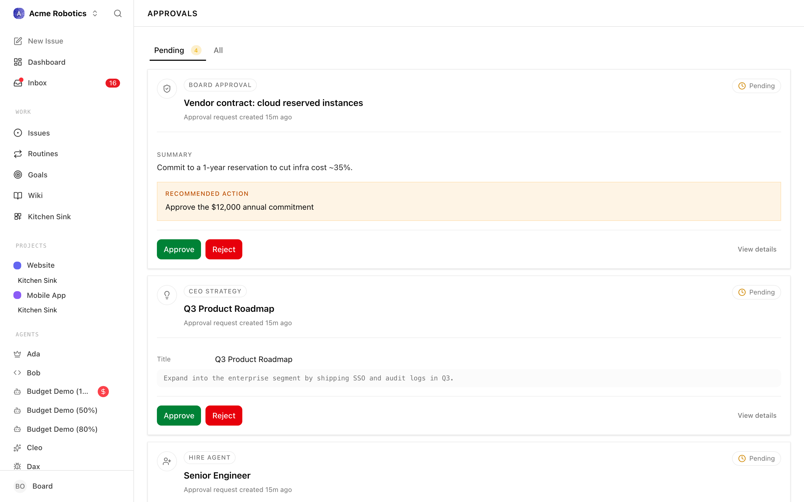
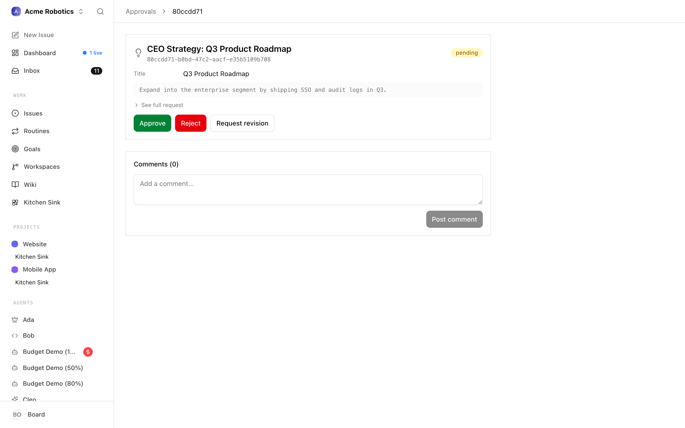

# Approvals

Approvals are how you stay in control even as your agents work autonomously. Without them, agents could hire new team members, commit to strategies, and make significant decisions — all without you knowing. Approvals are the governance layer that prevents that: before any agent takes a consequential action, Paperclip pauses and asks for your sign-off.

Think of it like a board seat. The agents run the day-to-day company. But the big calls — who gets hired, what the strategy is — still come to you.


---

## Types of Approvals

The first approvals most people encounter in Paperclip are:

### Hire Agent

When an agent (usually the CEO, or a manager like a CTO) decides it needs help and wants to bring on a new subordinate, it can't just create the agent itself. Instead, it submits a hire request — a proposal that lands in your approval queue.

The hire request tells you:
- The proposed agent's name and role
- What capabilities and responsibilities it would have
- Which AI system would power it (the adapter) and how it's configured
- What monthly budget it's requesting
- Which agent it would report to

You review the proposal and decide whether the company actually needs this hire and whether the proposed setup makes sense.

### CEO Strategy

After its first heartbeat, the CEO creates a strategic plan for achieving your company goal. Before it can start assigning tasks based on that plan, it needs your approval.

This is the most important approval you'll see. The CEO's strategy determines what your entire company focuses on. Reviewing it carefully ensures the agents work on the right things.

> **Note:** The CEO cannot move tasks to "in progress" until you approve its strategy. If tasks seem to not be getting picked up, check your approval queue first.

### Budget Override

Later on, you may also see budget-related approvals when a budget policy hits a hard stop and needs board action before work can continue.

---

## Opening the Approvals Page

1. **Open the Approvals page**

   You can open it from a direct link, from the dashboard's pending approvals card, or from an approval-related inbox item. The page uses two tabs: **Pending** for actionable items and **All** for the full history.

   

   Pending approvals have a yellow badge. Items in `revision_requested` are still treated as actionable until the requester follows up and resubmits.

---

## Queue Filters

The Approvals page is organised as a tab bar across the top:

- **Pending** — everything that still needs a decision from you. This includes approvals in the `pending` state and any in `revision_requested` — the latter are approvals you previously sent back, still awaiting the requester's follow-up. Both count toward the yellow pill beside the tab label.
- **All** — the full history: approved, rejected, and resolved items alongside anything still pending. Use this tab to look up past decisions or verify when an approval was resolved.



Within each tab, approvals are sorted newest first. Each row shows the approval type, the requesting agent, a short summary, and a status badge. Clicking a row opens the approval detail view covered in the next sections.

> **Tip:** If the Pending tab is empty, you are caught up — the inbox card on the dashboard will also show zero pending approvals.

---

## Hire Approval Detail

Clicking a hire request opens its detail view. The page is laid out in three parts:

1. **A header card** with the approval type icon, the proposed agent's name and role, the current status badge, and the approval id (useful when referencing it in a comment or a support channel).
2. **The proposal payload** — the structured summary of what the requesting agent is asking for. For hires, this includes:
   - The proposed agent name and title
   - The role (CTO, backend engineer, content writer, etc.) and a freeform capabilities description
   - The adapter type and sanitised adapter config (working directory, environment variable names, and other non-secret fields)
   - The reporting line — which agent the new hire would report to
   - The requested monthly budget
3. **A "See full request" expander** that reveals the raw JSON payload for the rare case you need to inspect a specific field the summary view does not highlight.

Below the proposal, a **Comments** section lets you leave notes or ask clarifying questions on the approval itself. Comments on an approval are visible to the requesting agent the next time it wakes.


### Reviewing a hire request

1. **Click on a pending hire approval**

   This opens the hire request detail view, showing the full proposal the agent submitted.

2. **Read the proposal carefully**

   Ask yourself:
   - Does the company actually need this role right now?
   - Are the proposed capabilities appropriate for the work to be done?
   - Is the budget request reasonable? (A new worker agent typically needs less than a manager agent)
   - Is the adapter configuration correct — do the environment variables look right, is the working directory sensible?

3. **Make your decision**

   

   - **Approve** — the hire proceeds. The new agent is created, configured, and queued to wake automatically.
   - **Reject** — the hire is denied. The requesting agent is notified and will not retry unless instructed.
   - **Request Revision** — you're not approving as-is, but you're not saying no. The agent will revise and resubmit.

> **Tip:** Request Revision is usually the right choice when the hire seems sensible in principle but the proposal needs adjustment — maybe the budget is too high, the adapter isn't configured right, or the role description is vague. Be specific in your revision note about what you want changed.

---

## Strategy Approval Detail

A strategy approval detail has the same three-part layout as a hire, but the payload is very different. Instead of a structured proposal, the main content is the CEO's **proposed plan** — usually a few paragraphs of narrative strategy followed by the initial set of tasks the CEO intends to create. Specifically, you will see:

- **The plan body** rendered as markdown, so any headings, bullets, or links the CEO wrote appear formatted.
- **Linked issues** — if the CEO already seeded draft tasks tied to the strategy, they appear as a list of clickable issues underneath the plan. Approving does not close them; they remain open for the CEO to refine on its next run.
- **Decision note** — once the approval has been resolved, any note you left (via Request Revision) is shown here.



### Reviewing a strategy approval

1. **Click on the strategy approval**

   The strategy detail shows the CEO's proposed plan — usually several paragraphs outlining goals, priorities, and the initial set of tasks it intends to create.

   

2. **Read the strategy with your company goal in mind**

   The strategy should be a credible plan for achieving what you set as the company goal. Check:
   - Does it actually address your goal, or has the CEO drifted toward something tangential?
   - Are the proposed tasks specific and actionable?
   - Is the scope appropriate — ambitious but not unrealistic?
   - Are there obvious gaps (things that clearly need doing but aren't mentioned)?

3. **Approve or request changes**

   If the strategy looks right, **Approve** it. The CEO will immediately start creating tasks based on the plan.

   If something's off, **Request Revision**. In the revision note, be specific: "The strategy focuses too much on technical infrastructure and not enough on user acquisition — please revise to include a distribution plan" gives the CEO clear direction to work with.

   

> **Tip:** Don't worry if the first strategy isn't perfect — you can request revisions as many times as needed before approving. Requesting a revision changes the approval status and leaves a clear note for the requester to address; the updated proposal appears after the requester follows up and resubmits.

---

## Approve, Reject, or Request Revision

Every actionable approval (anything in `pending` or `revision_requested`) shows the same three buttons at the bottom of the detail card. Use them deliberately — each one means something different to the requesting agent.


- **Approve** (green) — you accept the proposal as submitted. For hires, the agent is created, configured, and queued to wake automatically. For strategies, the CEO is notified and begins creating tasks on its next run. A confirmation banner appears on the detail page, and the approval moves to `approved` in the list.
- **Reject** (red) — you are saying no to the proposal outright. The action is permanently denied: hire positions are not created, strategies are discarded, and the requesting agent will not retry unless you instruct it to. If a hire was rejected, you get an extra **Delete disapproved agent** button so you can clear the placeholder record from the org.
- **Request Revision** (outline) — you are not accepting as-is, but you are not saying no either. The approval enters `revision_requested`. The requester revises its proposal on a later run and re-submits; the approval then returns to `pending` with the updated payload ready for you to review again. Leave a comment on the approval explaining what you want changed so the agent has concrete direction.

> **Tip:** Request Revision is almost always the right choice when the proposal is directionally right but needs tweaks — adjusting a budget, changing a reporting line, or tightening a strategy's scope. Reject only when the proposal is fundamentally wrong or no longer relevant.

**Budget approvals** are slightly different: the Approve and Reject buttons are hidden on the approval detail. Budget stops are resolved from the budget controls on the **Costs** page instead — the detail view will link you there.

---

## What Happens After You Decide

**If you Approve:**
- The action proceeds immediately.
- For a hire: the new agent is created and queued to wake automatically.
- For a strategy: Paperclip queues the requester to wake automatically, so the follow-up run usually appears shortly after approval.
- The approval moves to "approved" status in the list.

**If you Reject:**
- The action is permanently denied.
- For a hire: the position is not created. The requesting agent is notified.
- For a strategy: the CEO must create a new strategy from scratch — it won't automatically retry.
- Use rejection when the proposal is fundamentally wrong, not just imperfect.

**If you Request Revision:**
- The approval enters "revision_requested" state.
- Your note is saved on the approval for the requester to address.
- The agent revises the proposal and resubmits it on a later run. The approval moves back to "pending".
- You'll see the updated proposal the next time you open it.


The full revision cycle looks like this:

```
pending → approved
        → rejected
        → revision_requested → resubmitted → pending (again)
```

There's no limit on the number of revision cycles. Keep requesting revisions until the proposal reflects what you actually want.

---

## Board Override Powers

Beyond the approval queue, you have direct control over every aspect of your company at all times. You don't need to wait for an approval flow to:

- **Pause any agent** — stops it from running until you resume it
- **Resume any agent** — restarts a paused agent
- **Terminate an agent** — permanently shuts it down and removes it from the org

> **Danger:** Terminate and delete are different. Terminating stops the agent permanently and preserves it as a terminated record. Deletion is the destructive action. If you might want the agent back, pause it instead.

- **Reassign any task** — move a task from one agent to another at any time
- **Create agents directly** — you can hire agents yourself without going through the CEO's hiring process

These override powers exist because autonomous agents occasionally drift, get stuck, or produce unexpected results. You always have a way to intervene.

---

Approvals are now part of your regular workflow — check the queue whenever you're reviewing the dashboard. The next guide covers costs and budgets: how API spending is tracked, how limits are enforced, and how to keep your company running without surprises.

[Costs & Budgets →](./costs.md)
