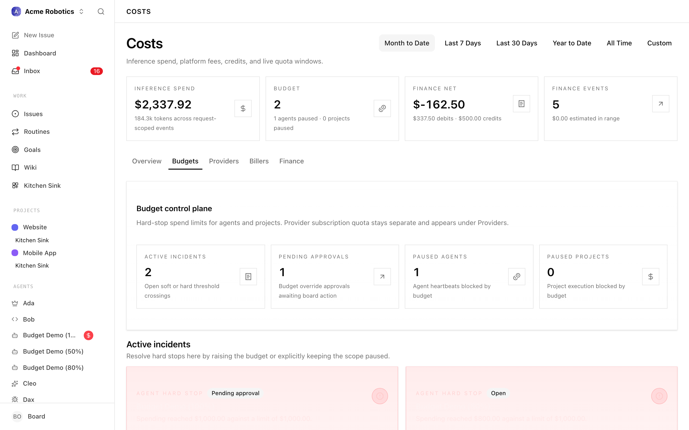
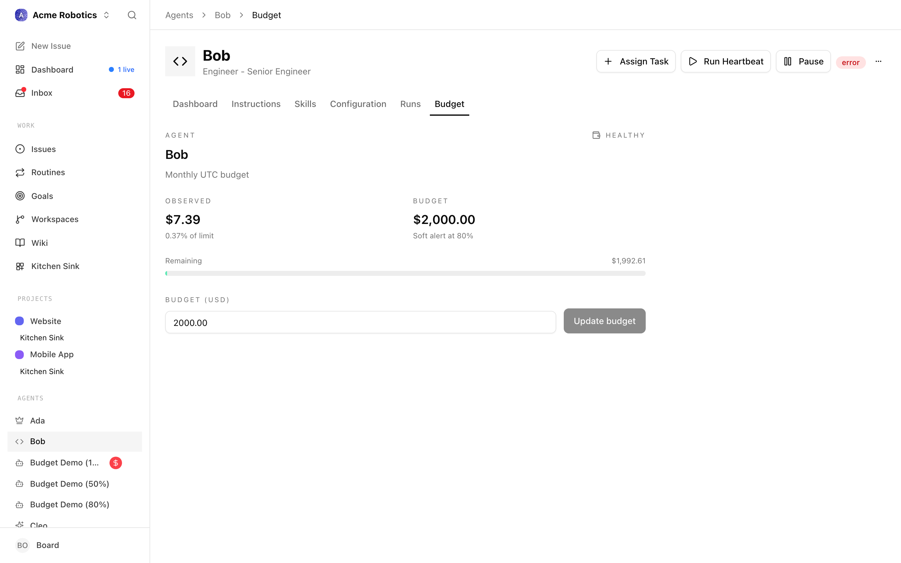
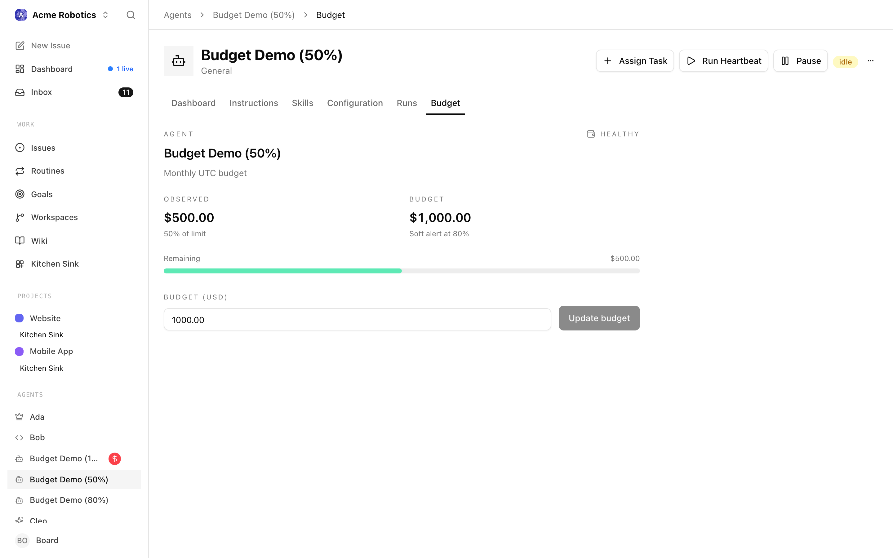
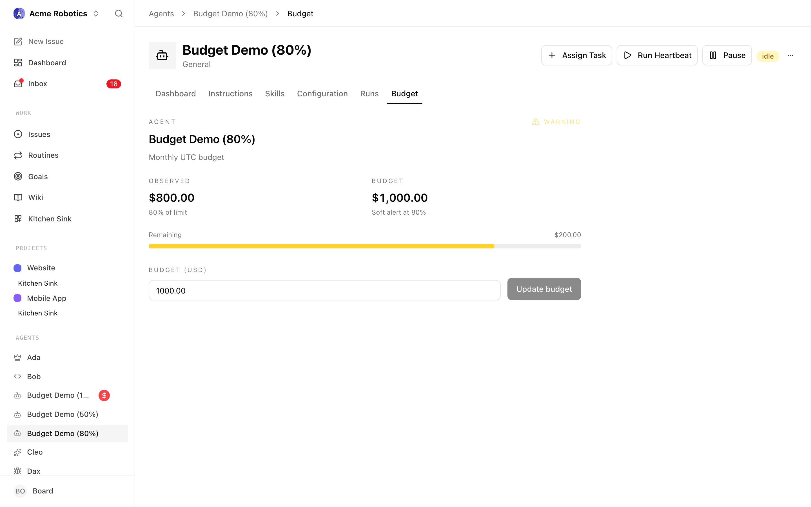
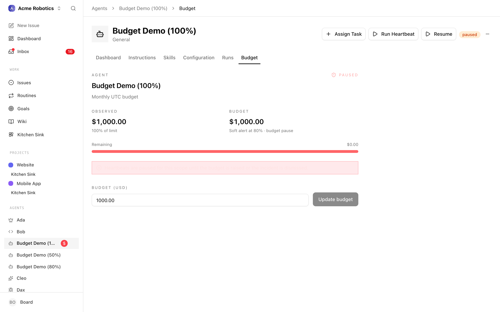
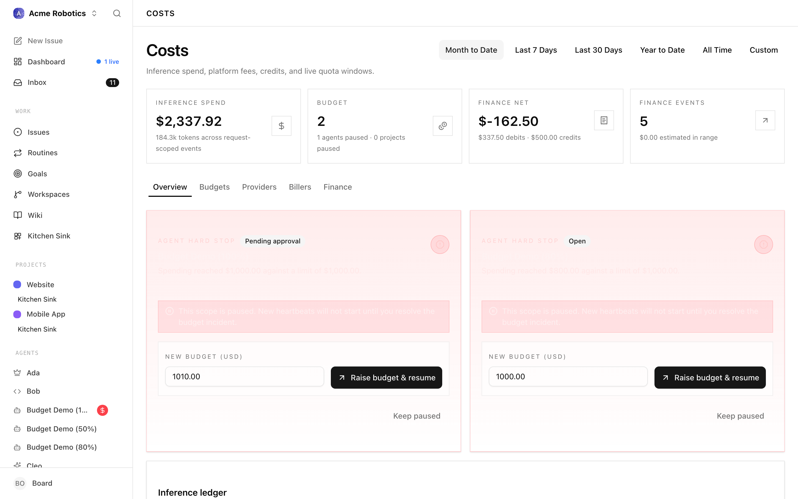
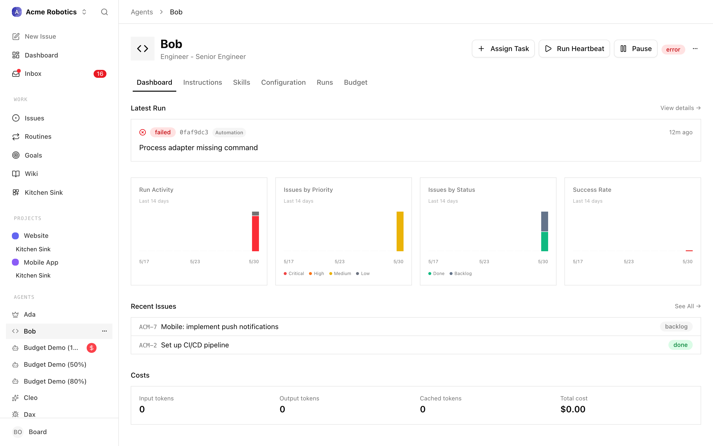

# Costs

> **Warning:** AI agents make real API calls that cost real money. Every time an agent works — every heartbeat, every task, every comment it reads and writes — it sends and receives text through a provider like Anthropic or OpenAI, which charges you per token (roughly per word). This isn't a Paperclip fee; it's a cost you pay directly to the AI provider. Read this guide before your agents start running in earnest.

Paperclip's budget system exists to make sure you're never surprised. You set limits, and the platform enforces them automatically — an agent won't spend a cent beyond what you allow.

The **Costs** page in the sidebar is where all of this lives. It has five tabs — **Overview**, **Budgets**, **Providers**, **Billers**, and **Finance** — plus a shared date-range selector and four headline metrics at the top. This guide walks through each tab, then folds in the core concepts around how costs work, how budgets protect you, and how to tune spend over time.

---

## How Costs Work

Every time an agent runs a heartbeat, it generates an API call. That call sends the agent's context (its identity, its tasks, the instructions it's working from) to the AI provider, and receives a response (the agent's reasoning and next actions). The provider charges based on the number of tokens — input tokens (what's sent) and output tokens (what comes back).

Paperclip records every one of these calls: which agent made it, which model it used, how many tokens were used, and the exact dollar cost. These records are aggregated per agent per calendar month (resetting on the 1st of each UTC month).

> **Note:** A token is roughly equivalent to one word, though technically it's a fragment of text slightly smaller than that. A busy agent doing coding or writing work might process 100,000–500,000 tokens per month. At typical Anthropic pricing, that's roughly $3–$15 per month for a moderately active worker agent — but this varies significantly based on the model used and how much context each task requires.

Beyond per-request inference costs, there are also **account-level** charges — monthly subscription fees, credit top-ups, invoice adjustments, refunds — that don't map to a single API call. Paperclip tracks those separately in the finance ledger so you can reconcile your actual provider invoices against what Paperclip thinks you spent.

---

## Page Header and Date Range

Every tab on the Costs page shares the same header, so it's worth understanding what you're looking at before diving into the individual views.

The page title reads **Costs**, with a subtitle that reminds you what's tracked: inference spend, platform fees, credits, and live quota windows.

To the right of the title is a **date-range selector** — a row of preset buttons (Today, Week-to-date, Month-to-date, custom, and so on) that scopes every chart, table, and metric on the page. If you pick **custom**, two date inputs appear and you enter the start and end date manually. Until both custom dates are filled in, most of the tabs show a prompt to pick a range before loading data.

Below the header is a strip of four **metric tiles** that summarise the current range:

- **Inference spend** — total dollars spent on per-request inference in the selected range, with the total token count shown underneath.
- **Budget** — either a utilisation percentage (e.g. `62%` of the monthly cap), the count of active incidents if any budget has been breached, or the word `Open` if no monthly cap is configured. The subtitle explains which of those three is showing.
- **Finance net** — debits minus credits for the account-level finance ledger across the range.
- **Finance events** — the number of finance events recorded, plus the total estimated (non-invoice-authoritative) debits still open.

These tiles always reflect the selected date range, not an all-time total.

---

## Overview Tab


The **Overview** tab is the default landing view. It gives you a single-screen readout of spend health without forcing you to drill into any one dimension.

### Inference ledger card

The left side of the overview is the **Inference ledger** card. It restates the total inference spend for the range in large type, shows either the configured monthly budget (`Budget $X.XX`) or the words `Unlimited budget` when no cap is set, and puts the total token count in a small box to the right.

If a monthly budget is configured, a horizontal utilisation bar sits below it. The bar colour reflects health:

- **Green** — under 70% consumed.
- **Yellow** — 70–90%.
- **Red** — above 90%.

Underneath the bar is a line like `62% of monthly budget consumed in this range.` This is the fastest answer to "are we on track this month?".

### Finance ledger card

The right side of the overview is the **Finance ledger** card — the same four metrics as the page header tiles, restated in context:

- **Debits** — account-level charges in the range, with the total event count.
- **Credits** — refunds, offsets, and credit returns.
- **Net** — debit minus credit for the period.
- **Estimated** — debits that are not yet invoice-authoritative (for example, a Paperclip estimate of a subscription day that hasn't been reconciled with the provider's invoice yet).

### By agent

Below the ledger cards is the **By agent** card. Each agent that generated inference events in the range is listed with:

- Agent name and avatar, plus a `terminated` badge if the agent has been retired.
- Total cost for the range, right-aligned.
- Token breakdown: `in <input+cached> · out <output>`.
- Run-type breakdown: `N api · N subscription` — how many runs went through API-priced calls versus subscription-backed calls (see **Billers** below for the distinction).

If an agent has a per-model breakdown available, a caret appears on the left of the row. Clicking the row expands it to show one line per `provider / model / billingType` combination with its share of that agent's spend, the cost, the token count, and which biller handled the call. This is the fastest way to see "why is this particular agent spending so much" — you can immediately tell whether it's one runaway model or a healthy mix.

### By project

To the right of the agent breakdown is the **By project** card. Paperclip attributes run costs to a project when the run was triggered by an issue that belongs to that project. Each row shows the project name and its total attributed cost. Runs that didn't happen inside a project-linked issue appear as `Unattributed`.

### Finance timeline

Under the project card is a compact **finance timeline** showing the most recent 6 account-level events (debits and credits) in the range. If there are no finance events yet, the card prompts you to add them once biller invoices or credits land.

### Active budget incidents (overview)

If any agent or project has breached its hard-stop budget, up to two **Budget incident cards** appear at the top of the Overview tab, above everything else. Each card shows the scope, the breach details, and two resolution buttons — **Keep paused** or **Raise budget and resume** (with an amount input). The full incident list lives on the Budgets tab.

---

## Budgets Tab


The **Budgets** tab is where you configure the spend ceilings that protect your company. Think of it as the control plane for hard stops — the place where you decide, in dollars, how much any given scope is allowed to spend before Paperclip pulls the emergency brake.

### Budget Levels

Paperclip operates two levels of budget protection that work together:

**Company budget** — the total monthly ceiling for your entire company. All agents combined cannot spend more than this. Set it conservatively when starting out.

**Per-agent budget** — an individual monthly ceiling for each agent. This is enforced independently of the company total. An agent at 100% pauses even if the company still has budget remaining. This protects you from any single agent spending disproportionately.

A third scope, **project budget**, acts as a lifetime cap on an execution-bound project — useful for one-off work where you want to say "this project can never cost more than $200" regardless of the month.

All budgets are displayed in dollars in the Paperclip UI.

### Budget control plane

At the top of the Budgets tab is a **Budget control plane** card with four headline metrics:

- **Active incidents** — open soft or hard threshold crossings.
- **Pending approvals** — budget override approvals awaiting board action.
- **Paused agents** — count of agents currently blocked from running because of a budget breach.
- **Paused projects** — count of projects currently blocked from execution because of a budget breach.

If all four show zero, your budget posture is clean.

### What Happens When Limits Are Hit

Paperclip enforces budgets automatically, in two stages:

```
$0 ─────────────────────── 80% ──────── 100%
   Normal operation         ⚠              🛑
                          Warning        Auto-paused
```

**At 80%:** Paperclip records a warning so you can intervene before the hard stop. The agent continues running.

**At 100%:** The agent is automatically paused. No further heartbeats are triggered. The agent stops all activity until either you increase its budget or the calendar month resets.

An auto-paused agent doesn't lose its work — any tasks it had in progress remain assigned to it and will pick up again once the agent is resumed.

### Active incidents

If any budget policy has been breached, an **Active incidents** section appears under the control plane. Each incident card shows:

- The scope (company, agent, or project) and its name.
- The policy details — how much was configured and how much was actually spent.
- Two actions:
  - **Keep paused** — acknowledge the breach and leave the scope paused. Useful when you want the agent to stop for the rest of the month and resume naturally at rollover.
  - **Raise budget and resume** — increase the policy's amount (you enter the new cap in the card) and immediately un-pause the scope.

Both actions are logged and become part of the audit trail.

### Budget policies by scope

Below the incidents, the rest of the tab is organised into three sections — **Company budgets**, **Agent budgets**, and **Project budgets** — with one Budget policy card per configured policy in each section.

Each policy card shows:

- The scope (who this applies to) and the window kind (monthly recurring for company and agent, lifetime for project).
- The current cap and the current spend against it.
- An editable amount field and a **Save** button.

If no policies exist yet, a single empty-state card appears with a pointer to set agent and project budgets from their detail pages and to use the existing company monthly budget control.

### Setting a Company Budget

1. **Open the Costs page**

   Company-wide budget controls live on the **Costs** page, under the **Budgets** tab.

   

2. **Set the monthly budget**

   Enter a dollar amount in the Monthly Budget field. This is the maximum your entire company can spend in a calendar month.

   > **Tip:** Start conservative — $50–100/month is enough for experimentation with a small team. You can always increase it once you have a feel for how much your agents are spending.

3. **Save**

### Setting Per-Agent Budgets

Each agent should have its own budget. This limits exposure from any single agent and makes your cost picture easier to read.

1. **Open the agent's Budget tab**

   Click the agent's name in the sidebar or in the Agents list, then open **Budget** on the agent detail page.

   

2. **Set the monthly budget**

   Enter a dollar amount. Some rough guidance on how to think about agent budgets:

   | Agent role | Typical monthly budget |
   |------------|------------------------|
   | CEO | $30–50 — runs frequently, high context per run |
   | Manager (CTO, CMO, etc.) | $20–40 — active but more focused than CEO |
   | Worker agent (engineer, writer, etc.) | $10–25 — executes tasks but less strategic reasoning |

   These are starting points, not rules. Watch actual spend for the first two weeks and adjust from there.

3. **Save**

### Increasing a Budget or Resuming a Paused Agent

If an agent hits its 100% limit and auto-pauses, you have two options:

**Option 1: Increase the agent's monthly budget**

1. Open the agent's settings
2. Update the Monthly Budget field to a higher amount
3. Save

The agent will resume immediately. It won't wait for the month to roll over.

**Option 2: Wait for the month to reset**

On the 1st of each UTC month, all monthly budgets reset to zero. A paused agent that's been paused purely for budget reasons will become active again automatically at rollover.

> **Note:** If you don't want the agent to resume automatically at month rollover, manually pause it first. Otherwise it will start running again as soon as the new month begins.

### Viewing Budget Status at Different Thresholds

For reference, here's what to expect at each stage:



*Normal operation — green bar, no action needed.*



*Warning threshold reached — this is your signal to intervene before the hard stop.*



*Budget exhausted — agent is auto-paused. Increase budget or wait for month reset.*

---

## Providers Tab


The **Providers** tab breaks spend down by who the inference was actually performed by — Anthropic, OpenAI, Google, and any other model provider your agents use. This is the view you want when you're asking "how much am I sending Anthropic this month?" or "is my OpenAI usage growing?".

### Provider sub-tabs

At the top of the tab is a sub-tab bar. The first entry is **All providers** — an aggregate showing tokens and cents across everything. After that comes one sub-tab per provider that generated events in the selected range. Each sub-tab label includes the provider's display name, its token count, and its cost, so you can read the split without clicking in.

### Provider card

Selecting **All providers** renders a grid of provider cards (two per row on wider screens). Selecting a single provider shows the same card by itself. Each **ProviderQuotaCard** rolls up, for a given provider:

- **Per-model spend** — one row per model used in the range, with input tokens, cached-input tokens, output tokens, and dollar cost. This is where you confirm, for example, that most of your Anthropic spend is on Claude Sonnet and not a stray Opus call.
- **Current-week spend** — a separate roll-up showing what the provider cost you this calendar week, independent of the main range selector. Useful for catching week-over-week surprises.
- **Share of budget** — the provider's share of the company monthly budget, with a deficit notch that lights up if the provider is projected to overshoot its fair share at the current burn rate (only shown when the date range is set to **Month-to-date**).

### Quota windows

For providers that have a subscription plan with a rolling usage window (e.g. Anthropic Pro/Max with a 5-hour window, daily, or weekly caps), the card also renders a **Quota windows** section. For each window Paperclip queries the provider and shows:

- Window label (e.g. "5-hour", "daily", "weekly").
- How much of the window you've consumed.
- How long until the window resets.
- The data source (provider API, estimated, or last-known cached value).

If the provider's quota endpoint returned an error, the card surfaces that error inline instead of a bar. Quota data refreshes on its own schedule and shows a loading indicator the first time.

### Provider window spend

Underneath the quota bars, Paperclip also shows **window spend** — what the provider cost you inside each active quota window. This is how you tell the difference between "I'm at 80% of my 5-hour cap because of one burst" and "I'm at 80% and it's evenly distributed".

---

## Billers Tab


The **Billers** tab answers a different question than **Providers**: not "who ran the inference?" but "who charged me for it?". In most companies these are the same entity, but they can diverge — for example, when you run Claude models through a subscription plan (Anthropic is the biller *and* provider) versus through the API (Anthropic is still the biller, but the pricing model is different), or when a gateway or reseller handles the billing relationship on your behalf.

### Biller sub-tabs

Like the Providers tab, the Billers tab has a sub-tab bar at the top. **All billers** shows an aggregate grid; each per-biller sub-tab shows the same card standalone. Sub-tab labels include the biller's display name, token count, and cost.

### Biller spend card

Each **BillerSpendCard** shows:

- The biller's total spend in the range, in dollars and tokens.
- The current calendar week's spend with that biller, for a short-horizon sanity check.
- The biller's share of the company monthly budget.
- A per-provider breakdown *within this biller* — i.e. which providers' models were billed through this biller, and how much each contributed. This is where you'd see, for example, that one biller is paying for both Anthropic and OpenAI calls.

### Why this matters

The Biller view is how you reconcile invoices. When the Anthropic invoice lands at the end of the month, the number on it should line up with what the Anthropic biller card has been telling you all along. If it doesn't, you have a starting point for investigation — drill into the biller card, compare per-provider and per-model rows, and compare timestamps against your provider's usage dashboard.

### Attribution

Every cost event in Paperclip is tagged with both a provider (who did the inference) and a biller (who charges you). For simple setups the two are identical, and you can largely ignore the Billers tab. For more complex setups — multiple accounts with the same provider, subscription-plus-API combinations, or a centralised gateway — the Billers tab is how you keep the accounting clean.

---

## Finance Tab


The **Finance** tab is the account-level ledger — everything that isn't a per-request inference cost. Subscription fees, invoice reconciliations, credit top-ups, refunds, and adjustments all land here. If the Providers and Billers tabs show what your agents did, the Finance tab shows what actually hit your accounts.

### Finance summary card

At the top of the tab is the **Finance ledger** card with four metric tiles — the same four from the page header, expanded into full-width tiles:

- **Debits** — total debited dollars in the range, plus the count of events.
- **Credits** — refunds, offsets, and credit returns.
- **Net** — debit minus credit for the selected period.
- **Estimated** — debits that Paperclip has estimated but are not yet invoice-authoritative. These are the events most likely to change as invoices arrive.

### By biller

The **By biller** card groups finance events by who charged or credited you. Each **FinanceBillerCard** shows the biller, its debit and credit totals for the range, and an event count. This is the usual starting point for reconciling against a specific vendor's invoices.

If no finance events exist yet, the card prompts you to add them once biller invoices or credits land.

### Finance timeline

Below the biller grid is a **FinanceTimelineCard** listing individual finance events chronologically. Each row shows the event type (e.g. subscription debit, credit top-up, invoice adjustment), amount, biller, timestamp, and whether it's estimated or authoritative. This is where you spot the specific event you're trying to trace.

### By kind

To the right of the timeline is the **By kind** card. Instead of grouping by who charged you, it groups by *what kind of event* — all subscription debits together, all credits together, all adjustments together. Useful when you're answering "how much are we spending on subscriptions versus pay-as-you-go?".

### Estimated versus actual

Paperclip separates estimated debits from authoritative ones because your provider's invoice is the source of truth. Until an invoice is reconciled, Paperclip's number for a subscription day is its best guess — typically derived from the plan price divided by the billing cycle length. Once the real invoice arrives and is imported, the estimated flag flips off and the number becomes authoritative.

The **Estimated** metric at the top tells you, at a glance, how much of your finance ledger is still provisional. A small number means most of your ledger is invoice-backed; a large number means a lot of estimated spend is waiting for reconciliation.

### Exporting finance data

Finance events can be exported for use in external accounting systems. The export carries the same fields you see in the timeline (event kind, biller, debit/credit amounts, timestamps, authoritative flag) so the resulting file can be reconciled against provider invoices or uploaded into a ledger.

---

## Monitoring Spending

### From the Dashboard

The Cost Summary panel on the dashboard shows each agent's current month spend as a bar chart. Green = normal, amber = approaching limit (80%+), red = paused at 100%.



Check this panel whenever you open Paperclip. A bar that has jumped unexpectedly since your last check is worth investigating.

### From the Agent Detail Page

Click on any agent, then open **Runs** to see per-run spend and **Budget** to see the current cap and utilization.



This is useful when you want to understand why a particular agent is spending more than expected.

### From the Costs page

For anything cross-agent — "which provider got the most money this week?", "which project ate the most budget?", "how much of our ledger is still estimated?" — go straight to the Costs page and pick the tab that matches the question. Overview for a general health check, Providers/Billers for vendor accounting, Finance for invoice reconciliation, Budgets for hard-stop management.

---

## Cost-Saving Tips

**Use a less expensive model for worker agents.** The CEO agent benefits from the most capable model available (like Claude Opus), since it needs to reason about strategy. Worker agents doing more routine tasks — writing content, processing data, running searches — can often use a faster, cheaper model like Claude Sonnet without a meaningful drop in quality. You set the model in the agent's adapter configuration.

**Reduce heartbeat frequency for background agents.** An agent that runs every 15 minutes uses roughly 4× as many API calls as one that runs every hour. For agents that don't need to respond quickly, a longer interval saves money with little downside.

**Write tighter task descriptions.** Agents read their full task description, context, and conversation history on every heartbeat. Open-ended tasks with long context chains accumulate cost quickly. Specific, concise task descriptions with clear "done" criteria keep context small and focused.

**Pause agents during off-hours.** If your company doesn't need to run 24/7, manually pause agents at the end of the working day and resume them in the morning. Most of the autonomous work can happen within a defined window.

**Watch the cost-per-run on new agents.** After a new agent completes its first few heartbeats, check the per-run cost on its detail page. If it's higher than expected, check what it's doing: long context chains, excessive tool use, or a misconfigured prompt can all inflate cost.

**Prefer subscriptions when usage is predictable.** If you have an agent whose workload is steady and fits comfortably inside a provider's plan window (e.g. an Anthropic Pro subscription), routing through the subscription biller can be cheaper than pay-as-you-go API pricing. Use the Providers tab's quota-window view to confirm the subscription has headroom before committing an agent to it.

**Reconcile finance regularly.** Invoice-authoritative numbers are always more accurate than estimates. A few minutes a month importing the real invoice into the Finance tab keeps your ledger honest and catches pricing changes early.

---

Your company's finances are now under control. The next guide covers the Activity Log — the complete audit trail of everything that has ever happened in your company, and how to use it to understand and debug agent behaviour.

[Activity Log →](./activity-log.md)
