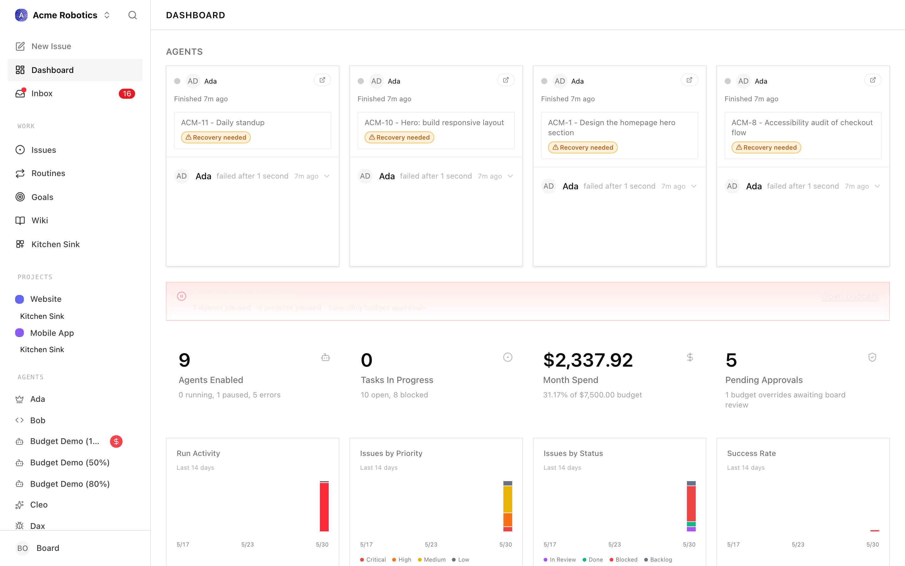

# 5-Minute Path

The shortest route from "downloaded Paperclip" to "an agent has finished a task". You'll install Paperclip, create a company, hire a CEO agent, and approve its first strategy. That's the deal.

---

## What this is, briefly

A Paperclip company is a self-contained AI organisation — one goal, a team of agents, a task board, a budget. The CEO is the first agent you hire. It reads your goal, proposes a strategy, and — once you approve it — starts creating tasks and moving them across the board.

You'll see all four ideas (company, agent, task, heartbeat) in the next 15 minutes. The full mental model lives in [Key Concepts](../welcome/key-concepts.md); you don't need it before starting.

---

## The path

Four pages. Allow ~15 minutes total — install is the longest leg and varies with your setup.

| Step | Page | What you'll have at the end | Approx. time |
|------|------|-----------------------------|--------------|
| 1 | [Installation](./installation.md) | A running Paperclip instance at `http://localhost:3100` (or your domain) | 3–10 min |
| 2 | [Create Your First Company](./your-first-company.md) | A company with a name and a goal | 1–2 min |
| 3 | [Hire Your First Agent](./your-first-agent.md) | A configured CEO agent in `idle` status | 2–4 min |
| 4 | [Watching Agents Work](./watching-agents-work.md) | A heartbeat fired, a strategy approval submitted, the first tasks on the board | 2–5 min |

Read the steps in order. They're short on purpose.

> **Note:** The "5-minute" promise is the time between starting **step 2** and approving the CEO's first strategy in **step 4**. Installation time depends on whether you already have Node.js, Claude Code, and an API key. The Desktop App path is faster if you're not already a Node developer.

---

## What you need before you start

- A Mac (for the Desktop app) or any machine with Node.js 20+ (for the terminal install).
- An API key from [Anthropic](https://console.anthropic.com) (for `claude_local`) or [OpenAI](https://platform.openai.com) (for `codex_local`). The installation guide walks through getting one.
- For the `claude_local` adapter on Mac: [Claude Code](https://docs.anthropic.com/en/docs/claude-code) installed.

> **Warning:** Agents make API calls that cost money. Plan on spending $5–20 to play with the product, $20–100/month for an active company. Set per-agent and company budgets before enabling heartbeats — Paperclip pauses agents automatically when they hit 100%.

---

## What you'll see at the end of the path

By the time you finish step 4, you'll have:

- A company on the **Companies** page with your goal.
- A CEO agent on the **Agents** page in `idle` status with its heartbeat enabled.
- A pending **Strategy** approval in the Approvals queue, written by the CEO.
- After you approve: a handful of `todo`/`backlog` tasks on the **Issues** page.
- A run transcript under **Agents → CEO → Runs** showing exactly what the CEO did during its first heartbeat.

That's a working autonomous company. From there, you can hire more agents, refine the goal, or step in and assign tasks yourself.

---

## Where to go next

Once you finish the four steps:

- **Hire your second agent** — the CEO can request reports through the [Approvals](../day-to-day/approvals.md) flow. See [Agents](../org/agents.md) for role design and [Org Structure](../org/org-structure.md) for how reporting lines work.
- **Set up real workflows** — read [Issues](../day-to-day/issues.md) for the task lifecycle, [Costs & Budgets](../day-to-day/costs.md) for spend control, and [Heartbeats & Routines](../projects-workflow/routines.md) for scheduling.
- **Connect a code repo** — the [Execution Workspaces](../projects-workflow/workspaces.md) guide covers giving agents a real project to work in.

If anything in the UI seems unfamiliar along the way, [Key Concepts](../welcome/key-concepts.md) and the [Glossary](../welcome/glossary.md) are the fastest reference.

[Start with Installation →](./installation.md)
