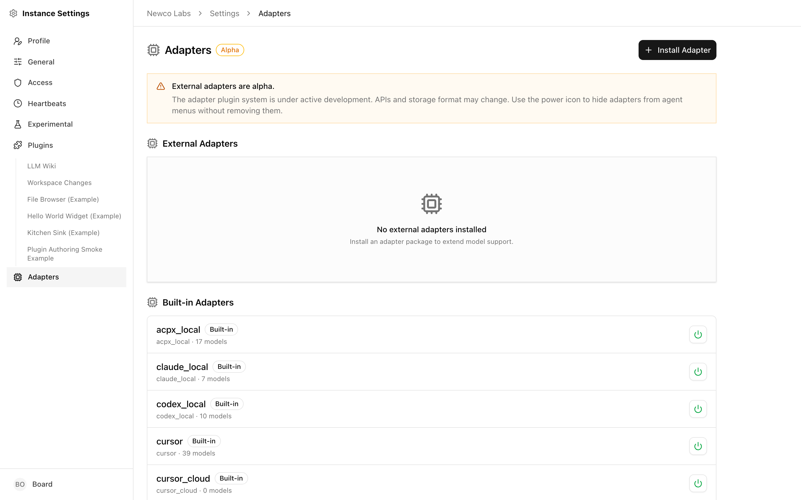

# The Adapter Manager

Every agent in Paperclip needs an **adapter** — the shim that lets the control plane talk to a specific AI runtime. Built-in adapters ship with the product (Claude Code, Codex, Gemini, OpenCode, Cursor, Pi, Hermes, HTTP, Process, OpenClaw Gateway), and you can extend the set by installing **external adapters** from npm or a local path.

The **Adapter Manager** is the single place where you see which adapters your instance knows about, toggle their visibility in the agent menus, install and upgrade external packages, and pause external overrides on built-ins.

This guide walks through the page itself. For the per-adapter config fields (working directory, model names, timeouts, environment variables) see [Agent Adapters](./agent-adapters.md). For the technical catalog of every adapter type — wire format, capabilities, model listings — see the [Adapter Reference](../../reference/adapters/overview.md).

> **Alpha:** The external-adapter runtime is in alpha. APIs, on-disk layout, and the list of exposed capabilities can change between versions. For production use, pin adapter package versions.

---

## Opening the Adapter Manager

The Adapter Manager lives under **Settings → Adapters**. The breadcrumb reads _Company_ → _Settings_ → _Adapters_, and the page header shows a CPU icon, the page title, and an **Alpha** badge.

Below the header there's a persistent amber notice reminding you that external adapters are alpha, and that the power icon on each row hides an adapter from the agent menus without removing it.

---

## The two lists

The page is split into two sections:

- **External Adapters** — adapter packages you (or another operator) installed. Each row is removable and can be reloaded or reinstalled in place.
- **Built-in Adapters** — adapters that ship with Paperclip. These cannot be removed, but they can be hidden from the agent dropdown.

When an external adapter declares the same `type` as a built-in (for example, an external `claude_local` package), the server treats it as an **override**. The override row appears in **External Adapters** with a blue _Overrides built-in_ badge, and a synthetic row appears in **Built-in Adapters** with an _Overridden by …_ badge so you can still see which built-in is affected.

### What each row shows

Every row shows the same block of metadata:

- The adapter's display label (`Claude Local`, `Codex Local`, your package's `label`, …).
- A **Built-in** or **External** badge.
- For external rows, an icon indicating source: a folder icon for _installed from local path_, a package icon for _installed from npm_.
- A version badge (`v0.3.2`) when the package declares one.
- Any of the override/disabled badges listed below.
- A one-line meta row: `adapter.type · package-name · N models`.

**Badges you may see:**

| Badge | Meaning |
|---|---|
| `Built-in` | Ships with Paperclip. Cannot be removed. |
| `External` | Installed by you. Can be removed, reloaded, reinstalled. |
| `Overrides built-in` (blue) | This external adapter replaces a built-in of the same type. |
| `Overridden by …` (blue) | This built-in is currently replaced by an external. |
| `Hidden from menus` (amber) | Adapter is installed and loaded, but the agent-config dropdown will not offer it. |
| `Override paused` (amber) | External override is loaded but temporarily not taking effect — the built-in is active instead. |

---

## Enabling and disabling an adapter

Every row has a power icon in the action column. Its exact behaviour depends on what you clicked:

- **Built-in or plain external adapter.** Clicking the power icon toggles menu visibility. When it's dim/grey, the adapter still exists and still works for any agent already configured to use it — it just doesn't appear in the adapter dropdown when you create or edit an agent. Clicking again shows it in the menu.
- **External adapter that overrides a built-in.** The power icon controls the **override pause** instead of menu visibility. Pausing the override does not uninstall the external package; it simply tells the runtime to fall back to the built-in until you resume.

Hover the icon to see the tooltip for the current state — the wording switches between _Show in agent menus_, _Hide from agent menus_, _Pause external override_, and _Resume external override_ so you always know which action you're about to take.

> **Note:** Hiding a built-in from menus is an operator preference. Existing agents keep working. If you want to truly stop an adapter from running, remove the external package, or — for built-ins — change the affected agents to a different adapter type first.

---

## Installing an external adapter

Click **Install Adapter** in the top right of the page. A dialog opens with a two-button source switch: **npm package** or **Local path**.

### From npm

1. Choose **npm package** (the default).
2. Enter the package name — for example, `@my-org/paperclip-adapter-openrouter`.
3. Optionally enter a version; leave it blank for `latest`.
4. Click **Install**.

Paperclip fetches the package, validates that it exports a `createServerAdapter()` factory, registers the adapter type, and adds a row to **External Adapters**. A toast confirms the install (`Adapter installed — Type "..." registered successfully. (v...)`). On failure the dialog stays open and shows the error.

### From a local path

Pick **Local path** when you're developing an adapter or using one you've cloned somewhere on disk:

1. Switch to **Local path** in the dialog.
2. Either paste an absolute path (`/mnt/e/Projects/my-adapter`, `/Users/me/code/my-adapter`, `E:\Projects\my-adapter`) or click the **Choose…** button for platform-specific instructions.
3. Click **Install**.

Linux, WSL, and native Windows paths are all accepted — Windows paths are auto-converted. Local-path installs show a folder icon in the row so you can tell them apart at a glance; they do **not** offer the **Reinstall** action (there's no registry to pull from).

> **Tip:** The adapter package must export a `createServerAdapter()` function that conforms to Paperclip's adapter contract. See [Creating an Adapter](../../reference/adapters/creating-an-adapter.md).

---

## Reload, reinstall, and remove

External adapters have three lifecycle actions, shown as icon buttons on the right of each row.

**Reload** (circular-arrow icon)
Re-imports the adapter module in place. Use this after changing the code of a local-path adapter — the runtime hot-swaps the module and invalidates any cached config parsers or UI schemas. Existing agents pick up the change on their next run.

**Reinstall** (download icon, npm installs only)
Pulls the latest version of the package from npm and reloads it. Clicking the icon opens a confirmation dialog that shows the package name, the installed version, and the latest version available on the npm registry:

- **Package** — `@my-org/paperclip-adapter-x`
- **Current** — `v0.3.2`
- **Latest on npm** — `v0.4.0`

If the installed version already matches the latest, the dialog says "Already on the latest version." You can still reinstall to force a clean re-fetch. Click **Reinstall** to apply. A toast confirms success (`Adapter reinstalled — ... updated from npm. (v...)`).

**Remove** (trash icon)
Uninstalls the external adapter. A confirmation dialog warns that the adapter will be unregistered, removed from the adapter store, and — for npm installs — cleaned up from disk. Agents still configured to use that adapter type will start failing on their next run, so reassign them to a different adapter first.

Built-in rows never show the trash icon. They cannot be removed.

---

## Per-adapter configuration

The Adapter Manager itself does **not** hold configuration for a specific adapter. Adapter config lives on each _agent_ that uses the adapter: working directory, model selection, timeouts, environment variables, and whatever extra fields the adapter declares through its UI schema.

To configure a built-in adapter, open the agent you want to change and edit its adapter config on the agent form.

To configure an external adapter, the same pattern applies — the Agent Manager renders the form fields the external adapter's `createServerAdapter()` reports through its UI schema, including any custom widgets the adapter ships.

For field-by-field walkthroughs of the common built-ins, see [Agent Adapters](./agent-adapters.md). For the technical contract that adapters implement (including the UI parser schema), see [Adapter UI Parser](../../reference/adapters/adapter-ui-parser.md).

---

## Health and troubleshooting

Adapters are simpler than plugins — there's no background worker, no scheduled jobs, and no long-running state to go wrong. "Health" for an adapter mostly comes down to: _did the module load, and does it report any models?_

The row meta line (`type · package · N models`) is your first signal:

- **`0 models`** on a model-listing adapter usually means the adapter loaded but couldn't reach its provider (missing API key, offline, auth failure). Check the agent's environment variables and the provider's status page.
- **Row missing after install** — the install failed. Reopen the install dialog; the error toast will have explained why (invalid package, manifest missing, `createServerAdapter()` not exported).
- **Reload or reinstall returns an error toast** — the new code didn't load. The previous version stays active. Fix the error (often a build output issue for local-path installs), then reload again.
- **Agents fail with "adapter not found"** — the adapter was removed or the `type` string on the agent doesn't match an installed adapter. Reinstall the package or change the agent's adapter.
- **Override paused unexpectedly** — someone clicked the power icon on an overriding external row. Click it again to resume the override.

If the list itself fails to load you'll see a _Loading adapters..._ line that never resolves or an error toast. Refresh the page; if it persists, check the server logs for adapter-registry errors.

---

## Where to go next

- [Agent Adapters](./agent-adapters.md) — what each adapter does and which configuration fields it exposes on the agent form.
- [Adapter Reference](../../reference/adapters/overview.md) — technical catalog of every built-in adapter type.
- [Creating an Adapter](../../reference/adapters/creating-an-adapter.md) — how to author and publish an external adapter package.
- [Adapter UI Parser](../../reference/adapters/adapter-ui-parser.md) — the schema contract your adapter uses to render config fields in the agent form.
