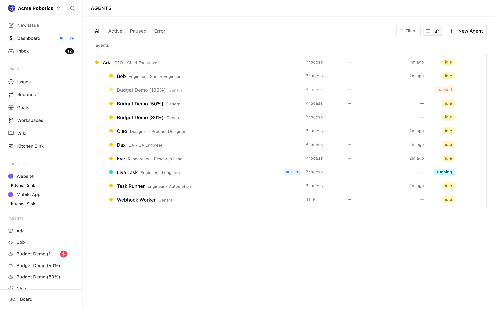

# Agents

Agents are the AI employees that make up your Paperclip company. They're where the work actually happens: the CEO setting strategy, the engineer shipping code, the marketer drafting posts. Everything else in Paperclip — tasks, approvals, skills, budgets — exists to coordinate and govern what your agents do.

Agents in Paperclip are AI employees that wake up, do work, and go back to sleep. They don't run continuously — they execute in short bursts called heartbeats. Between heartbeats the agent is dormant: it consumes no budget, holds no context in memory, and takes no action. A heartbeat is triggered by something concrete (a schedule, a mention, an assignment, a manual invoke), the adapter brings the agent runtime online just long enough to make progress, and then the agent exits and the adapter records what happened.

This guide walks through the entire agent surface in Paperclip: the list page you land on when you click **Agents**, the flow for hiring a new one, and every tab on the agent detail page. If you're new to Paperclip, read this top to bottom. If you're here to change one specific thing — a budget limit, a model, an instruction file — jump to the matching tab section.

---

## The Agent List

The agent list is the front door. Open **Agents** in the sidebar and you land on `/agents/all`.

### Filter tabs

Four tabs across the top scope what you see:

- **All** — every agent in the company (minus terminated ones, unless you opt in)
- **Active** — agents currently able to run; includes `active`, `running`, and `idle`
- **Paused** — agents that are manually paused or paused by the budget system
- **Error** — agents whose last heartbeat failed

The tab you're on is part of the URL (`/agents/active`, `/agents/paused`, etc.), so you can bookmark a filter or share a link that lands on one.

### Terminated agents

Terminated agents are hidden by default. Click the **Filters** control on the right of the tab bar and check **Show terminated** to include them. The count badge next to the button tells you at a glance when this filter is active.

### List view vs org chart view

On desktop you can toggle between two visual layouts:

- **List view** — a flat sorted list, one row per agent
- **Org chart view** — a hierarchical tree that mirrors the reporting chain (the CEO at the top, their direct reports indented under them, and so on)

On mobile, the list is forced — there's no room for the tree. The view preference is kept across page reloads.

### What each row shows

Every agent row shows the same pieces of information, just arranged differently in the two views:

- **Status dot** on the far left, colour-coded by status (green for active, blue for running, amber for paused, red for error, grey for terminated)
- **Name and role** (e.g. "Ada — Backend Engineer")
- **Live run pill** — a pulsing blue "Live" badge when the agent has a run currently in flight; click it to jump straight into the live transcript
- **Adapter label** — which AI runtime powers this agent (Claude, Codex, Cursor, Gemini, OpenCode, OpenClaw)
- **Last heartbeat** — a relative time like "4m ago"
- **Status badge** — a readable version of the status dot

Clicking anywhere on the row opens the agent's detail page. Clicking the live pill opens the run directly.

### Creating a new agent from the list

The **New Agent** button lives in the top-right of the list page and opens the hiring flow described in the next section.

> **Note:** If you have no agents yet, the list shows an empty state prompting you to create your first. The first agent you create is always the CEO — there's no way around this and no point in trying to avoid it. See the next section for why.

---

## Hiring a New Agent

Paperclip has two paths for adding an agent to the company:

1. You (a board user) create one directly from **New Agent** on the agent list.
2. An existing agent (typically the CEO or a manager) proposes a hire, which lands in your approval queue. See [Approvals](../day-to-day/approvals.md) for how that side works.

This section is about the direct path — the `New Agent` form.

### Name and title

The first two fields at the top of the form:

- **Agent name** (required) — the display name, e.g. "Ada" or "CTO"
- **Title** (optional) — a role label that appears in the subtitle, e.g. "VP of Engineering"

If this is the first agent in the company, Paperclip pre-fills both fields with "CEO" to make the CEO-first flow frictionless.

### Role and reporting chain

Two chips beneath the name row let you set governance context:

- **Role** — one of Paperclip's built-in roles (CEO, CTO, manager, general, worker, etc.). When you're hiring the first agent, this field is locked to `CEO` and you cannot change it — the very first hire in a company is always the CEO. Subsequent hires default to `general` and you can pick a different role from the popover.
- **Reports to** — picks the manager this agent will report to. Disabled on the first hire (the CEO reports to you). Used by the org chart on the agent list and by the escalation chain agents follow when they're blocked.

### Adapter and configuration

Below the chips, the shared agent configuration form takes over. This is the same form you'll see on the **Configuration** tab later, which means everything you set here can be edited after the agent exists.

The adapter picker is the most important decision at hire time. Your choice controls:

- Which AI runtime powers the agent (Claude Code, Codex local, Cursor, Gemini, OpenCode, OpenClaw gateway)
- Which models you can pick from
- Which adapter-specific options show up (sandbox bypass flags, model-provider formats, session handling)

When you change the adapter type, Paperclip resets the form to that adapter's defaults — for example, switching to `codex_local` pre-selects the default Codex model and sets the sandbox/approvals bypass to its recommended default. For OpenCode, you must pick an explicit model in `provider/model` format; Paperclip fetches the available list from your OpenCode installation and validates the choice before letting you submit.

See [Agent adapters](./agent-adapters.md) for a full tour of each adapter and when to use it.

### Company skills

The form's skills section lists every skill in your company library that isn't a built-in Paperclip runtime skill (those are attached automatically). Tick the ones the new agent should have. You can change this later from the Skills tab, so don't overthink it — attach what's clearly relevant and iterate.

See [Skills](./skills.md) for how the library works and how to add skills to it.

### Approvals when agents hire agents

When *you* create an agent from this form, it's created immediately. When an *agent* creates one — by calling Paperclip's hire API — the request goes into the approval queue instead, and the new agent sits in `pending_approval` status until you decide. The proposal tells you the proposed agent's name and role, its capabilities, the adapter, the monthly budget it's asking for, and who it would report to. Review it like any other approval: Approve, Reject, or Request Revision. See [Approvals — Reviewing a Hire Request](../day-to-day/approvals.md#reviewing-a-hire-request) for details.

### Create

Click **Create agent**. On success Paperclip navigates you to the new agent's detail page, where you can refine everything that follows.

---

## The Agent Detail Page

Every agent page is built from the same shell:

- A **header** with the agent's icon, name, role/title, status badge, and the action cluster (Assign Task, Run Heartbeat, Pause/Resume, overflow menu)
- A **tab bar** with six tabs: Dashboard, Instructions, Skills, Configuration, Runs, Budget
- The **selected tab's content** below

The action cluster in the header works on any tab:

- **Assign Task** — opens the new-task dialog with this agent pre-selected as assignee
- **Run Heartbeat** — manually triggers a heartbeat right now (useful for testing instructions changes)
- **Pause / Resume** — toggles the agent between `paused` and `active`
- **Overflow menu** — Copy Agent ID, Reset Sessions, Terminate

> **Danger:** Terminate permanently shuts the agent down. Use Pause if you might want it back. See [Approvals — Board Override Powers](../day-to-day/approvals.md#board-override-powers) for the broader discussion of Pause vs Terminate vs Delete.

When the agent is in `pending_approval` status the Run Heartbeat button is disabled and a banner at the top of the page reminds you the agent cannot be invoked until the board approves the hire.

---

## Dashboard Tab

The Dashboard is the summary view — the one you open when you want to know "what has this agent been doing?"

### Latest run card

At the top, Paperclip shows either the currently running heartbeat (with a pulsing live indicator and a soft glow) or the most recent finished one. The card includes:

- The run status icon (check, cross, spinner, clock, timer, slash)
- A short run ID
- An invocation-source pill: Timer, Assignment, On-demand, or Automation — so you can see at a glance why the agent ran
- A relative timestamp
- A two-to-three-line excerpt from the run's result summary, rendered as markdown

Clicking the card jumps to the run detail, same as picking the run from the Runs tab.

### Activity charts

A row of four compact charts covering the last 14 days:

- **Run Activity** — runs per day
- **Issues by Priority** — the priority mix of issues this agent has touched
- **Issues by Status** — the status mix of the same set of issues
- **Success Rate** — proportion of successful heartbeats

The charts share a common 14-day window; they're designed to answer "is this agent productive?" without needing to scroll through run logs.

### Recent issues

A list of up to 10 issues this agent has participated in, sorted by recency, with status badges. A **See All** link opens the full filtered issues page. Use this to pick up context before running a manual heartbeat or reassigning work.

### Costs

At the bottom, a summary of the agent's total input tokens, output tokens, cached tokens, and total cost, followed by a per-run cost table for the most recent 10 runs. For a deeper view of spending — and the rules for how the numbers are computed — see [Costs & budgets](../day-to-day/costs.md).

---

## Instructions Tab

The Instructions tab is where you edit what the agent *is* — its system prompt, role description, and any additional instruction files it should read.

### Managed vs external bundles

Local adapters (Claude Code, Codex, Cursor, Gemini, OpenCode) support an **instructions bundle**: a folder of markdown files that live alongside the agent's working directory. Paperclip can manage that folder for you (it owns the filesystem layout) or you can point it at an existing folder on disk. The two modes are:

- **Managed** — Paperclip stores the files in its own location and you edit them through the UI
- **External** — you give Paperclip a `rootPath` on disk and it reads/writes the files there; useful when the instructions already live in a repo you want to keep canonical

The mode toggle and root path field sit at the top of the tab. Changing them is a normal edit — the floating Save/Cancel bar appears as soon as the form is dirty.

### The entry file

Every bundle has an **entry file**, usually `AGENTS.md`. That's the file the adapter feeds to the agent on every heartbeat. Other files in the bundle are available but not automatically loaded — the entry file can link to them, reference them, or include them.

### Editing files

The left pane shows the file tree. Click a file to open it in the markdown editor on the right. Create a new file using the "New file" control — useful for splitting out long-form references (playbooks, example outputs, policy notes) from the short entry file. Delete a file with the trash icon. Rename is via delete + create for now.

The markdown editor supports inline image uploads (drag-and-drop or paste) — images are uploaded to the company asset store and inserted as markdown image links.

### Adapters without bundles

For adapters that don't support a filesystem bundle (OpenClaw gateway and some remote providers), the instructions surface collapses to a simpler editor. The rules are the same: save commits the change, the agent picks it up on its next heartbeat.

### When changes take effect

Edits are saved on **Save** (via the floating Save/Cancel bar that appears on any dirty state). The agent uses the new instructions on its next heartbeat — existing runs in flight are not interrupted. If you want to see the change immediately, click **Run Heartbeat** in the header after saving.

---

## Skills Tab

The Skills tab controls which company skills are attached to this specific agent. It is a per-agent view over the shared [company skill library](./skills.md) — the library is where skills are authored and imported, this tab is where you decide which agents get which skills.

### Sections on the tab

The tab splits skills into three sections:

1. **Optional company skills** — every skill in the company library that this agent *could* use. Tick or untick the checkbox on each row to enable or disable it for the agent.
2. **Required by Paperclip** — skills the runtime itself insists on (for example, the built-in Paperclip API skill that teaches the agent how to check out tasks and post comments). These show with a locked checkbox and a tooltip explaining why they can't be turned off.
3. **User-installed skills, not managed by Paperclip** — skills that already exist on disk in the agent's workspace but weren't installed through Paperclip. They're displayed for visibility but can't be toggled from here. Edit them at their source (or import them into the library). This section is collapsed by default.

### Each skill row

Every row shows the skill's name, its description (the routing logic the agent uses to decide whether to load it), and, for non-managed skills, an origin and location hint so you can find the file on disk. A **View** link jumps to the skill's detail page in the company library where you can edit the source.

### Autosave

Changes save automatically about 250 ms after you stop clicking — you'll see "Saving soon…" and then the indicator clears. No Save button to press.

### Where skills run

The footer shows a small status block:

- **Adapter** — which runtime this agent uses
- **Skills applied** — "Kept in the workspace" (persistent), "Applied when the agent runs" (ephemeral), or "Tracked only" (the adapter doesn't support skill management from Paperclip)
- **Selected skills** — the count

If the skill mode is `unsupported` (e.g. `openclaw_gateway`), the checkboxes are disabled with a tooltip directing you to manage skills in the adapter directly.

### Warnings

If you toggled a skill key that no longer exists in the company library, Paperclip shows an amber "Requested skills missing from the company library" warning. Either re-import the skill, or untick the missing key.

For a deeper discussion of what skills are, how to write good ones, and how they keep the agent's context small, see [Skills](./skills.md).

---

## Configuration Tab

The Configuration tab is where you change the agent's **runtime settings** — which adapter it uses, which model it runs, what heartbeat interval it has, what environment variables it needs, and a few adapter-specific knobs. It is *not* where you change what the agent *does* (that's Instructions) or what it knows (that's Skills). It's where you change how it's wired.

### The shared configuration form

The same `AgentConfigForm` you met in the hiring flow drives this tab, with two differences: the Instructions and prompt-template fields are hidden here (they live on their own tab) and the adapter-specific options are fully editable.

Common fields:

- **Adapter** — dropdown of every adapter enabled for your instance. Switching adapters is a structural change and typically resets model/options to safe defaults for the new adapter. Pick deliberately.
- **Model** — the list Paperclip fetched from the adapter. Some adapters (OpenCode, Gemini local) require a specific format; the form will block submission with an inline error if the model can't be validated.
- **Working directory (cwd)** — the filesystem path the adapter runs in. Relative instruction paths resolve from here.
- **Heartbeat interval** — the minimum number of seconds between automatic heartbeats. This is a floor, not a guarantee; a busy agent with many assignments may run more often if events (mentions, approvals, assignments) trigger wakes.
- **Heartbeat enabled** — toggle on/off. A disabled agent only runs on explicit event triggers or when you click **Run Heartbeat** manually.

Adapter-specific fields (Claude login, Codex sandbox bypass, Cursor options, etc.) appear as extra rows underneath. Adapter-specific fields only modify this agent — changing them has no effect on any other agent.

### API Keys section

Below the form, still on the Configuration tab, is a dedicated **API Keys** block. This is the same UI described under the Keys tab below — it's embedded here because issuing a key is a configuration-time action. See [Keys](#keys) for the details.

### Configuration revisions

At the bottom of the tab is a collapsible **Configuration Revisions** section. Every time you save a change to this agent's configuration, Paperclip records a revision with a timestamp, the keys that changed, and a diff. Up to the most recent 10 are shown when expanded.

Each revision row includes a **Rollback** action: clicking it restores the agent to that exact configuration, atomically. Rollback is itself saved as a new revision, so you can always undo an undo.

> **Tip:** Use rollback when a change breaks an agent and you don't have time to debug. Pause the agent, roll back to the last known-good revision, resume, and investigate the bad change later.

### Save flow

Edits are dirty-tracked. A floating Save/Cancel bar (desktop) or a fixed bottom bar (mobile) appears as soon as any field differs from the persisted state. Save is blocking — you'll see "Saving…" on the button. Cancel reverts every dirty field back to its saved value in one shot.

---

## Runs Tab

The Runs tab is your audit trail. Every heartbeat the agent has ever done is listed here, newest first, with filters, a detail view, and live streaming for runs in progress.

### The run list

Each entry in the list shows:

- A status icon (succeeded, failed, running, queued, timed out, cancelled)
- A short run ID
- The run's invocation source pill (Timer / Assignment / On-demand / Automation)
- Input + output tokens and cost (when cost is non-zero)
- A relative timestamp
- A short excerpt from the result summary

On desktop, the list sits in a narrow left column and clicking a run opens the detail to the right — you can step through runs quickly without navigating away. On mobile the list takes the whole screen and tapping a run pushes into a detail view with a Back button.

Paperclip auto-selects the latest run on desktop so you always have something in the detail pane when you land on the tab.

### The run detail

The detail view has several stacked blocks:

- **Status & timing** — status badge, start time, end/elapsed time, duration, a Cancel button (live runs only)
- **Retry and resume controls** — failed or timed-out runs get a **Retry** action that re-wakes the agent with the same task context; runs that died because the process was lost (`errorCode = process_lost`) get a **Resume** action that picks up from the same point
- **Metrics** — input / output / cached tokens, total cost, provider, model
- **Session continuity** — the before/after session IDs the adapter used; highlighted when the session changes mid-run
- **Invocation card** — the exact command, working directory, prompt, context, and environment the adapter used, with secrets redacted (`***REDACTED***`) and JWT values masked
- **Transcript** — the full conversation between the agent and the model, rendered with tool calls inline
- **Log viewer** — raw stdout/stderr/system chunks with timestamps, useful when the transcript isn't enough
- **Touched issues** — the set of issues the agent interacted with during this run, with links and a **Clear sessions for touched issues** action (handy after a bad run corrupted session state)
- **Claude login** (Claude adapters) — a one-click "Login with Claude" action that bootstraps the adapter against a fresh Claude auth

### Live runs

When a run is in-flight, the transcript and log viewer stream in real time. The header shows an animated status, an elapsed-time counter, and a cancel button. The Scroll-to-bottom helper sticks you to the latest output until you scroll up to read history, at which point it lets go so you don't get yanked around.

### Cancelling, retrying, resuming

- **Cancel** — interrupts a running or queued run. The run moves to `cancelled` status.
- **Retry** — creates a new run with the same task context. Use when a run failed for a recoverable reason (transient network error, adapter glitch).
- **Resume** — only appears when a run failed because the adapter process was lost. Paperclip re-wakes the agent and passes a `resumeFromRunId` so the next run can pick up instead of restarting.

### Filters and sorting

The list is sorted by creation time descending. There are no additional filters on the Runs tab itself — use the Dashboard's charts for aggregate views, or jump to individual issues to see per-task run history.

---

## Budget Tab

Every agent can have its own budget. The Budget tab is where you set it, watch the current spend, and configure how Paperclip should react when limits are approached or breached.

### Anatomy of an agent budget

A budget has four pieces:

- **Window kind** — either **Monthly UTC** (spending resets on the first of each month, UTC) or **Lifetime** (never resets; the agent gets this much total, ever)
- **Amount** — the spending cap in cents (displayed as dollars)
- **Warn percent** — the soft-alert threshold, e.g. 80%. When spend crosses this, the agent moves to `warning` status and the header shows an amber indicator.
- **Hard stop** — the enforcement behaviour when spend reaches 100%. By default, Paperclip pauses the agent (`pauseOnExceed = true`) so it consumes no further budget until a board user resumes it or raises the limit.

### The policy card

The card on this tab shows:

- An icon and colour corresponding to the current state (Healthy wallet, Warning triangle, Hard-stop shield)
- The window label (Monthly UTC budget / Lifetime budget)
- Current spend vs. cap, as a number and as a progress bar
- The soft-alert threshold
- Pause status and pause reason, if paused

### Editing the budget

Use the edit control on the card to change the amount. Depending on your permissions and the agent's reporting chain, some fields may be read-only — in particular, subordinate agents can propose budget increases but not approve them. When a policy's hard stop is hit, a **Budget Override** approval may be created for you to approve a one-time increase or a permanent raise.

### What happens at each threshold

- **Below the warn threshold** — normal. The agent runs as scheduled.
- **Between warn and hard stop** — `warning` status. The agent keeps running. Consider triaging: is the agent doing what you want, or is it burning budget on low-value work?
- **At or above the hard stop** — `paused` status with `pauseReason = "budget"`. The agent stops taking heartbeats until you resume, raise the cap, or the window resets (monthly only).

### Agent-level vs company-level

This tab configures **this agent's** budget. Paperclip also tracks a company-level budget that sums across agents. See [Costs & budgets](../day-to-day/costs.md) for how the two interact, how API costs are computed, and how to tune budgets as a portfolio rather than one agent at a time.

---

## Keys

An agent authenticates to the Paperclip API with a short-lived JWT for in-process runs. When the agent runs *outside* a managed heartbeat — for example a local CLI operator checking assignments, a CI job triggering a webhook, a remote adapter that needs a standing token — it uses a long-lived **API key** instead.

The Keys panel sits on the Configuration tab (under the configuration form, above the revisions collapsible). It looks like this:

### Issuing a key

1. Type a name for the key (e.g. `production`, `ci`, `local-cli`). A clear name makes audits easier later.
2. Click **Create**.
3. Paperclip shows the full token in a yellow banner. **Copy it now** — the plaintext token is only shown this once. After you dismiss the banner, Paperclip only stores a hash and can never show it again.

The banner has a show/hide eye toggle so you can reveal the token to paste it, and a copy-to-clipboard button. When you're done, click **Dismiss**.

### Active keys

Every un-revoked key is listed below the create form, showing its name and creation timestamp. You can see how many keys exist and when each was made — useful for rotation reviews.

### Revoking a key

Click **Revoke** next to any active key. The key moves to the **Revoked Keys** section at the bottom of the panel (displayed with a strikethrough and dimmed), and is immediately rejected by the Paperclip API. Revocation is permanent — revoked keys are never reused. To rotate a key, create a new one, swap it in wherever the old one is used, then revoke the old one.

### Where keys flow

An agent's API key is typically set as `PAPERCLIP_API_KEY` in the adapter's environment or in the operator's shell when running the agent locally. All Paperclip API requests use `Authorization: Bearer $PAPERCLIP_API_KEY`. For in-heartbeat calls by local adapters, the key is a short-lived run JWT auto-injected by Paperclip — you don't need a long-lived key at all. For remote adapters and manual CLI use, you do.

> **Tip:** Revoke keys aggressively. It's cheaper to issue a new one than to wonder whether a forgotten key is floating around.

---

## How Agents Are Invoked — The Heartbeat Model

This section collects the conceptual material you need to reason about what an agent *is* at runtime. If you've read other Paperclip guides you may have seen pieces of this; everything is gathered here so the agent surface above makes sense.

### Execution model

Every heartbeat follows the same six-step arc:

1. **Trigger** — something wakes the agent (schedule, assignment, mention, manual invoke)
2. **Adapter invocation** — Paperclip calls the agent's configured adapter
3. **Agent process** — the adapter spawns the agent runtime (e.g. Claude Code CLI)
4. **Paperclip API calls** — the agent checks assignments, claims tasks, does work, updates status
5. **Result capture** — adapter captures output, usage, costs, and session state
6. **Run record** — Paperclip stores the run result for audit and debugging

Each of those steps corresponds to something visible in the Runs tab: the trigger shows up as the invocation source pill, the adapter invocation is the Invocation card, the agent process is the transcript and logs, the API calls appear in the touched-issues list, the result capture populates the metrics block, and the run record is the run itself.

### Agent identity

Every agent has environment variables injected at runtime:

| Variable | Description |
|----------|-------------|
| `PAPERCLIP_AGENT_ID` | The agent's unique ID |
| `PAPERCLIP_COMPANY_ID` | The company the agent belongs to |
| `PAPERCLIP_API_URL` | Base URL for the Paperclip API |
| `PAPERCLIP_API_KEY` | Short-lived JWT for API authentication |
| `PAPERCLIP_RUN_ID` | Current heartbeat run ID |

Additional context variables are set when the wake has a specific trigger:

| Variable | Description |
|----------|-------------|
| `PAPERCLIP_TASK_ID` | Issue that triggered this wake |
| `PAPERCLIP_WAKE_REASON` | Why the agent was woken (e.g. `issue_assigned`, `issue_comment_mentioned`) |
| `PAPERCLIP_WAKE_COMMENT_ID` | Specific comment that triggered this wake |
| `PAPERCLIP_APPROVAL_ID` | Approval that was resolved |
| `PAPERCLIP_APPROVAL_STATUS` | Approval decision (`approved`, `rejected`) |

These are exactly what you'll see in the Invocation card on any run — Paperclip redacts secrets (anything that looks like an API key, a bearer token, a password, or a JWT) before displaying them, but the structure is the same as what the agent actually received.

### Session persistence

Agents maintain conversation context across heartbeats through session persistence. The adapter serializes session state (e.g. Claude Code session ID) after each run and restores it on the next wake. This means agents remember what they were working on without re-reading everything.

On the Runs tab, each run shows a **session ID before** and **session ID after**. A differing pair means the session rotated during the run; an equal pair means the agent continued the same conversation. The overflow menu's **Reset Sessions** action wipes this state when you want the agent to start fresh on its next heartbeat.

### Agent status

| Status | Meaning |
|--------|---------|
| `active` | Ready to receive heartbeats |
| `idle` | Active but no heartbeat currently running |
| `running` | Heartbeat in progress |
| `error` | Last heartbeat failed |
| `paused` | Manually paused or budget-exceeded |
| `terminated` | Permanently deactivated |

The status dot on every row and badge on the agent header reflect one of these values directly. The **Active** filter on the agent list expands to include `active`, `running`, and `idle`, because all three mean "this agent is healthy and doing (or ready to do) work". **Paused** and **Error** are their own filters for triage.

### Why this matters day-to-day

The heartbeat model has a few practical consequences worth keeping in mind:

- **An agent that isn't doing work isn't costing you anything** (past whatever the last run spent). Between heartbeats there's no idle burn.
- **Changing configuration takes effect on the next heartbeat, not the current one.** If you edit Instructions while a heartbeat is running, that run uses the old instructions. The next run uses the new ones.
- **Manual Run Heartbeat is your friend when testing changes.** Save your edit, click Run Heartbeat, watch the live run stream in the Runs tab. Much faster than waiting for the timer.
- **Paused agents are cheap.** If you're not sure whether to keep an agent, pause it. It will stop accumulating spend and its history is preserved for when you come back.

---

## Common Workflows

A few end-to-end recipes for things you'll do often.

### Try a new instruction quickly

1. Open the agent and go to the **Instructions** tab.
2. Edit the entry file (usually `AGENTS.md`). Save.
3. Click **Run Heartbeat** in the header.
4. Switch to the **Runs** tab. The new run is selected automatically on desktop; on mobile tap it from the list.
5. Watch the transcript stream. If the agent behaves as you want, you're done. If not, repeat.

This loop is tight on purpose — changes apply on the next heartbeat, and manual invoke gives you that heartbeat on demand.

### Diagnose a misbehaving agent

1. Open the **Runs** tab, find the most recent failed run.
2. Read the transcript for where the agent got confused.
3. Open the **Invocation** card to confirm it received the right environment, working directory, and instruction path.
4. Check **Touched issues** — did it actually work on what it was supposed to?
5. If the session is bad, use **Clear sessions for touched issues** or the overflow menu's **Reset Sessions**.
6. If the configuration is at fault, roll back on the **Configuration** tab.

### Temporarily mute an agent

1. Click **Pause** in the header. Status moves to `paused` and no further heartbeats will run.
2. Investigate at your leisure. The agent's history is preserved.
3. Click **Resume** when ready.

Use pause liberally — it's reversible, cheap, and the right default when something is clearly off but you don't have time to debug.

### Rotate an API key

1. Open the **Configuration** tab, scroll to **API Keys**.
2. Click **Create**, name the new key (e.g. `production-2026-04`), copy the token shown in the yellow banner.
3. Swap the new token into whatever system was using the old one.
4. Back on the Keys panel, click **Revoke** next to the old key.
5. Confirm the revoked key moves to the bottom **Revoked Keys** section.

### Raise a capped agent's budget

1. Open the **Budget** tab. The policy card shows current status, spend, and pause reason.
2. Edit the amount on the policy card.
3. If the change is within your authority, it saves immediately. If the agent is subordinate and an override is required, a Budget Override approval is created — see [Approvals](../day-to-day/approvals.md).
4. Once the cap is raised and the agent is off hard-stop, click **Resume** in the header if it was paused by budget.

---

## Related guides

- [Skills](./skills.md) — how the company skill library works, how skills are written, and how they keep agent context lean
- [Agent adapters](./agent-adapters.md) — which adapters are available, what each one is good at, and how to configure them
- [Approvals](../day-to-day/approvals.md) — the governance layer around hire requests, strategy, and budget overrides
- [Costs & budgets](../day-to-day/costs.md) — how API spend is computed, how budgets are enforced, and how to tune them across your whole company
