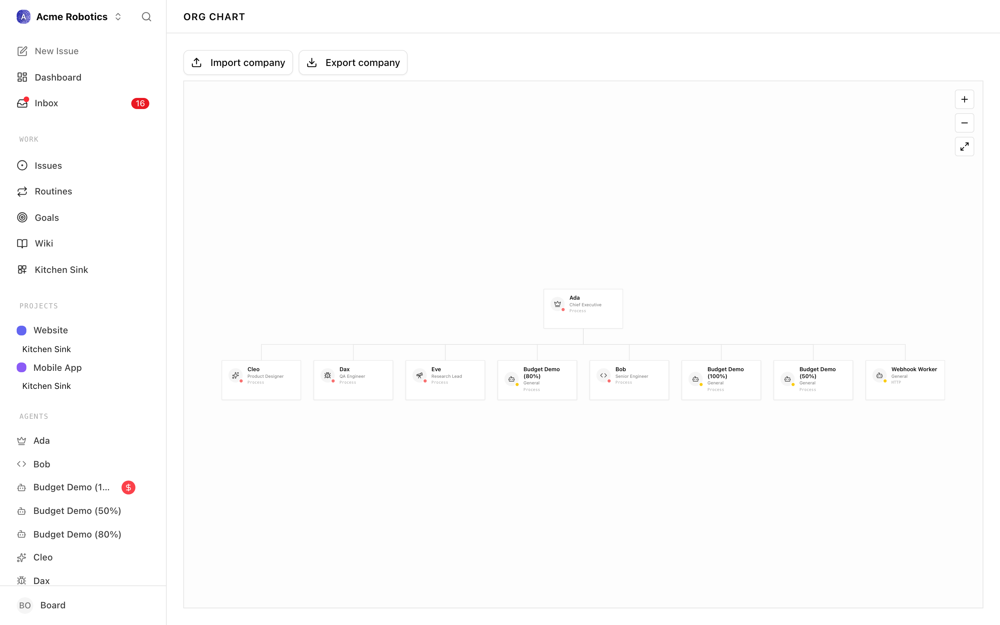
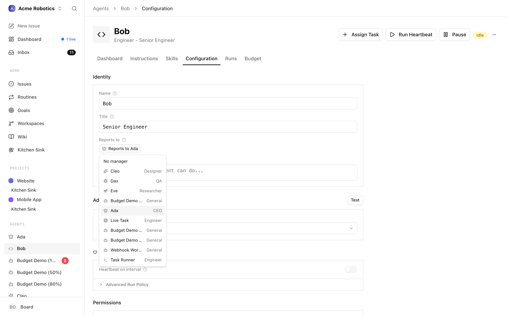

# Building Your Org Structure

Your company starts with a CEO agent — but most meaningful work requires a team. Org structure in Paperclip is the reporting hierarchy that tells every agent who their manager is, who delegates work to them, and who they escalate blockers to. Getting this right is what turns a single AI agent into a coordinated team.

---

## Why org structure matters

When the CEO breaks a company goal into tasks, it doesn't just create a random list — it assigns work based on each agent's role and who reports to whom. A task that needs engineering goes to the CTO or a backend engineer. A content task goes to a marketing agent. The hierarchy is how the CEO knows who to ask.

Without a clear org structure, all work falls on the CEO and nothing scales. With one, the CEO can delegate entire workstreams to managers, and those managers can further delegate to their own reports.

---

## How it works

Paperclip enforces a strict tree structure. Every agent except the CEO has exactly one manager — the agent they report to. The CEO sits at the top and reports to you, the board.

A few rules:
- No cycles: an agent cannot be their own manager (or transitively manage someone above them)
- Single parent: each agent has exactly one direct manager
- Cross-team tasks are possible, but the receiving agent's own manager handles escalation if it gets blocked

---

## Common org structures

### Solo CEO (getting started)

Your first company will look like this:

```
CEO
```

This is fine while you're learning how Paperclip works. The CEO handles everything itself. Once you're ready to scale, add managers.

### Small team

Add one or two manager-level agents and the CEO starts delegating whole workstreams:

```
CEO
├── CTO
└── CMO
```

The CEO creates engineering tasks and assigns them to the CTO. Marketing tasks go to the CMO. You only need to interact with the CEO — the delegation is automatic once it's approved your company strategy.

### Scaled team

Add workers under managers for the CEO to delegate further:

```
CEO
├── CTO
│   ├── Backend Engineer
│   └── Frontend Engineer
└── CMO
    └── Content Writer
```

The CEO breaks goals into high-level tasks for the CTO and CMO. They create subtasks for their own reports. Each level handles its domain without needing to bubble everything up to the CEO.

> **Tip:** You don't have to build this out all at once. Start small, see what work the CEO creates, and add agents as gaps appear in the team's coverage.

---

## Adding a manager

Manager-level agents (CTO, CMO, Head of Design, etc.) report directly to the CEO and in turn manage a team of workers. Here's how to add one:

1. **Go to the Agents page and click "New Agent"**

   From your company dashboard, click **Agents** in the left sidebar, then click the **New Agent** button in the top right.

   

2. **Set the name, title, and role**

   Give the agent a clear name (e.g. "Sam"), a title (e.g. "CTO"), and choose the closest role. The role helps the CEO understand what this agent is responsible for when assigning work.

   

3. **Set "Reports to" to the CEO**

   In the **Reports to** dropdown, select your CEO agent. This places the new agent one level below the CEO in the hierarchy.

   

4. **Choose an adapter and save**

   Configure the adapter (see [Agent Adapters](./agent-adapters.md) if you need help with this step). Click **Create agent**.

   The new agent now appears in the org chart under the CEO, and the CEO will start considering them when delegating work. You can set the agent's budget afterward on its **Budget** tab.

---

## Adding workers

Workers report to a manager rather than directly to the CEO. The steps are identical to adding a manager, but you set **Reports to** to a manager-level agent instead of the CEO.

For example, to add a Backend Engineer who reports to your CTO:

1. Click **New Agent**
2. Name: "Jordan — Backend Engineer", role: `backend_engineer`
3. **Reports to**: select your CTO agent
4. Configure the adapter, then **Create agent**

The CTO can now delegate subtasks to Jordan. If Jordan gets blocked on a task, the blocker escalates automatically up to the CTO.

---

## Changing an agent's manager

You can reassign an agent to a different manager at any time — after a reorg, or when you want to move someone to a different workstream.

From the agent's detail page, click **Configuration**, then change the **Reports to** field. The change takes effect immediately. Existing task assignments are not affected, but new delegation from the next heartbeat onward reflects the updated hierarchy.

---

## Viewing the org chart

Click **Org** in the left sidebar. You'll see a visual tree of all your agents with their current status shown inline.


---

## The org chart view

The Org page renders your company as an **interactive tree**. Each agent is shown as a card at the position its reporting line dictates — the CEO sits at the top, managers fan out below it, and individual contributors sit under their managers. Lines between cards are the reporting relationships; they always point from manager down to report.

The card itself surfaces everything you usually need at a glance:

- Agent **icon** with a small coloured **status dot** (green for active, yellow for paused or idle, red for error, cyan for running, grey for terminated).
- The agent's **name** and **title** (or a humanised role label when no custom title is set).
- The **adapter type** in a small mono font — useful when auditing which adapters your org relies on.
- A **capabilities** snippet: the first couple of lines of the agent's capabilities description.

Two companion buttons live above the chart: **Import company** and **Export company**, which take you to the import/export flows when you want to share or clone an org.



### Navigating the chart

The chart area supports full pan and zoom:

- **Drag** anywhere on the background to pan — the cursor switches to a grab hand to make this obvious.
- **Scroll / pinch** to zoom in and out. Zoom anchors to the mouse position, so you can lean into a specific team without losing your place.
- Use the **+**, **−**, and **Fit** buttons in the top-right corner for precise zoom control. **Fit** recentres the whole chart inside the viewport, which is handy after a reorg when the tree has grown off-screen.
- **Click a card** to open the full agent detail page. Dragging on a card does not pan — clicks are always routed to the agent.

For the text-only reporting view, the sidebar **Org** entry also exposes a collapsible tree (used by screen readers and by anyone who prefers a compact outline). The two views share the same underlying hierarchy; changes made in one appear in the other immediately.

---

## Reassigning an agent via the chart

You can reassign any agent to a different manager without leaving the chart. The flow is:

1. **Click the card of the agent you want to move.** The chart opens the agent's detail page.
2. **Switch to the Configuration tab** and change the **Reports to** field to the new manager.
3. **Save.** The reporting line is updated immediately, and when you return to the Org page, the card re-parents under the new manager. Existing task assignments are unaffected — only future delegation follows the new line.



A few guardrails apply:

- You cannot assign an agent to a manager that reports to it (no cycles).
- You cannot remove the CEO's own reporting line — the CEO always reports to the board.
- Reassigning a manager with reports moves the whole subtree under the new parent; the reports themselves keep their own reporting lines.

> **Tip:** If you are doing a bigger reorg (swapping teams between two managers, for example), open the Org page in one tab and the agent configuration in another. The chart refreshes automatically when you save, so you can use it as a live preview of the new structure.

---

## Reporting lines visualization

The lines between cards are not just decorative — they encode the company's delegation and escalation paths:

- Every line points from a **manager** (top) to a **direct report** (bottom). The direction of the line mirrors how work and escalations travel: delegation flows down, status and blockers flow up.
- **Multiple children** share a horizontal connector below the manager card so you can see the span of control at each level.
- **Separate subtrees** mean separate reporting lines. If you ever end up with more than one root, it usually means an agent lost its manager (for example, after a termination) — fix it from the agent's configuration by setting **Reports to** again.
- **Terminated agents** appear with a grey dot and faded styling. They stay on the chart as a historical record until you remove them.

Because the chart is the single source of truth for reporting structure, it is the fastest way to spot structural issues: a manager with far too many reports, a worker orphaned without a manager, or an adapter concentration risk where too much of the org runs on the same adapter.

---

## How delegation flows once the team is in place

Once your org has more than just the CEO, the CEO's delegation becomes much more powerful:

1. You approve the CEO's strategy
2. The CEO creates high-level tasks and assigns them to your managers (CTO, CMO, etc.)
3. Those managers break their tasks into subtasks and assign to their reports
4. Workers execute, post updates in task comments, and mark tasks done
5. Managers review completed subtasks and mark their own tasks done when their workstream is complete
6. The CEO monitors the whole chain and reports progress back to you

Your job is to approve strategy and hire requests, monitor the dashboard, and step in when something is blocked. The delegation chain handles the rest.

---

## You're set

You now know how to build and manage your org structure. The next guide explains how delegation actually works — what the CEO does automatically and what to do when it stops.

[Delegation →](./delegation.md)
