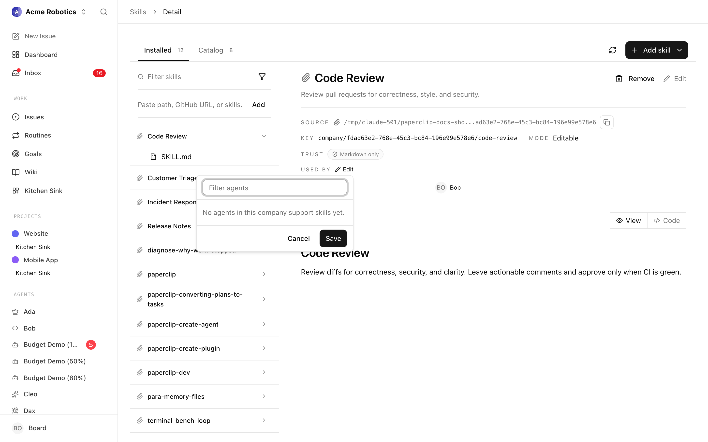

# Skills

When you want an agent to follow a specific procedure — a code review checklist, a deployment runbook, a customer response template — you could put those instructions in the agent's main configuration. But if you want multiple agents to use the same procedure, or want to keep agent configurations lean and focused, that's where skills come in.

A skill is a reusable instruction document that agents can load on demand. Instead of baking every procedure into every agent's configuration, you write a skill once in the company skill library and make it available to any agent that needs it. The agent reads the skill's description when it starts a task, decides whether the skill is relevant, and loads the full instructions only when it needs them.

---

## What a skill looks like

A skill is a folder containing a `SKILL.md` file. The file has a short frontmatter block (the routing description) and a body (the actual instructions).

```
skills/
└── code-review/
    ├── SKILL.md
    └── references/
        └── examples.md
```

The frontmatter description is what the agent reads first — it's written as decision logic so the agent knows when to use this skill:

```markdown
---
name: code-review
description: >
  Use when asked to review a pull request or code diff.
  Don't use when writing new code from scratch.
---

# Code Review

When reviewing code, check the following...
```

The agent sees the name and description for every available skill at the start of its heartbeat. If the description matches what the agent is doing, it loads the full skill content and follows the instructions.

---

## Why this matters for performance and cost

Skills keep the base context small. An agent with 10 skills doesn't load all 10 into its context on every heartbeat — it only loads the ones that are relevant to the current task. This means:

- Fewer tokens consumed per run (lower cost)
- Cleaner, more focused context for the agent (better results)
- Easier to maintain — update a skill in one place, all agents benefit

---

## Adding a skill

Skills are managed from the company-level **Skills** page. The page has a left-hand list of every installed skill and a right-hand pane that shows the selected skill's files, description, and usage. Two controls live above the skill list: a filter box to search by name, key, slug, or source, and an input where you can paste a source string to import a skill from elsewhere.

You can add a skill in one of four ways, depending on where it is coming from.

### 1. Import from a GitHub repository

Paste a GitHub URL (or a `skills.sh` install command) into the source field at the top of the Skills page and press **Add**. Paperclip clones the skill folder, detects the `SKILL.md`, and registers it in the library. GitHub-sourced skills are pinned to a specific commit — you can check for updates and upgrade the pin from the skill detail pane.


### 2. Import from a gist

Gists work through the same source field. Paste the gist URL and Paperclip treats it like a remote file source — useful when you want to share a one-off procedure without setting up a full repository.

### 3. Import from a local file or folder

You can also paste a local path (Linux, WSL, or Windows) into the source field. Paperclip walks the folder, finds any `SKILL.md` files, and imports them. This is the right choice when you already keep skills in a project workspace on disk — the scan button (circular arrow next to the plus icon) re-runs the local import across every project workspace in the company so newly added `SKILL.md` folders show up automatically.

### 4. Import from the skills.sh marketplace

[skills.sh](https://skills.sh) is a community catalog of ready-made skills. Each listing provides a copy-ready install command; paste it into the source field and Paperclip imports the skill along with its source metadata (you will see a small skills.sh badge on the skill row).

### Creating a skill from scratch

If none of those sources apply, click the **+** button next to the scan icon. A small form appears inline with three fields:

- **Skill name** — the human-readable name shown in the list.
- **Optional shortname / slug** — the `kebab-case` key the agent uses to reference this skill. If you leave this blank, Paperclip derives it from the name.
- **Short description** — the routing logic ("Use when… Don't use when…") the agent reads before loading the skill body.

Click **Create skill** and the skill is added to the library as a Paperclip-managed, editable entry.

The skill is now available in the company library. When creating or editing an agent, you can attach optional skills from that library.


---

## File inventory

Every skill is a folder, not a single file. Expanding a skill in the sidebar reveals its **file inventory** — the full tree of files underneath the skill's root. The inventory pinpoints each file with a few pieces of metadata that matter in practice:

- **Entry file** — the top-level `SKILL.md` that agents read first. It is always sorted to the top of the tree and contains the skill's frontmatter (name, description) plus the instructions body.
- **Other files** — subfolders such as `references/` or `scripts/` hold supporting material (examples, style guides, helper scripts). The file kind icon tells you at a glance whether each leaf is markdown, a reference document, or a script.
- **Editable** — a skill is editable only when Paperclip controls its source. Skills imported from GitHub, gists, or the skills.sh catalog are **read-only**: you can view any file but cannot save changes; the detail pane shows an explanation badge instead of an Edit button. Paperclip-managed and local-folder skills open in the Markdown editor when you click **Edit**.
- **Deprecated** — when a skill is retired, it is marked deprecated in the library and hidden from agent skill menus. Existing agents keep working until you detach the skill from them.
- **Virtual** — some entries in the inventory are virtual: they represent content the adapter synthesises at runtime (for example, materialised runtime skills for adapters that do not support skills natively). Virtual entries are tagged in the row and cannot be edited directly.


The header above the file viewer shows:

- The **Source** badge (skills.sh, GitHub, local folder, or Paperclip) with the source label — clicking the label copies the path to the workspace when applicable.
- The **Pin** for GitHub-sourced skills — the short commit SHA Paperclip is locked to, plus a **Check for updates** button and, when an update exists, an **Install update** action.
- The skill **Key** (the stable identifier adapters use).
- The **Mode** — Editable or Read only.
- **Used by** — the list of agents currently attached to this skill.

---

## Adapter sync preferences

Different adapters handle skills differently. The Agent → Skills tab surfaces this as a **skill application mode** just above the skill list:

- **Kept in the workspace** (`persistent`) — the adapter writes skill files into the agent's workspace directory and leaves them there between runs. Most long-running local adapters use this mode.
- **Applied when the agent runs** (`ephemeral`) — the adapter materialises skill files for each run, then cleans up afterwards. This is the default for sandboxed adapters that treat the workspace as disposable.
- **Tracked only** (`unsupported`) — Paperclip cannot push skills into the adapter, so it only records which skills you have assigned. Adapters like `openclaw_gateway` fall into this category; you will see a banner directing you to manage skills inside the remote runtime (for example, OpenClaw) rather than from Paperclip.

Assignments still save regardless of mode — the mode only controls whether Paperclip physically syncs the skill files. Warnings surface in an amber banner when, for example, a desired skill is missing from the company library or the adapter rejected a sync.

---

## Assigning a skill to an agent

Skills live at the company level, but each agent decides which of those skills to use. To assign or remove skills for an agent:

1. **Open the agent's detail page** from the Agents list or the org chart.
2. **Switch to the Skills tab.**
3. You will see three groups:
   - **Required skills** — entries the adapter marks as mandatory. You cannot disable these.
   - **Optional skills** — every skill in the company library that the agent *could* use. Each row has a checkbox; tick it to assign the skill, untick to detach.
   - **Unmanaged skills** — read-only rows for skills the adapter picked up from somewhere Paperclip does not control (for example, a global skill bundle on the host). These are shown for visibility only.
4. Changes autosave about 250 ms after you stop clicking — the small "Saving soon..." / "Saving changes..." indicator in the top-right confirms when Paperclip has persisted the update. The agent will pick up the new skill list on its next run.



A **View company skills library** link at the top of the tab jumps back to the company-wide Skills page, so you can open the underlying skill to tweak its instructions without leaving context.

> **Tip:** If a skill you expect is not in the optional list, it is not in the company library yet. Add it from the Skills page first, then come back.

---

## Trust level

Skills are loaded into agent runs as additional instructions, so where they come from matters. Paperclip uses the **Source** badge on every skill row to make that provenance obvious:

- **Paperclip-managed** — authored inside Paperclip. You have full control of the contents; these are the safest skills to give an agent.
- **Local folder** — pulled from a project workspace on the same machine. Trust level matches whatever you trust the folder itself with.
- **GitHub / skills.sh** — pinned to a specific commit or release. The pin means the skill body cannot change underneath you without an explicit **Install update** from the detail pane, so you get a second chance to review diffs before they hit your agents.
- **Gist / URL** — point-in-time imports of external content. Treat these like any third-party code: review the body before you attach the skill to an agent.

Before attaching a skill to a high-trust role (your CEO, a finance agent, an operator with access to secrets), open the skill and read its `SKILL.md` end-to-end. The **Used by** list on the detail pane makes it easy to audit which agents are already exposed to a given skill.

---

## What makes a good skill

**Write the description as routing logic.** The description is not a marketing pitch — it's the signal the agent uses to decide whether to load the skill. Include "Use when" and "Don't use when" guidance.

**Be specific and actionable.** The agent should be able to follow the skill without guessing. Vague instructions ("review the code carefully") produce vague output. Concrete checklists and steps produce consistent results.

**Include examples where they help.** Code snippets, example outputs, before/after comparisons — concrete examples are more reliable than abstract descriptions.

**Keep each skill focused on one concern.** A skill that covers code review, deployment, and customer communication is three skills fighting for attention. One skill, one purpose.

**Put supporting detail in `references/`.** If a skill needs supporting documents — style guides, example files, reference material — put them in a `references/` subfolder rather than cramming everything into `SKILL.md`.

---

## Skills across agents

Skills live at the company level, not inside one specific agent. This means:

- Your CTO and Backend Engineer can share a `code-review` skill without duplicating it
- Your CEO can use a `delegation-checklist` skill that your CMO also uses for their own task breakdown
- Updating a skill improves all agents that use it at once

You can also scan and import skills from project workspaces when you already have skill files on disk. That's useful for teams migrating existing `SKILL.md` folders into the Paperclip library.

---

## Working with skills programmatically

Most of the time you will manage skills from the UI, but the same operations are available as REST endpoints when you want to script onboarding or reproduce a known agent setup from another company.

- **List the skills attached to an agent**: `GET /api/agents/{agentId}/skills`
- **Sync the attached set**: `POST /api/agents/{agentId}/skills/sync` with `{ "desiredSkills": [...] }`. Each entry is a skill UUID, canonical key, or unique slug. The server reconciles attachments to match — adding any missing and removing any not in the list.
- **Provision skills at hire time**: pass `desiredSkills` on `POST /api/companies/{companyId}/agents` so the agent comes online with the right set already attached.

The skills must already be installed at the company level before you can attach them. For the full reference — file shape, install pipeline, canonical keys, versioning, and troubleshooting — see:

- [Skills reference](../../reference/skills.md) — everything about how skills work on disk and over the wire.
- [Agents API → Skills](../../reference/api/agents.md#skills) — request/response shapes for the agent-level routes.

---

## You're set

Skills give your agents reliable, reusable procedures that improve consistency and reduce cost. The next guide covers export and import — how to back up, share, and reuse company configurations.

[Export & Import →](../power/export-import.md)
