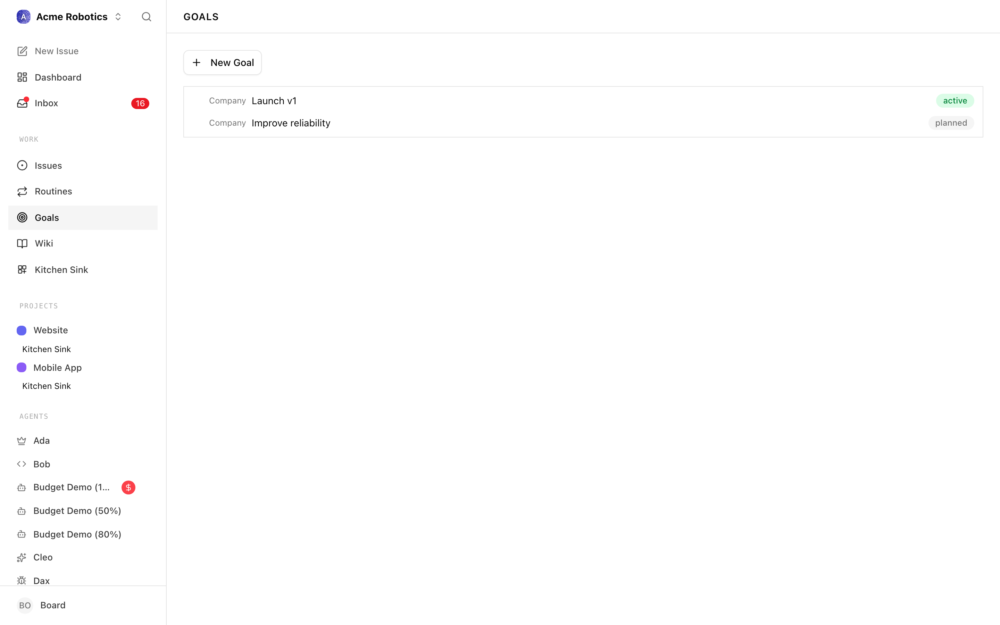
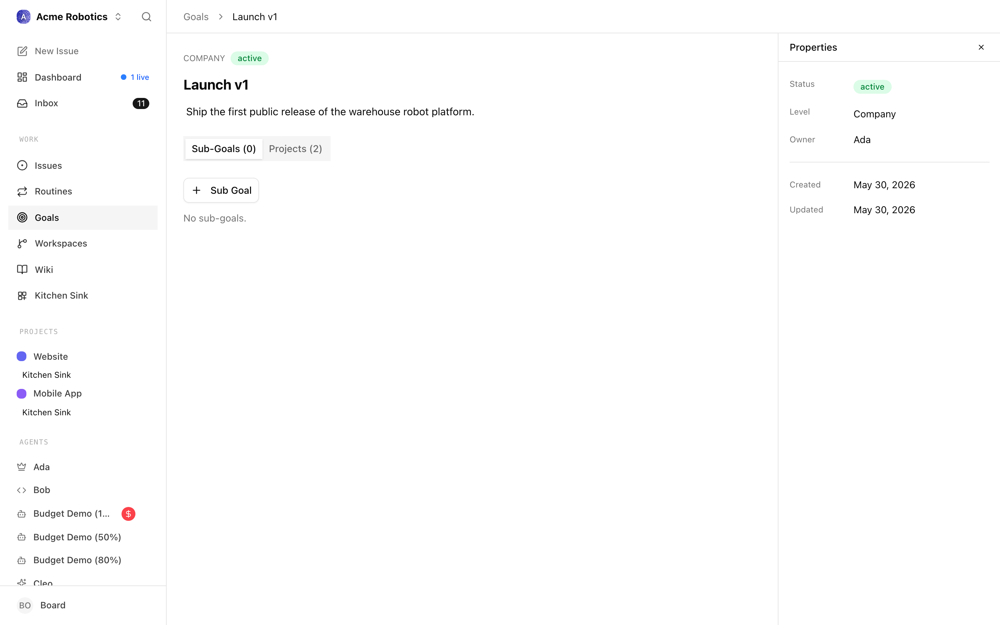

# Goals

A goal in Paperclip is an outcome statement — a description of something the company is trying to achieve. Goals sit above projects and issues in the hierarchy: they do not contain code, they do not get "worked on" directly, and they do not have an execution workspace. Instead, they act as anchors. Projects link up to goals, and the CEO's strategy typically justifies itself by pointing at which goals it is advancing.

If issues are the "what to do" and projects are the "where to do it", goals are the "why it matters". A company may have just a handful of goals — long-lived, stable, rarely changing — while underneath them the set of projects and issues churns continuously.

This guide covers:

- The goals list and how it is rendered as a tree.
- The goal detail page and its tabs.
- How projects get linked to goals.
- The goal hierarchy: parent and child (sub-)goals.

---

## Goals List

The Goals page lists every goal defined for the selected company. Because goals can have parents and children, the list is rendered as a tree rather than a flat list.



### Tree view

The tree is driven by the `parentId` field on each goal:

- **Top-level goals** have no parent. They render at the root of the tree.
- **Sub-goals** have a parent goal and render underneath it, indented.
- Child goals are grouped under their parent and can themselves have children — nesting is not limited to a single level.

Each row in the tree shows the goal's title, a status badge, and a level label (for example `company`, `team`, or whatever levels your company uses). Clicking a row navigates to the goal detail page.

### Creating a goal

When the list is non-empty, a **New Goal** button appears at the top of the page. Clicking it opens the new-goal dialog where you set the title, description, level, and optional parent. If you want to create a sub-goal of an existing goal, it is usually easier to open that goal's detail page and use the Sub Goal button from the Sub-Goals tab — it pre-fills the parent.

If the company has no goals yet, the list is replaced with an empty state and a large **Add Goal** button that opens the same dialog.

### Filters

The Goals list itself does not expose a filter bar. The tree shows every goal, at every level, for the selected company. Filtering typically happens one level down — you open a goal and inspect its linked projects or its sub-goals. If you need to find a specific goal by title, use your browser's in-page search or the company-wide search once your company has many goals.

---

## Goal Detail

Opening a goal from the tree takes you to its detail page. The layout has three regions: a header with the goal's identity, the main body with editable title and description, and a tab bar with **Sub-Goals** and **Projects** tabs.



### Header and body

The header shows:

- **Level** — the goal's level label in muted uppercase (for example `COMPANY` or `TEAM`). Levels are how Paperclip lets you separate high-level company outcomes from narrower team or workstream goals.
- **Status** — a status badge. Goals use the same status vocabulary as projects and issues for visual consistency, so you can tell at a glance whether a goal is active, achieved, or dropped.
- **Properties toggle** — a small slider icon on the right that re-opens the properties panel if you closed it. The properties panel is where you edit level, status, parent, and other metadata without having to leave the page.

The body below the header has:

- An inline-editable **title**. Click it to edit; it saves when you blur.
- An inline-editable **description** that supports multiline markdown. You can paste or drop images into the description — they are uploaded under the goal's asset area. Use the description to write the "success looks like" narrative for the goal: what has changed in the world when this goal is achieved?

### Tabs

Underneath the body the page splits into two tabs:

- **Sub-Goals (N)** — the goal's child goals, rendered as the same tree view used on the main Goals page, scoped to this goal's descendants. A **Sub Goal** button opens the new-goal dialog with the parent pre-filled.
- **Projects (N)** — every project that is linked to this goal. Each row is a compact project entity row: color, name, description preview, and a status badge. Clicking a row opens the project detail page. If there are no linked projects, the tab shows a muted "No linked projects." message.

The counts in the tab labels update as you add, remove, or unlink children and projects, so the tab bar doubles as a quick summary of how much sits under this goal.

### Progress rollup

Paperclip does not compute a numerical percentage on goals. The goal's status field is the one authoritative signal — set by a human (or by the CEO when the goal is clearly achieved or abandoned). For a qualitative rollup, the Projects tab is the place to look: the shape of the linked projects' statuses (how many are `in_progress` vs `completed` vs `backlog`) tells you how the goal is tracking without forcing the system to invent a synthetic progress number.

If you want more granular signal, drill into individual projects and inspect their Issues tabs.

---

## Linking Issues and Projects to a Goal

Goals do not contain issues directly. Instead, the relationship goes through projects: a project is linked to one or more goals, and every issue inside that project inherits the link implicitly. When the CEO plans work, this is the chain it follows:

```
Goal  →  Project  →  Issue  →  Execution workspace  →  Agent run
```

### Linking a project to a goal

There are two symmetric ways to establish the link:

- **From the project side** — open the project's Configuration tab (see [Projects](./projects.md)) and add the goal under the Goals field. The change saves automatically.
- **From the goal side** — open the goal detail page, switch to the Projects tab, and use the project picker in the linking UI. This is useful when you have a new goal and want to attach several existing projects to it in one sitting.

A project can be linked to multiple goals. This is intentional: a single body of work often advances more than one outcome, and forcing a single-parent relationship would hide that.

### Linking individual issues

Because the link travels through projects, there is no separate "assign issue to goal" UI at the issue level. Move the issue between projects to change its goal attribution, or link the issue's project to the goal you want it to roll up to.

If you need an issue to appear under a different goal without moving it to a different project, the right move is usually to link the project to that additional goal rather than special-casing one issue.

### Why the indirection matters

Keeping goals at the project layer, not the issue layer, avoids a common failure mode where a goal accumulates hundreds of directly-linked issues and becomes unreadable. Projects are the natural grouping for issues; goals are the natural grouping for projects. The two-step hop is the feature, not the bug.

---

## Goal Hierarchy

Goals can nest via the **parent goal** relationship. A goal with no parent is a root goal; a goal with a parent is a sub-goal of that parent.

### When to use sub-goals

Use sub-goals when an outcome is big enough that it needs to be broken into distinct, independently-trackable pieces. A root goal "Ship the public beta" might have sub-goals for "Core product ready", "Pricing and billing live", and "Launch plan executed". Each sub-goal can then have its own linked projects and status, while the root goal stays at the level of the overall narrative.

Do not use sub-goals as a substitute for projects. If the work is concrete enough that you can point at a repository and start running issues, it should be a project, not a sub-goal.

### Creating a sub-goal

From the parent goal's detail page, switch to the Sub-Goals tab and click **Sub Goal**. The new-goal dialog opens with the parent pre-filled. Fill in the title, description, and level, then save.

You can also create a sub-goal from the main Goals page by choosing a parent in the dialog; the two entry points produce identical results.

### Reparenting and flattening

Moving a goal between parents is done from the goal's properties panel — change the parent field, and the tree re-renders. Flattening a sub-goal to a root goal is the same action, with the parent set to none.

Deep hierarchies are rarely the right answer. Two or three levels is usually enough to capture the structure without making the tree tedious to read.

### Status propagation

Paperclip does not auto-compute a parent goal's status from its children. The status field on each goal is independent. This keeps things predictable — a human (or the CEO) stays in charge of declaring when an outcome is achieved — at the cost of having to update parent statuses by hand when the work underneath is clearly done.

---

## Where to go next

- The project layer that sits under goals: [Projects](./projects.md).
- How issues pick up agents: [Managing Tasks](../day-to-day/issues.md).
- How the CEO builds a strategy that references your goals: [Approvals](../day-to-day/approvals.md).
