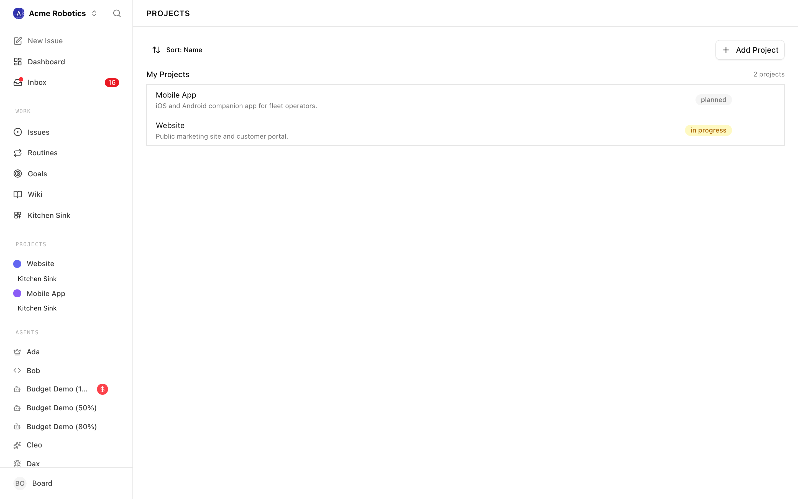
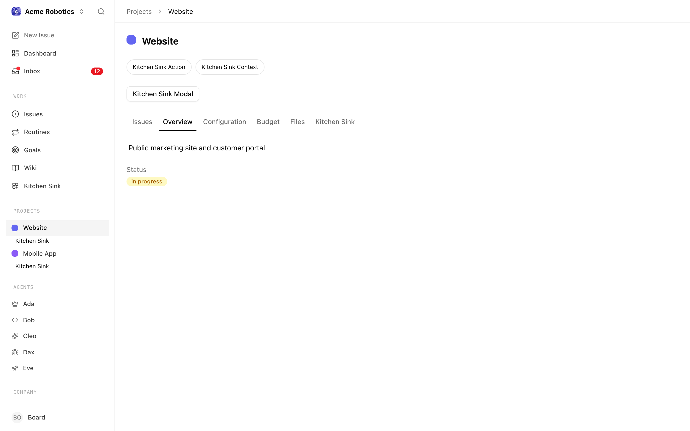
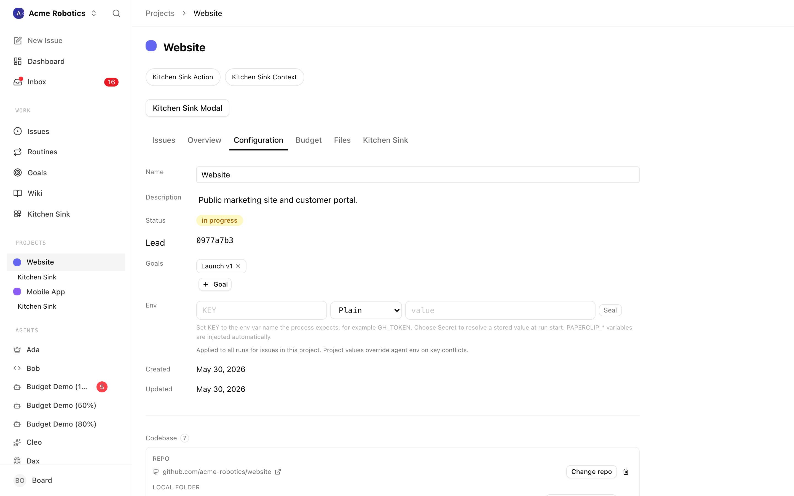
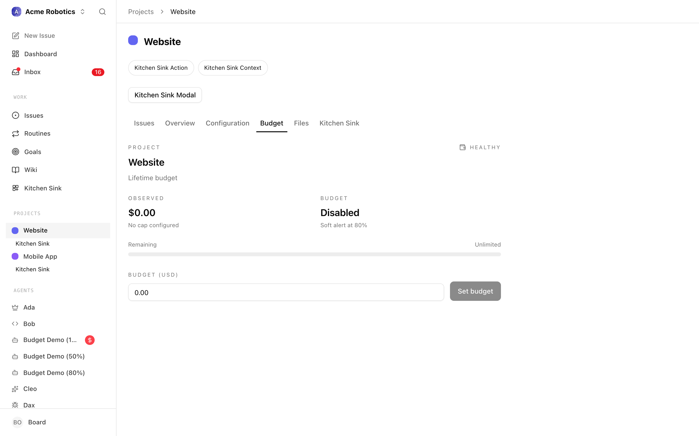

# Projects

A project is the container Paperclip uses to group related work. If goals answer "why are we doing this?" and issues answer "what exactly needs doing?", projects sit in between: they bind a body of work to a concrete place — a repository, a working directory, a budget envelope, a set of execution workspaces — where agents can actually pick up tasks and make progress.

Every issue in Paperclip lives under a project. Every execution workspace is scoped to a project. Budgets can be pinned to a project. When you tell an agent "work on the marketing site", you are really telling it "work on issues in the Marketing Site project, using the code and configuration the project points at". Projects are how the abstract strategy the CEO writes becomes something concrete an agent can check out and run.

This guide walks through the project list, then the five tabs you see when you open a project: **Overview**, **Issues**, **Workspaces**, **Configuration**, and **Budget**.

---

## Project List

The Projects page lists every active (non-archived) project in the currently selected company, sorted by creation order, with an **Add Project** button in the top right.

### Row anatomy

Each row is a single project entry. Reading left to right you see:

- **Color swatch** — a small square in the project's color. The color is chosen when the project is created and can be changed on the project detail page. Use it to visually scan related projects; it has no functional meaning.
- **Project name** — the main title. Clicking anywhere on the row opens the project detail page and defaults to the Issues tab (unless you previously visited the project, in which case Paperclip restores the tab you last used).
- **Description** (subtitle) — the first line of the project description if one has been set. If the project has no description, this area is empty.
- **Target date** — the project's target completion date if set. Shown on the right in muted text. Projects without a target date omit this field.
- **Status badge** — the current project status: `backlog`, `planned`, `in_progress`, `completed`, or `cancelled`. The badge color is consistent with issue status badges used elsewhere in the app.

Archived projects are filtered out of this list. You can still reach them by following a direct link, and you can unarchive them from the project's Configuration tab.

### Filters and actions

The list itself does not expose filter controls; it simply shows every active project in the company. If you need to narrow things down, the navigation crumbs at the top of the page and the company switcher in the sidebar are the main tools.

The top-right **Add Project** button opens the New Project dialog, where you can set the name, description, target date, initial status, and color. The Configuration tab is where you come back later to change repository bindings, environment variables, and execution workspace behaviour — the create dialog only covers the minimum a project needs to exist.

If the company has no projects yet, the list is replaced with an empty state prompting you to add the first one.

---

## Overview Tab

The Overview tab is the light-weight, human-readable summary of a project. It is the right place to land when someone asks "what is this project about?" without diving into issues or configuration.

### What you see

- **Description** — an inline-editable markdown block. Click anywhere in the description area to start editing; the value saves when you blur the editor. If there is no description yet, you see a placeholder prompting you to add one. Images can be pasted or dropped and will be uploaded to the project's asset area.
- **Status** — the current project status rendered as a status badge. To change the status you open the Configuration tab; the Overview tab is read-only for this field.
- **Target date** — shown when one has been configured. Like status, the Overview tab only displays this; editing lives in Configuration.

### Linked goals and progress

Goals linked to the project are surfaced in the properties panel on the right of the project page (not in the Overview body itself). Linking a project to one or more goals is how the CEO's strategy connects to executable work: a goal describes an outcome, and any project linked to it inherits that outcome as its reason for existing. See the [Goals guide](./goals.md) for how goals are defined and how to link or unlink them.

Progress on a project is implicit: Paperclip does not maintain a single "percent complete" field. Instead, progress is the shape of the Issues tab — how many issues are `todo`, `in_progress`, `in_review`, `done`, or `cancelled`. If you want a rolled-up view, read the Issues tab with the status grouping turned on.

### When to use the Overview tab

Use Overview as:

- A landing page for collaborators who are new to the project.
- A place to keep a short, living summary of scope and non-goals.
- The first tab you open when an approval references a project you did not set up.

For everything else — triage, configuration, workspaces, budget — use the other tabs.

---

## Issues Tab

The Issues tab is the project's task board. It is the same issue list you see on the global Issues page, pre-filtered to this project. For most day-to-day work this is the tab you will spend the most time on.

### What is shown

The tab renders the shared issues list component, so the columns, grouping, and sorting controls are identical to the global view:

- Issues are grouped by status (`todo`, `in_progress`, `in_review`, `done`, `blocked`, `cancelled`, `backlog`) by default.
- Each row shows the issue identifier, title, assignee, priority, and any live-run indicator when an agent is currently executing against the issue.
- Live run indicators refresh every few seconds while the tab is open, so you can watch a run pick up, advance, and finish without refreshing the page.

### Filtering and view state

Your view settings on this tab — grouping, sort order, which statuses are collapsed — are persisted separately from the global issues view under a per-project key. Switching to another project and back restores the same layout. Switching to the global issues list does not disturb the project-scoped view.

There is no separate "filter by project" control here because the list is already scoped to the project. You can still filter by assignee, priority, label, or free-text search within the project.

### Creating issues in the project

Issues created from this tab default to the current project, so you do not have to set the project field by hand. If you need to create an issue in a different project, either switch to that project first or use the global issue creation dialog and pick the project explicitly.

### Relationship to execution workspaces

Each issue may be tied to an execution workspace — a specific working copy of the project's code — when the issue is picked up by an agent. The Workspaces tab (next section) groups issues by the workspace they are running in, which is often a more useful lens once work is in flight. See [Execution Workspaces](./workspaces.md) for the underlying model.

---

## Workspaces Tab

The Workspaces tab shows the execution workspaces currently attached to the project. It only appears when the company has the **isolated workspaces** experimental setting enabled and the project has at least one non-default workspace with activity. On projects without isolated workspaces, Paperclip redirects you to the Issues tab instead.

### What a workspace row represents

Each row on the Workspaces tab is a summary card combining:

- A workspace identity — its name, underlying working directory or git worktree path, and status.
- The issues currently running in that workspace, so you can see what work is tied to it.
- Runtime service controls — Start, Stop, and Restart buttons for any runtime services the workspace exposes (dev servers, watchers, databases). Runtime services are not auto-started; you control them from this card.
- A **Close workspace** action that opens the workspace close dialog. Closing a workspace stops its runtime services and archives it.

Workspaces whose status is `cleanup_failed` are grouped into a separate section labelled **Cleanup attention needed**, rendered in amber. These are workspaces that could not be fully torn down and need a human decision — either retry the close action, or investigate the underlying path manually.

### Project primary vs. isolated workspaces

The project's primary working directory is not shown as a separate row here — it is the implicit default every issue runs in when no isolated workspace is provisioned. This tab lists the non-default workspaces only. For the full mental model of primary, isolated, and reused workspaces, see [Execution Workspaces](./workspaces.md).

### When agents create workspaces

Agents create isolated workspaces implicitly when they pick up an issue that is configured to run in isolation, or when you explicitly request one. The Workspaces tab is the place to monitor, manage, and close those workspaces over time. If the list grows long, closing the oldest completed ones is safe — once the underlying branch has been merged or discarded, the workspace no longer serves a purpose.

---

## Configuration Tab

The Configuration tab is where the project's editable properties live. Most of these fields auto-save as you edit: you will see a small **Saving / Saved / Failed** indicator next to the field, and there is no explicit save button.

### Basic properties

- **Name** — the project name shown in the list and in every breadcrumb. Changing it is safe; links that use the project's slug continue to resolve.
- **Description** — the full description, rendered as markdown. Matches the description on the Overview tab; edit either location and the value stays in sync.
- **Status** — one of `backlog`, `planned`, `in_progress`, `completed`, or `cancelled`. Use this to communicate the overall state of the project to the team and to the CEO; it does not affect whether agents can pick up issues in the project.
- **Goals** — the list of goals the project is linked to. Add or remove goal links here; linked goals appear on the Overview area and in the properties panel. See the [Goals guide](./goals.md) for the goal model.

### Repository binding and working directory

Projects can be bound to either a local folder (`cwd`), a remote repository (`repoUrl`), or both:

- **Local folder only** — for projects where the code lives on the machine Paperclip is running on. Agents work directly in this folder (or in isolated worktrees derived from it).
- **Remote repository only** — for projects where Paperclip clones or references a remote repository. Useful when no local checkout exists yet.
- **Both** — the most common setup: a local checkout that also tracks a remote URL. Both references are kept so tooling that needs one or the other has it available.

The **Choose path** action helps you pick a local folder via the native OS file picker.

### Environment variables

Each project can define environment variables that are injected into agent runs and execution workspace commands. These are managed through the environment variable editor on this tab:

- Add, rename, and delete variables inline.
- Secret-valued variables are stored via the secrets store and rendered masked.
- Variables set at the project level override nothing at the company level; they simply extend the environment an agent sees when it runs inside this project.

### Execution workspace configuration

When isolated workspaces are enabled for the company, the Configuration tab exposes the per-project knobs:

- **Execution workspace enabled** — whether this project participates in isolated workspaces at all. If off, every issue runs in the project primary workspace.
- **Default mode** — the default workspace mode for new issues: isolated (new workspace), reuse existing, or project primary. Individual issues can override.
- **Base ref** — the git ref (branch, tag, or commit) new isolated workspaces branch from.
- **Branch template** — the naming convention Paperclip uses when it creates new branches for isolated workspaces (e.g. a template that includes the issue identifier).
- **Worktree parent directory** — where Paperclip places new git worktrees on disk.
- **Provision command** — an optional command run after a new workspace is created (for example, to install dependencies).
- **Teardown command** — an optional command run before a workspace is closed.

These settings map to the behaviours described in [Execution Workspaces](./workspaces.md). You will usually set them once per project and rarely touch them again.

### Archive and unarchive

At the bottom of the Configuration tab is the **Archive** action. Archiving hides the project from the project list and from most pickers, but it does not delete anything: issues, workspaces, and history remain intact. Archived projects can be unarchived from the same control.

When you archive, the page navigates back to the dashboard and shows a confirmation toast. If the archive fails (for example because of a server error), a failure toast appears and the project remains active.

### Pause by budget hard stop

If the project is currently paused because its budget policy hit a hard stop, a red **Paused by budget hard stop** pill appears at the top of the project page (not inside this tab specifically, but worth noting here because the resolution path is the Budget tab). Resume the project either by raising the budget or by resolving the budget override approval.

---

## Budget Tab

The Budget tab is where the project-scoped budget policy lives. This is a project-level cap, distinct from:

- **Agent budgets** — per-agent caps, set on each agent's configuration.
- **Company budgets** — the overall cap for the company.

Project budgets are useful when a single project needs a hard spending ceiling independent of the agent doing the work. For a first principles tour of budgeting, see [Costs & Budgets](../day-to-day/costs.md).

### Reading the budget card

The Budget tab renders a single policy card for this project's budget:

- **Scope** — always `project` on this tab, targeting the current project's id and name.
- **Metric** — `billed_cents`. Paperclip tracks billable cost in cents and converts to a currency figure for display.
- **Window** — `lifetime`. Project budgets default to a lifetime cap rather than a rolling window; the total spend against the project counts against the amount.
- **Amount** — the configured cap. Editable in the card.
- **Observed amount** — how much has been spent so far against the project.
- **Remaining amount** — amount minus observed.
- **Utilization percent** — the observed share of the cap, with a warn threshold (default 80%) after which the card visually signals that the project is approaching its limit.
- **Hard stop enabled** — when true, exceeding the cap pauses the project automatically. This is the behaviour that triggers the "Paused by budget hard stop" pill described above.
- **Notify enabled** — when true, the company is notified as the project crosses the warn threshold.
- **Paused** — whether the project is currently paused (and why, in **Pause reason**).

### Setting or changing the amount

Click the amount field, enter the new cap in dollars (the UI converts to cents), and save. The change invalidates the budget overview, the project detail view, the project list, and the dashboard, so every surface that shows a budget number updates.

If the project has no explicit policy, the card is rendered in a placeholder state with zero amount, zero observed, and `isActive: false`. Saving a non-zero amount creates the policy.

### Distinct from agent and company budgets

A project budget does not replace agent budgets or the company budget. All three apply in parallel:

- An agent hitting its own budget stops, regardless of project budget headroom.
- A project hitting its budget pauses the project, regardless of which agent was working in it.
- The company budget is the overall ceiling; if it stops, no agents in any project can spend further.

See [Costs & Budgets](../day-to-day/costs.md) for how these three interact, how to read the company-wide cost overview, and how to resolve a budget override approval when a hard stop is reached.

### Resume after a hard stop

When the project is paused by a hard stop, you have two options:

1. **Raise the amount** from the Budget tab. Once the new amount exceeds observed spend, the project can resume on the next run.
2. **Resolve the budget override approval** from the approvals queue. Budget approvals are the formal path an agent uses to ask for more headroom without a human manually raising the cap.

Both flows are described in more detail in the approvals and costs guides.

---

## Where to go next

- Task-level work: [Managing Tasks](../day-to-day/issues.md).
- The goal model that sits above projects: [Goals](./goals.md).
- The execution surface beneath projects: [Execution Workspaces](./workspaces.md).
- Budget mechanics in more depth: [Costs & Budgets](../day-to-day/costs.md).
