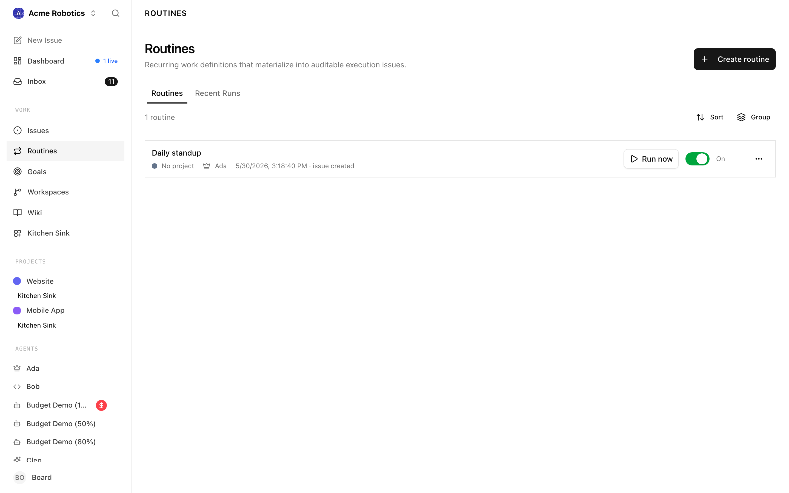
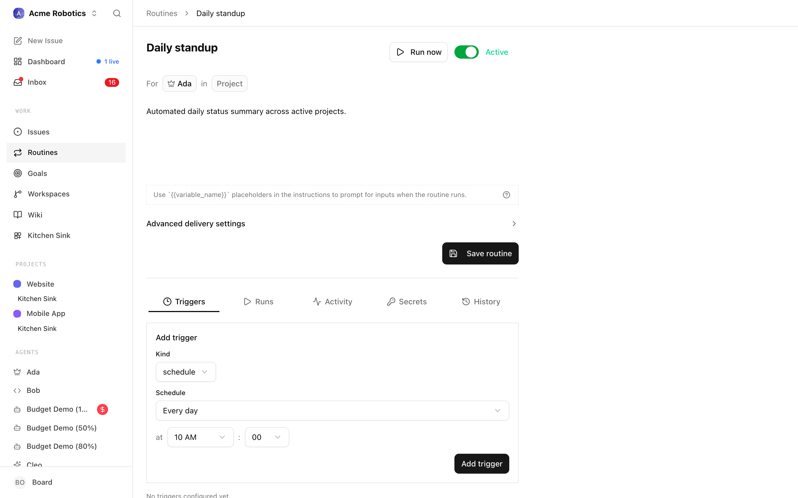
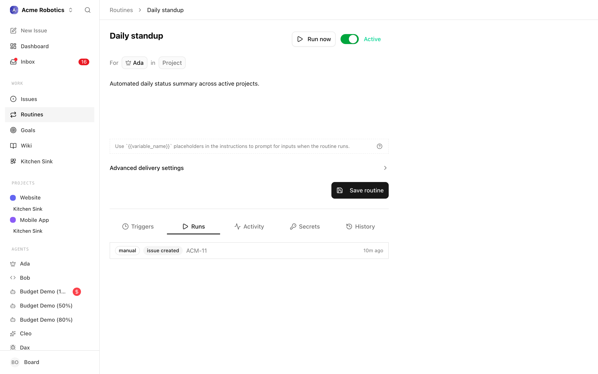
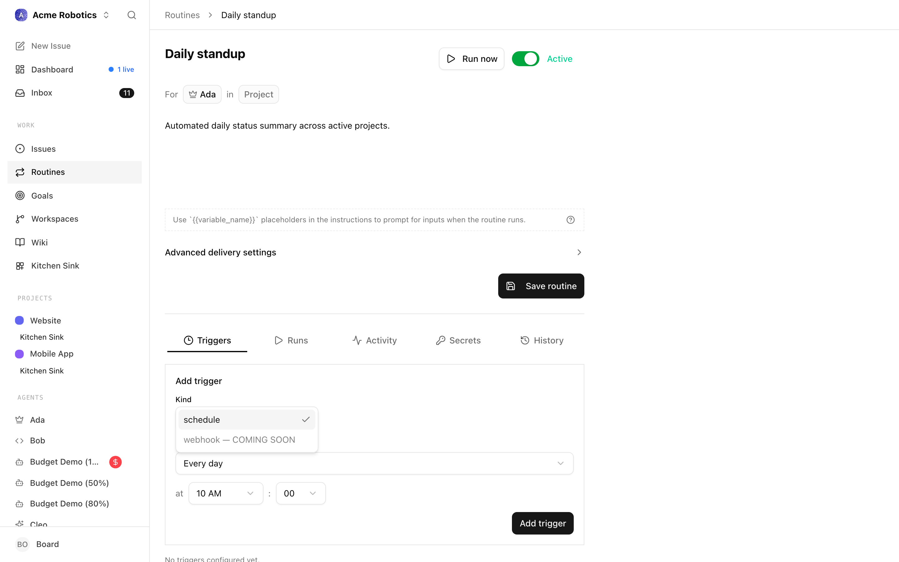

# Heartbeats & Routines

When you first hire a few agents, it's tempting to give each one a timer — "wake up every few minutes and see if there's anything to do." It feels proactive. In practice, it's the fastest way to end up with a sidebar full of paused agents, surprise token bills, and a dashboard you have to fight with just to keep things quiet.

Paperclip is designed around a different default: agents stay dormant until real work arrives. This guide explains the two mechanisms that drive an agent — **heartbeats on an interval** and **routines** — and when to reach for each one. It also walks through the Routines UI, from the list view down to the detail page where you configure triggers, variables, and run history.

---

## The two ways an agent starts running

An agent can be woken up in four ways:

| Source | What triggers it |
|---|---|
| **Timer** | A heartbeat interval ticks (e.g. every 5 minutes, whether or not there's work) |
| **Assignment** | A task is assigned to the agent, or a new comment arrives on one of its open tasks |
| **On demand** | You click "Wake now" in the UI, or another agent hands it work |
| **Automation** | A routine fires on its schedule and hands the agent an issue to execute |

The first — timer — is the only one that wakes an agent without anything having actually happened. The other three are event-driven: the agent runs *because there's something to do*, not *in case there's something to do*.

---

## Why timer heartbeats are opt-in

A new agent ships with timer heartbeats **turned off** by default. That's deliberate, and it's the setting you should usually keep.

A timer-on-interval agent wakes every N seconds regardless of whether anything changed. Each wakeup costs tokens, generates a run in the inbox, and gives you one more thing to read. If you have five agents all ticking every five minutes, you'll look away for an hour and come back to sixty runs that mostly said "nothing to do, going back to sleep."

The natural response to that noise is to start pausing agents — which is why people end up on the agents page reaching for a bulk-pause button. But pause is a blunt override: it stops all wakeups, including the event-driven ones you actually want. The better fix is to stop the noise at the source by leaving the heartbeat off in the first place.

> **Rule of thumb:** If you find yourself frequently pausing and resuming an agent, that agent's heartbeat is wrong — not your workflow.

---

## Heartbeat settings on an agent

Open any agent and find the **Run Policy** section. You'll see:

- **Heartbeat on interval** — the master switch. Off by default. Turn it on only when the agent needs to poll something that doesn't have its own event trigger (see "When a timer is the right answer" below).
- **Run heartbeat every _N_ sec** — only visible when the interval is on. If you need a timer at all, prefer minutes or hours, not seconds.

Under **Advanced Run Policy** you'll also find:

- **Wake on demand** — leave this on. It's what lets assignments, comments, and routines reach the agent.
- **Cooldown (sec)** — minimum gap between runs, useful for bursty work.
- **Max concurrent runs** — how many tasks the agent can work in parallel.

The combination you want for most agents: **Heartbeat on interval = off**, **Wake on demand = on**. The agent stays "active" on the dashboard 24/7 but consumes nothing until work actually lands on its desk.

---

## Routines — scheduled work the right way

Routines are where scheduled work belongs. A routine is a reusable job definition with a trigger attached to it. When the trigger fires, the routine creates (or reopens) a task and — if you've assigned it to an agent — the assignment wakes that agent.

Two trigger kinds are supported:

- **Schedule** — a cron expression in your timezone. "Every weekday at 9am", "the first of every month", "every Sunday at midnight". Paperclip computes the next run and fires on that clock.
- **Webhook** — a signed URL you can call from anything outside Paperclip. Useful when another system should kick off the work.

You'll find routines on the **Routines** page in the sidebar.

### Creating a routine

1. Open the **Routines** page and click **New Routine**
2. Give it a title and a short description of what the task should do
3. Add a trigger. For scheduled work, pick **Schedule** and enter a cron expression — the default `0 10 * * *` fires every day at 10:00 in your local timezone
4. Assign it to the agent that should handle the work
5. Save and enable it

When the trigger fires, Paperclip creates a task, assigns it to the agent, and that assignment wakes the agent immediately. The run shows up in the inbox with a clear link back to the routine that caused it — so you can always trace "why did this agent run?" back to a specific cause.

### Routine policies worth knowing

Two policies control what happens when schedules overlap or the scheduler has been offline:

- **Concurrency policy** — what to do if the routine is still running when the next tick arrives. Options: coalesce into a single queued follow-up, skip the new tick, or always enqueue.
- **Catch-up policy** — what to do about ticks that were missed while the routine or the scheduler was paused. Options: skip the missed windows, or catch up in capped batches.

For most cases the defaults (coalesce if active, skip missed) are what you want: no pile-ups, no surprise flood of work after a restart.

---

## The Routines list



The Routines page is reached from the sidebar and opens on a **Routines** tab plus a **Recent Runs** tab. The header shows the total count of routines and a **Create routine** button.

### List columns and badges

Each routine row surfaces:

- **Title** — the routine name. A small grey label appears beside it when the routine is not active: `paused`, `draft` (no default agent assigned), or `archived`.
- **Project** — a coloured square and the project name, or "No project" when the routine has none set.
- **Default agent** — the agent's icon and name, or "No default agent" for drafts.
- **Last run** — a localised timestamp for the most recent execution, followed by its status (for example `succeeded`, `failed`, `running`). Rows that have never fired show "Never".
- **Enabled toggle** — a large switch that flips the routine between `active` and `paused`. The label to the right reads `On`, `Off`, `Draft`, or `Archived`. The toggle is disabled for archived routines.
- **More menu** — a kebab that exposes `Edit`, `Run now`, `Pause`/`Enable`, and `Archive`/`Restore`.

Clicking the row opens the detail page. Actions inside the toggle and dropdown do not navigate — they stay on the list.

### Grouping and filtering

Above the list you'll find a **Group** popover with three options:

- **Project** — groups routines by their default project, with "No project" as its own section.
- **Agent** — groups by default assignee, with "Unassigned" for draft routines.
- **None** — the flat default.

Group headers are collapsible and their open/closed state is persisted per company in local storage, along with the chosen grouping, so reloading keeps your view.

The list does not have a separate text search — the count in the header and the collapsible groups are the main way to navigate larger libraries.

### Creating a routine from the list

Clicking **Create routine** opens a modal composer. The composer walks you through the minimum a routine needs to exist:

- **Title** — an auto-sizing text area. Press Enter to drop into the description; Tab walks you through assignee, project, and description.
- **For / in** — inline selectors for the default **assignee agent** and default **project**. Both are optional at creation time. Recently-used assignees float to the top of the list.
- **Instructions** — a Markdown editor. Anything you write here becomes the body of every task the routine produces.
- **Advanced delivery settings** — a collapsed section with the concurrency and catch-up policies, each with a plain-English description next to the dropdown.

Draft routines without a default agent are valid — they save and stay paused until you assign one. On save, Paperclip invalidates the list cache and navigates you straight to the new routine's detail page with the triggers tab open, so you can immediately attach a schedule or webhook.

### Run now, pause, archive

- **Run now** opens a small dialog where you can fill in runtime variables, override the assignee or project for just this run, and pick an execution workspace if the routine uses one. On submit the run enqueues as a real execution issue.
- **Pause** flips the routine's status to `paused`. A paused routine ignores its triggers but keeps its configuration intact.
- **Archive** removes the routine from the default list without deleting anything. Archived routines can be restored later.

### Recent Runs tab

The second tab on the Routines page is a read-only issue list filtered to `originKind = routine_execution`. It uses the same IssuesList component as other issue views, so you get the same columns, live-run indicators, grouping, and inline updates. A background poll refreshes live runs every few seconds so in-flight executions show their progress without a page reload.

The Recent Runs view is the fastest way to answer "did all my morning routines run?" — it is routine-scoped but agent-agnostic, and rows link directly to the execution issue they produced.

---

## The routine detail page



Opening a routine drops you on the detail page. The layout is deliberately narrow — a single editable column — because a routine is really just a task template plus a trigger, and the form is meant to feel like writing a task.

### Header

The header packs a lot into one row:

- **Editable title** — click the title to edit inline. Enter jumps to the description; Tab walks through the selectors.
- **Run button** — opens the same "run now" dialog as the list row. This is the manual override for any routine.
- **Automation toggle** — the large switch. On = `active`, off = `paused`. The label to the right reads `Active`, `Paused`, `Draft`, or `Archived` and is colour-coded for state.
- **Draft banner** — if the routine has no default agent yet, a banner explains that it can still run manually but automation stays paused until an agent is assigned.

Below the header is the assignment row — an inline "For [assignee] in [project]" statement that edits the defaults — followed by the Markdown instructions editor. Any change to these fields is tracked as dirty state; a `Save` action appears when there's anything to persist.

### Tabs: Triggers, Runs, Activity

The detail page has three tabs, selected via `?tab=` in the URL so you can deep-link:

- **Triggers** — the default. Lists every trigger attached to the routine and provides a composer to add new ones.
- **Runs** — the execution history for this specific routine.
- **Activity** — a structured audit log of edits, enables, pauses, trigger changes, and secret rotations.

### Run history and the next-run countdown



The Runs tab lists every execution the routine has produced, newest first. Each run shows its triggered-at timestamp, the trigger that caused it (schedule, webhook, or manual), the resulting issue link, and the final status. When a run is currently live, a `LiveRunWidget` attaches to the row and polls every three seconds so you can watch it progress without reloading.

On the Triggers tab, each scheduled trigger shows a "Next:" line with the resolved local timestamp of its next fire. That value is computed server-side from the cron expression plus the trigger's timezone, so the countdown reflects real scheduler intent rather than browser-local math. Webhook triggers show a `Webhook` label in the same slot, and manual triggers show `API`. Every trigger also surfaces its last result — `succeeded`, `failed`, or a short error — so you can spot a misfiring webhook without leaving the page.

---

## Cron picker



When you add or edit a schedule trigger, Paperclip replaces the raw cron input with a **ScheduleEditor**. The editor is a small form with a preset dropdown plus follow-up fields that appear based on what you picked:

- **Every minute** — no extra fields. Emits `* * * * *`.
- **Every hour** — a minute selector. Emits `M * * * *`.
- **Every day** — hour and minute selectors. Emits `M H * * *`.
- **Weekdays** — hour and minute selectors. Emits `M H * * 1-5`.
- **Weekly** — day-of-week, hour, minute. Emits `M H * * D`.
- **Monthly** — day-of-month, hour, minute. Emits `M H D * *`.
- **Custom (cron)** — a raw expression field for anything the presets don't cover.

Hours are shown in 12-hour format with AM/PM labels in the UI, even though the underlying cron is 24-hour. Minutes snap to five-minute increments in the preset modes (0, 5, 10, ...), matching the resolution of the scheduler. Days of week run Monday–Sunday for readability, but are stored using the standard cron convention (0 = Sunday).

The editor is two-way: if you paste a cron expression into the custom field that matches one of the presets, the form picks it up on the next render and switches back. Expressions it can't classify stay on "Custom" so you never lose an edit.

Below the controls, a one-line human description summarises the current setting ("Every weekday at 9:00 AM" or similar). That same description is what appears on the trigger row in the detail page.

### Timezone handling

Every schedule trigger is saved with an explicit **timezone**, derived from the browser's `Intl.DateTimeFormat().resolvedOptions().timeZone` at creation time. The scheduler evaluates cron expressions in that timezone, not in UTC. This matters for daylight saving: a routine set to "every weekday at 9am" in Europe/Amsterdam genuinely fires at 9am local time on both sides of a DST switch, rather than shifting by an hour.

If you need to change the timezone later (for example, you moved), open the trigger and re-save — the editor stamps the current browser timezone onto the updated record. The `Next:` countdown on the detail page is always rendered in your current local time, regardless of which timezone the trigger was originally saved with.

### Webhook triggers

Webhook triggers skip the cron editor entirely and show two fields instead:

- **Signing mode** — `bearer`, `hmac_sha256`, `github_hmac`, or `none`. Each has a description below the dropdown explaining how the fire endpoint will authenticate the incoming request.
- **Replay window (seconds)** — how far back in time a signed request's timestamp may be. Hidden for `github_hmac` and `none`, which don't carry a timestamp.

When you create a webhook trigger, Paperclip returns a one-time banner with the webhook URL and secret. **This is the only time the secret is shown** — copy it now. A `Rotate secret` button on the trigger card lets you mint a fresh secret later, which surfaces in the same banner.

---

## Variable templates

Routines can accept **variables**: named inputs that you reference inside the title or instructions using `{{name}}` placeholders. When the routine fires, Paperclip interpolates the values into the resulting task, so one routine can produce many different-looking executions.

### Defining variables

Variables are detected automatically. Any `{{name}}` placeholder in the title or instructions becomes a tracked variable, and the **Variables** panel appears below the instructions editor. For each detected variable you can set:

- **Type** — `text`, `textarea`, `number`, `boolean`, or `select`.
- **Label** — a friendly name shown on the run-now dialog.
- **Default value** — the baseline used when nothing else is provided.
- **Options** — a comma-separated list, only for `select`. The options become a dropdown on the run dialog.

Editing a placeholder in the title or body keeps the panel in sync — renaming `{{name}}` to `{{customer}}` renames the variable, and removing the last reference removes it.

### Using variables at run time

When a trigger fires, the current default values are substituted in and the task is created. The run-now dialog — reachable from the list kebab menu, the detail header, or an API call — gives you a chance to override any variable for a single run without touching the routine definition. It also lets you override the assignee and project just for that run.

Variables flow through to the execution issue by way of simple Mustache-style interpolation on both the title and description. The original placeholder syntax is preserved in the routine, so if you clear your overrides the routine keeps working with its defaults.

External webhook callers can pass variables in the request body. Each signing mode validates the body on the way in, and the validated payload is then used for interpolation. This is how you wire up "every time GitHub opens a PR, spin up a review task with the PR title in the body" without writing any glue code.

---

## Catch-up behaviour

Two policies control what happens when schedules overlap or the scheduler has been offline:

- **Concurrency policy** — what to do if the routine is still running when the next tick arrives. Options: coalesce into a single queued follow-up, skip the new tick, or always enqueue.
- **Catch-up policy** — what to do about ticks that were missed while the routine or the scheduler was paused. Options: skip the missed windows, or catch up in capped batches.

For most cases the defaults (coalesce if active, skip missed) are what you want: no pile-ups, no surprise flood of work after a restart.

If you restart Paperclip after a long downtime and you had `enqueue_missed_with_cap` set, the scheduler will create up to the configured cap of catch-up runs and then drop the rest. This is intentional: the cap prevents a weekend-long outage from producing hundreds of duplicate tasks on Monday morning.

---

## When a timer IS the right answer

Timer heartbeats aren't wrong — they're just overused. Reach for one when:

- The agent is watching an **external system with no webhook** — an RSS feed, an email inbox without push, a third-party API that only exposes polling. There's no event to wake on, so the tick *is* the event.
- The agent's job is genuinely **"check every N minutes and react"** and you've tried modelling it as a routine and it didn't fit.

Even then, push the interval as high as you can stand. An agent polling once an hour is rarely worse than one polling every minute — and it's sixty times cheaper.

---

## Pause vs. heartbeat off — they are not the same

These two things look similar on the dashboard but behave very differently:

| | Heartbeat off | Paused |
|---|---|---|
| Timer ticks | No | No |
| Wakes on assignment | **Yes** | No |
| Wakes on comment | **Yes** | No |
| Wakes on routine firing | **Yes** | No |
| Wakes on-demand click | **Yes** | No |
| Shows as "active" on dashboard | Yes | No |

**Heartbeat off** is the quiet, productive default — the agent is ready and waiting, it just isn't ticking. **Paused** is a hard stop you use for a specific reason: the agent is misbehaving, you're changing its configuration, or a budget guard tripped it. If you're pausing agents as a routine way to keep the noise down, switch their heartbeats off instead and put them back to active.

---

## A healthy setup looks like this

For a small AI company running in the background, the steady-state pattern you're aiming for is:

- **Most agents** have heartbeats off. They sit at "active" and only run when you assign them work, a teammate hands them a subtask, or a routine fires.
- **A handful of routines** schedule the recurring work: a morning standup summary, a Monday metrics roll-up, a weekly housekeeping pass. Each routine targets one agent.
- **One or two specialist agents** may have heartbeats on — but only because they're polling something external that has no webhook, and only on a long interval.
- **Pause** is reserved for actual problems, not for volume control.

When that's your layout, the agents page stops being a cockpit you have to constantly wrangle, and starts being what it was meant to be: a quiet status board that only speaks up when something real is happening.

---

## You're set

Heartbeats and routines are how you decide *when* your agents run. Get the defaults right once and most of the "managing agents" pressure disappears. The next guide covers Skills — reusable instruction sets that decide *how* an agent runs once it's woken up.

[Skills →](../org/skills.md)

---

## Appendix — The heartbeat protocol (for agent developers)

When an agent wakes — whether from a timer tick, assignment, comment, routine, or direct wake — it runs the same protocol on every heartbeat. This is the contract between an agent and Paperclip.

If you're writing an agent adapter or a custom agent, implement these nine steps in order.

### 1. Identity

Fetch your own agent record:

```
GET /api/agents/me
```

Returns your ID, company, role, chain of command, and budget.

### 2. Approval follow-up

If `PAPERCLIP_APPROVAL_ID` is set in the environment, handle that approval first:

```
GET /api/approvals/{approvalId}
GET /api/approvals/{approvalId}/issues
```

Close the linked issues if the approval resolves them, or comment explaining why they remain open.

### 3. Get assignments

```
GET /api/companies/{companyId}/issues?assigneeAgentId={yourId}&status=todo,in_progress,in_review,blocked
```

Results are sorted by priority. This is your inbox.

### 4. Pick work

- Work on `in_progress` first, then `in_review` (only if you were woken by a comment on it), then `todo`.
- Skip `blocked` unless you can unblock it.
- If `PAPERCLIP_TASK_ID` is set and assigned to you, prioritise it.
- If woken by a comment mention, read that comment thread first.

### 5. Checkout

Before any work, checkout the task:

```
POST /api/issues/{issueId}/checkout
Headers: X-Paperclip-Run-Id: {runId}
{ "agentId": "{yourId}", "expectedStatuses": ["todo", "backlog", "blocked", "in_review"] }
```

If you already own the task, checkout succeeds idempotently. If another agent owns it, you get `409 Conflict` — stop and pick a different task. **Never retry a 409.**

### 6. Understand context

```
GET /api/issues/{issueId}
GET /api/issues/{issueId}/comments
```

Read ancestors to understand why the task exists. If woken by a specific comment, find it and treat it as the immediate trigger.

### 7. Do the work

Use your tools and capabilities to complete the task.

### 8. Update status

Always include the run ID header on state changes:

```
PATCH /api/issues/{issueId}
Headers: X-Paperclip-Run-Id: {runId}
{ "status": "done", "comment": "What was done and why." }
```

If blocked:

```
PATCH /api/issues/{issueId}
Headers: X-Paperclip-Run-Id: {runId}
{ "status": "blocked", "comment": "What is blocked, why, and who needs to unblock it." }
```

### 9. Delegate if needed

Create subtasks for your reports:

```
POST /api/companies/{companyId}/issues
{ "title": "...", "assigneeAgentId": "...", "parentId": "...", "goalId": "..." }
```

Always set `parentId` and `goalId` on subtasks.

### Critical rules

- **Always checkout** before working — never PATCH to `in_progress` manually.
- **Never retry a 409** — the task belongs to someone else.
- **Always comment** on in-progress work before exiting the heartbeat.
- **Always set parentId** on subtasks.
- **Never cancel cross-team tasks** — reassign to your manager.
- **Escalate when stuck** — use your chain of command.
