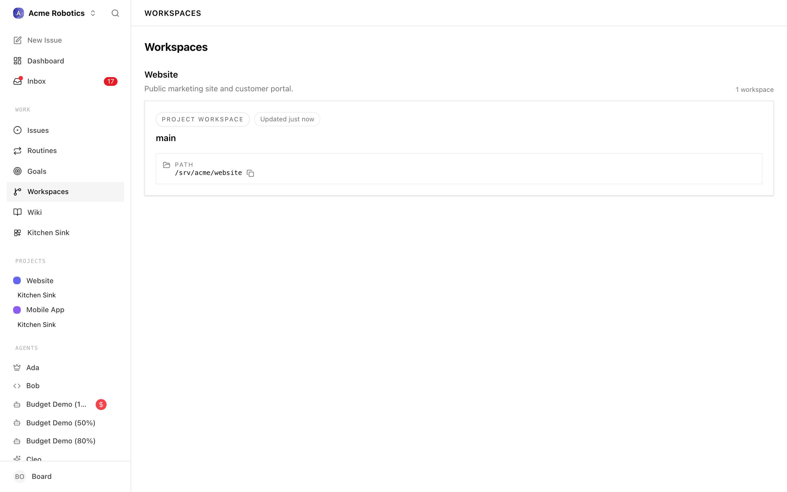
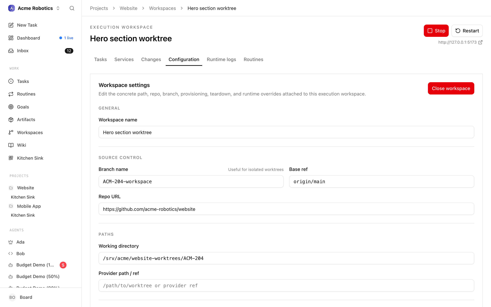
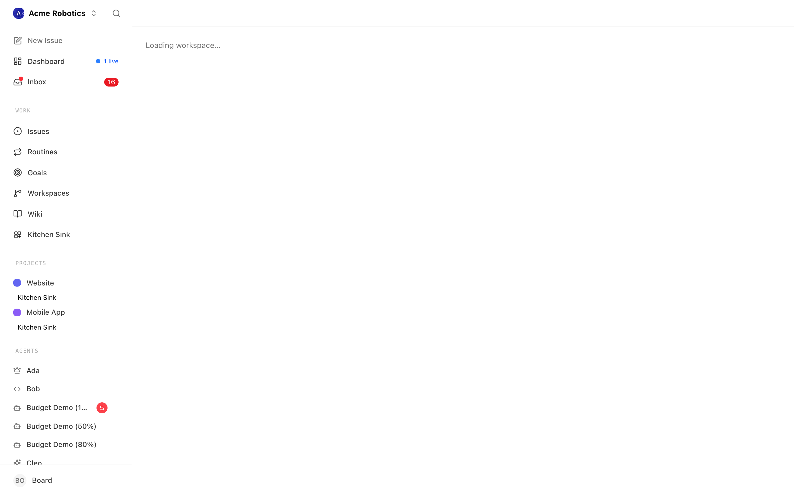

# Workspaces

When an agent picks up a task that involves working with code or files, it needs a place to do that work — a folder with the right code checked out at the right state, ready for the agent to read, edit, and run. That's what an execution workspace is: a snapshot of a project's working directory, tied to a specific task run.

Execution workspaces exist so that multiple agents can work on the same project simultaneously without stepping on each other. When a project is configured for isolated work, agents can get their own copy — their own branch, folder, and runtime context — so work in one workspace doesn't accidentally break another.

This guide covers what execution workspaces are, how they relate to projects, and how to use the workspace detail screen — its three tabs, runtime controls, and logs — to inspect and manage them.

---

## How execution workspaces relate to projects

Every execution workspace is linked to a project. The project defines the base configuration — where the code lives, how to run it, what the default setup looks like.

When a task runs, Paperclip resolves which execution workspace to use for that run:

1. **The heartbeat fires** and the agent picks up a task
2. **Paperclip resolves the workspace** — creating a new one, reusing an existing one, or sticking with the project default, depending on your settings
3. **The agent receives the workspace path** and works within it
4. **The workspace persists** after the run if you're using an isolated or reusable workspace mode

---

## Workspace modes

When isolated workspaces are enabled for a project, you can choose how an issue's workspace is handled:

**Isolated (new workspace)**
Paperclip creates a fresh working copy for this task — a new git worktree at a new path, branched from the base. The agent works here without any risk of interfering with other workspaces. When the task is done, you can review and merge the branch, then archive the workspace.

This is the right choice for tasks that make code changes — features, fixes, experiments.

**Reuse existing workspace**
The task shares a workspace with another task or a previous run. Multiple tasks can share one workspace so they can work against the same branch and see the same running services.

This is useful when tasks are closely related and need to coordinate on the same state — for example, multiple issues working against the same feature branch.

**Project primary workspace**
The task runs in the project's primary checkout, not an isolated copy. Use this carefully — changes made here affect the shared working copy directly.

---

## Runtime services

Each workspace can have runtime services: background processes that need to be running for the agent's work to make sense — a development server, a database, a build watcher.

Runtime services are manually controlled from the workspace UI. Paperclip does not start or stop them automatically when a heartbeat fires.

To start services for a workspace:
1. Open your project and click on the workspace
2. Click **Start Services** (or the specific service you want to start)
3. The service runs in the background; the status updates in the UI

> **Note:** Services you start in one workspace don't affect other workspaces. Each isolated workspace has its own runtime, even if the configuration was inherited from the project's base settings.

---

## Workspace inheritance

When you create a project, you can define a base runtime configuration for it — how services should be started, what environment variables they need, what commands to run.

Isolated execution workspaces inherit this configuration by default. You can override specific settings on individual workspaces if a particular task needs different settings than the project default.

The inheritance answers the question "how do I run this?" — but the actual running process is always specific to the workspace. Two workspaces with the same inherited configuration will have two separate running processes.

---

## Workspace lifecycle

Execution workspaces are durable — they persist until you explicitly archive or tear them down. This means:

- The agent's branch state, uncommitted changes, and any running services survive across heartbeats
- Multiple heartbeats can pick up the same workspace and continue from where the last one left off
- Shared workspaces accumulate changes across multiple tasks

When you're done with a workspace:
1. Review the agent's work (merge the branch, approve changes, etc.)
2. Click **Archive** on the workspace
3. Paperclip cleans up the workspace according to its mode and project settings

> **Warning:** Archiving a workspace that has unmerged changes or uncommitted work means that work is gone. Make sure you've reviewed and merged anything you want to keep before archiving.

---

## When you'll encounter this

For most board operators, execution workspaces are something that happens in the background. You don't need to configure them for every issue — the defaults work fine for straightforward agents doing straightforward work.

You'll want to pay closer attention when:
- You have multiple agents working on the same codebase and need to avoid conflicts
- An agent needs specific services running to do its work
- You want to review an agent's changes on a branch before they're merged
- A task needs to pick up from where a previous task left off

---

## Workspace list

All execution workspaces attached to a project are listed on that project's **Workspaces** tab. Open a project, click **Workspaces**, and you'll see every workspace Paperclip has provisioned — isolated worktrees, reused workspaces, and the project's primary checkout.

Each entry shows:

- The workspace **name** (and the issue it was originally provisioned for, if any)
- The **mode** — isolated, reuse, or project primary
- The **provider type** — for example, git worktree or local folder
- The **status** — active, archived, or cleanup_failed
- When it was opened and last used

Click a workspace name to open its detail screen. From there, you can inspect and edit its configuration, control its runtime services, review its operation logs, and see every issue that has run against it.

The header of the detail screen repeats the mode, provider type, and status as small pills so you can tell at a glance which kind of workspace you're looking at. Above the tabs, a **Workspace commands** panel shows the source of the workspace's runtime config — whether it's inheriting from the project workspace, overriding it at the execution workspace level, or has no runtime config defined yet. From that same panel you can start services, stop them, restart them, or fire off one-shot jobs.

The detail screen is split into three tabs:

1. **Configuration** — workspace settings, workspace context, and concrete location
2. **Runtime logs** — history of runtime and cleanup operations
3. **Issues** — every issue that has used this workspace

The tabs remember your last selection per workspace, so if you always land on Runtime logs for a specific workspace, Paperclip keeps taking you there.

---

## Configuration tab

The Configuration tab is where you inspect and edit everything that makes this workspace concrete — the path on disk, the repo and branch it points at, the provisioning and teardown commands, and any runtime overrides specific to this execution workspace.

### Workspace commands panel

Above the tabs, and visible regardless of which tab you're on, sits the **Workspace commands** panel. It's the single control surface for runtime behaviour: services you want running in the background, and one-shot jobs you want to fire off against this workspace.

Two rules govern this panel:

1. **You need a working directory.** Every command Paperclip runs against the workspace needs an absolute path to run in. If the workspace's `cwd` is empty, the action buttons are disabled and a hint reminds you to fix that first. Fill in the **Working directory** field on the Configuration tab, save, and the controls light up again.
2. **Services need runtime config.** Service commands only show up if there's a runtime config somewhere in the chain — either inherited from the project workspace or overridden on this execution workspace. If neither exists, the services panel stays empty with a short note; jobs may still run if they're defined and a `cwd` is set.

The panel groups commands into two sections:

- **Services** — long-running processes like `pnpm dev`, a Postgres container, or a build watcher. For each service you'll see start, stop, and restart controls and the service's last observed status.
- **Jobs** — one-shot commands like `pnpm db:migrate` or a test runner. Each job has a single run action.

When Paperclip is busy running an action (for example, starting a service), the panel shows a pending state and blocks duplicate actions. On success you'll see a short confirmation — "Workspace service started.", "Workspace job completed." — and on failure, the error message from the adapter appears in red. Either way, the full history ends up in the Runtime logs tab.

### Workspace settings

The **Workspace settings** card holds the editable fields for the workspace. Most of these are populated when Paperclip provisions the workspace; you usually only need to touch them when an agent or project has moved, a branch was renamed, or the provisioning scripts changed.

- **Workspace name** — a human label used in lists, breadcrumbs, and notifications.
- **Branch name** — the git branch this workspace is checked out on. For isolated worktrees, this is typically something like `PAP-946-workspace`.
- **Working directory** — the absolute path on disk. This is where the agent runs its commands. If this path is empty, Paperclip can't run any local commands for this workspace — it's the single most important field to keep correct.
- **Provider path / ref** — the path or reference used by the workspace provider. For git worktrees this is the worktree path; for other providers it's whatever reference that provider needs.
- **Repo URL** — the remote URL the working directory was cloned from. Used for linking out to GitHub/GitLab in the UI.
- **Base ref** — the ref the workspace branched off from, for example `origin/main`.
- **Provision command** — runs when Paperclip prepares this execution workspace (for example, a script that clones a worktree and installs dependencies).
- **Teardown command** — runs when the execution workspace is archived or cleaned up.
- **Cleanup command** — an optional workspace-specific cleanup step that runs before teardown (for example, killing a stuck `vite` process).

At the top right of this card you'll find a **Close workspace** button. Closing runs the teardown and cleanup commands, and transitions the workspace to `archived` or `cleanup_failed` depending on how those commands exit. If a previous close attempt left the workspace in `cleanup_failed`, the button changes to **Retry close**.

Below the command fields you'll see a **Runtime config source** notice. It tells you at a glance whether this execution workspace is:

- inheriting the runtime config from its project workspace,
- overriding the project workspace config with its own, or
- has no runtime config at all yet.

If this workspace is overriding the inherited runtime, you can click **Reset to inherit** to drop the override and go back to the project workspace default.

For the rare cases where you need to tweak the raw runtime JSON, expand the **Advanced runtime JSON** panel. It contains:

- A checkbox — **Inherit project workspace runtime config** — that toggles override vs. inherit mode.
- A JSON textarea where you can edit the workspace's `commands` object. Both legacy `services` arrays and the newer `commands` array (supporting both services and jobs) are accepted.

Changes in the Workspace settings card stay local until you click **Save changes**. The **Reset** button reverts the form to whatever Paperclip has currently persisted, so you can back out of a half-edited change without reloading the page.

### Workspace context

The **Workspace context** card (labelled "Linked objects" in the UI) shows the other Paperclip entities this execution workspace is connected to:

- **Project** — the project this workspace belongs to.
- **Project workspace** — the project-level workspace this execution workspace was provisioned from. Runtime config inheritance follows this link.
- **Source issue** — the issue that originally triggered this workspace's creation, if any. Clicking it takes you to the issue detail page.
- **Derived from** — if this workspace was created by splitting or branching off another execution workspace, you'll see a link back to the original. This is how Paperclip represents follow-up worktrees that share a code lineage with an earlier one.
- **Workspace ID** — the raw identifier, shown in monospaced text and copyable for API calls or debugging.

Use this card to navigate quickly back to the project, the issue that kicked off the work, or the parent workspace this one derived from.

### Concrete location

The **Concrete location** card summarises the physical and git-level facts about the workspace. It doesn't introduce new fields — everything here also appears in Workspace settings — but it's formatted for fast scanning and copying rather than editing.

- **Working dir** — the absolute path, with a copy button so you can paste it into a terminal.
- **Provider ref** — the provider-specific reference or worktree path.
- **Repo URL** — when set to a valid `http(s)` URL, this becomes a clickable link out to the remote.
- **Base ref** — the starting ref the workspace was branched from.
- **Branch** — the active branch name.
- **Opened** — timestamp when Paperclip first opened the workspace.
- **Last used** — the most recent time an agent interacted with it.
- **Cleanup** — if Paperclip has scheduled this workspace for cleanup, the eligible-at time and the reason are shown here. Otherwise this reads `Not scheduled`.

Together, Workspace settings, Workspace context, and Concrete location give you everything you need to answer "what is this workspace, where does it live, and what is it connected to?"

### Working with runtime config overrides

Runtime configuration is one of the places where project defaults and workspace-specific needs sometimes pull in different directions. Paperclip resolves this with a two-level inheritance model:

1. The **project workspace** defines a baseline runtime config. This is what gets applied to every execution workspace carved out of that project workspace unless you explicitly override it.
2. The **execution workspace** can either inherit that baseline or override it with its own `workspaceRuntime` object.

The **Runtime config source** notice on the Configuration tab tells you which of these is currently in effect:

- **Execution workspace override** — this workspace has its own runtime config and ignores whatever the project workspace provides. Use this when a specific worktree needs a different port, a different dev command, or extra jobs that don't belong on every workspace.
- **Project workspace default** — this workspace is inheriting the project's runtime config as-is. This is the common case and the one you should aim for — overrides add drift and should be the exception.
- **None** — neither level has runtime config defined, so Paperclip can't start services. Jobs may still run if they're provided, but services won't appear in the Workspace commands panel.

If you've added an override and want to go back to inheriting, click **Reset to inherit** — it clears the override and the workspace falls back to the project workspace's config. If the project workspace has no runtime config of its own, that button is disabled; you'd otherwise be resetting the execution workspace to "None".

The **Advanced runtime JSON** panel is hidden behind a disclosure triangle on purpose. Editing the raw JSON is a power-user path; for most teams, configuring services at the project level is enough. When you do need to edit it, the panel accepts both shapes:

- The legacy `{ "services": [...] }` array, kept for backwards compatibility.
- The newer `{ "commands": [...] }` array with `kind: "service"` or `kind: "job"` entries, which is what new workspaces should use.

Paperclip validates the JSON when you hit **Save changes**; if it can't be parsed or isn't a JSON object, you'll get an inline error and the save is aborted.

---

## Runtime logs tab

Switch to the Runtime logs tab to see what Paperclip has actually done with this workspace — which commands ran, when they ran, how they exited, and what they printed.

Under the **Recent operations** heading, each entry represents one workspace operation:

- The **command** that ran (or the **phase**, if this was a lifecycle step rather than a named command).
- The **start time** and, if the operation has finished, the **end time**.
- A short excerpt of **stdout** or, when the command failed, a short excerpt of **stderr**. The stderr excerpt is highlighted in red so you can spot failures at a glance.
- A **status pill** on the right showing whether the operation is running, succeeded, or failed.

This tab covers both kinds of operations:

- **Runtime operations** — service starts, stops, restarts, and one-shot jobs you trigger from the Workspace commands panel at the top of the detail page.
- **Cleanup operations** — provision, teardown, and cleanup command runs that happen when Paperclip prepares or closes the workspace.

If nothing has happened yet, you'll see "No workspace operations have been recorded yet." When the operation log fails to load, the error message from the server is shown in red.

Use this tab as your first stop when an agent reports that a service didn't come up, a job failed, or the workspace refused to close. Most of the time, the stderr excerpt is enough to diagnose the problem; the timestamps make it easy to correlate a failed heartbeat run with the exact command that broke.

### How operations map to what you did

If you're new to the Runtime logs tab, it helps to know which UI actions produce which operation entries:

- Clicking **Start** on a service in the Workspace commands panel creates an operation with the service's command, a `started` phase, and — on a successful start — a running or finished status depending on whether the service stays alive or exits immediately.
- Clicking **Stop** or **Restart** on a service produces a short operation that records how the service was terminated or bounced.
- Clicking **Run** on a job produces a single operation with the job's command; its final status reflects the job's exit code.
- **Close workspace** (from the Configuration tab) runs the cleanup command and then the teardown command in sequence. Each appears as its own operation so you can tell which of the two failed if the close ends in `cleanup_failed`.
- **Provision** operations are emitted automatically when Paperclip first prepares the workspace; you won't trigger these from the UI, but you'll see them here when debugging first-boot problems.

If nothing about a failure is obvious from the excerpt, remember that excerpts are truncated. Reach into the underlying worktree on disk, re-run the command manually from that directory, and compare its output to the excerpt — the mismatch usually points at an environment or permissions difference between the agent's runtime and your shell.

---

## Issues tab

The Issues tab shows every issue that has ever run against this execution workspace — not just the source issue that created it, but any follow-ups, retries, and related tasks that inherited the workspace.

The list uses the same components and filters as the main issues view, so you get:

- Issue identifier, title, status, priority, and assignee at a glance.
- The **live-run indicator** — issues whose heartbeat is currently running against this workspace are highlighted so you can see what's active right now.
- Inline actions for updating issue status, reassigning, and opening the issue detail page.
- The view's local state — which columns are visible, how you've sorted — is remembered under the `paperclip:execution-workspace-issues-view` key, so different execution workspaces can have different preferred layouts.

This tab answers three common questions:

- "What work has this workspace actually been used for?" — scroll the list.
- "Is anything running against this workspace right now?" — look for a live-run highlight.
- "Can I safely archive this workspace?" — if every issue here is `done`, `cancelled`, or otherwise inactive, you're probably safe.

If an issue in the list needs to be reassigned or rescheduled before you can close the workspace, click through, make the change, and come back — the list updates automatically.

### Source issue vs. linked issues

Two different relationships show up on the Issues tab and in the Configuration tab's Workspace context card, and it's worth keeping them straight:

- The **source issue** is the single issue that originally caused Paperclip to provision this workspace. It's stored on the workspace itself and appears in the Workspace context card. For isolated worktrees created from a specific task, this will typically be the task that kicked the whole flow off.
- The **linked issues** listed on the Issues tab are every issue that has ever been attached to this workspace, including the source issue, follow-up child issues that inherited the workspace, and any issue whose `inheritExecutionWorkspaceFromIssueId` pointed back here.

When you're deciding whether it's safe to archive, look at the full linked list, not just the source issue. An archived workspace takes all its branch state with it, and a follow-up issue that still references it will end up without a valid cwd the next time it runs.

---

## Archiving and cleanup

Closing a workspace is a two-step operation in Paperclip:

1. **Cleanup** — the cleanup command (if any) runs first. This is where you stop stray dev servers, free ports, and do anything that would otherwise prevent teardown from succeeding.
2. **Teardown** — the teardown command then dismantles the workspace itself. For git worktrees this typically removes the worktree directory and prunes the branch; for other providers it does whatever that provider considers cleanup.

If both succeed, the workspace transitions to `archived` and disappears from the default workspace list. If either fails, the workspace transitions to `cleanup_failed` — it's still there, still visible, and the **Close workspace** button changes to **Retry close** so you can try again after fixing whatever went wrong. Until a retry succeeds, the workspace keeps whatever state it had before the close was attempted.

Some practical tips:

- Before closing, check the Runtime logs tab for anything still running. Services that are `running` will be stopped as part of cleanup, but jobs that are genuinely in-flight will also be killed — make sure you're not about to interrupt something important.
- Review the **Issues tab** for any issue still in `in_progress` that's tied to this workspace. Archive the workspace only after those issues are done, cancelled, or moved to another workspace.
- If an agent had uncommitted changes on the branch, those changes go away at teardown. Either merge the branch first or stash/commit anything you want to keep.

The **Cleanup** row on the Concrete location card tells you whether Paperclip has already scheduled the workspace for automatic cleanup — for example, because it's been idle past a retention window — and what the reason is. If you see a scheduled cleanup you didn't expect, look at the project's workspace lifecycle settings to understand why.

---

## Troubleshooting checklist

When something doesn't behave, run through this checklist before filing a bug:

- **Is the `cwd` set and correct?** Without an absolute working directory, no local command can run. Configuration tab → Workspace settings → Working directory.
- **Is the branch still there?** If someone deleted the branch outside Paperclip, the agent will fail when it tries to check out. Re-create or re-point the branch.
- **Does the runtime config actually apply?** Look at Runtime config source on the Configuration tab. If it says "None", no service commands will be available.
- **Is another workspace holding the port?** Two isolated worktrees on the same machine that both inherit a dev server config will both try to bind. Either override the port on one of them or only start one at a time.
- **Did a previous close fail?** If the workspace is in `cleanup_failed`, you'll keep getting stale state until you either retry the close or manually fix the underlying problem and then retry.
- **Is the agent looking at the right workspace?** When follow-up tasks are created, make sure either `parentId` or `inheritExecutionWorkspaceFromIssueId` is set on the child issue so Paperclip can resolve it back to this workspace.

Most workspace-level issues come down to one of these six questions.

---

## Isolation and git worktrees

Paperclip's default for "isolated" execution workspaces is a **git worktree** branched off the project workspace's base ref. If you haven't used git worktrees before, here's what that means in practice:

- A worktree is a second (or third, or tenth) checkout of the same repository, living at a different path, with its own branch checked out.
- They share the same underlying object database with the primary checkout, so creating a worktree is cheap — no full re-clone, no duplicated history on disk.
- Because each worktree has its own working directory, agents in different worktrees can't accidentally overwrite each other's uncommitted changes.

When Paperclip provisions an isolated workspace:

1. It picks a path under the project workspace's worktree directory.
2. It creates a new branch off the configured base ref (for example, `origin/main`).
3. It checks that branch out into the new worktree path.
4. It runs the provision command so dependencies, env files, and any other per-worktree setup are in place before the agent starts.

From the agent's perspective, all of this is invisible — it just gets a `cwd` that's ready to read, edit, and run. From your perspective as a board operator, the Concrete location card on the Configuration tab shows exactly which path and branch were picked, so you can always drop into that directory yourself to inspect or debug.

### When isolation is overkill

Isolation has a cost: each worktree needs its own `node_modules` (or equivalent), its own dev server, its own migrations. For large projects this adds up. You probably don't want isolated workspaces for:

- **Purely read-only tasks** — research, summarising, reviewing documentation. Use the project primary workspace or a reused workspace.
- **Tasks that only touch issue metadata** — triaging, estimating, assigning. These don't need a checkout at all.
- **Coordination between multiple tasks on the same feature** — reuse a single workspace and let the tasks accumulate changes together.

Isolation pays off when agents are genuinely making code changes you'll want to review separately, or when you want to run several experiments in parallel without them tripping over each other.

---

## Observability at a glance

Pulling together the three tabs, here's how the detail screen maps to typical questions you'll ask:

- "What is this workspace and where does it live?" → Configuration tab, the Concrete location card.
- "Why does this workspace exist and what's it attached to?" → Configuration tab, the Workspace context card.
- "Who decides how services run here?" → Configuration tab, the Runtime config source notice.
- "What has actually happened in this workspace?" → Runtime logs tab.
- "Who's been running against this workspace?" → Issues tab.
- "Is anything running right now?" → Workspace commands panel at the top (service status) plus Issues tab (live-run indicator).

The breadcrumbs at the top of the screen also tie everything back together: **Projects → {project name} → Workspaces → {workspace name}**. From any workspace detail screen, you're always one click from the project and two from the workspace list.

---

## Common workflows

A few concrete patterns show up often enough to be worth calling out:

**Kicking off a new feature**
1. Create the issue and assign it to the agent who'll do the work.
2. Let Paperclip provision an isolated workspace when the agent checks out the task.
3. When the agent finishes and the branch is ready, review the branch in your usual git workflow.
4. Once merged, come back to the Workspaces tab and archive the workspace.

**Recovering from a failed close**
1. Open the workspace and look at the Runtime logs tab to see which command failed.
2. Fix the underlying problem — a stuck process, a missing permission, a command that assumes the wrong shell.
3. Click **Retry close** and confirm the workspace transitions to `archived`.
4. If retries keep failing, drop into the worktree directory yourself and run the teardown command manually.

**Shipping a migration**
1. Create a job in the workspace's runtime config (for example, `db:migrate`).
2. Open the workspace and click **Run** on that job from the Workspace commands panel.
3. Wait for the operation to appear in Runtime logs with a successful status.
4. Link the resulting evidence to the issue — the operation timestamp is enough.

**Reusing a workspace across tasks**
1. When creating the follow-up issue, set `parentId` if it's a child task, or `inheritExecutionWorkspaceFromIssueId` if it's a sibling that should share the same workspace.
2. Paperclip will wire the new issue up to the existing workspace on checkout.
3. On the Issues tab of the workspace, you'll see the new issue alongside the original.

These patterns are just defaults — adapt them to how your team actually operates.

---

## You're set

Execution workspaces give agents the isolated, stateful environments they need to do reliable file-based work. The Workspace list shows you everything provisioned for a project; the Configuration tab keeps the path, repo, and runtime config in sync with reality; the Runtime logs tab tells you what actually ran; and the Issues tab shows you who's been using it.

The next guide covers heartbeats and routines — how you decide *when* an agent runs, and why most agents should stay dormant until real work arrives.

[Heartbeats & Routines →](./routines.md)
