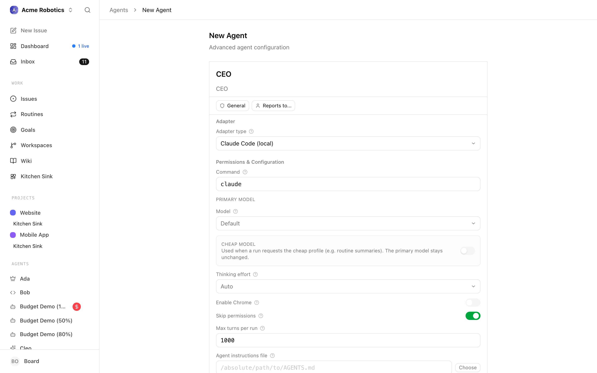

# Update or rotate a provider API key

You already have an agent running, and the API key it uses needs to change — maybe the provider rotated it, maybe it expired, maybe you moved from a subscription login (like Claude.ai) to a console-issued key and the old credential stopped working. This guide walks you through swapping the key in place, without rebuilding the agent.

If you're setting up an agent for the first time, follow [Hire Your First Agent](../guides/getting-started/your-first-agent.md) instead — that guide covers creating the key and wiring it from scratch.

---

## Two ways to store an API key

Paperclip lets you bind a provider key into an agent's `adapterConfig.env` in one of two shapes. Knowing which one you used decides where you change the value.

| Storage shape | What it looks like | Where you rotate it |
|---|---|---|
| **Plain value** | The key is pasted directly into the agent's Environment variables field. | On the agent itself — open the adapter form, paste the new value, save. |
| **Secret reference** | The agent's env-var entry points at a secret in Paperclip's secret store, usually with `version: "latest"`. | In **Company Settings → Secrets** — rotate the secret once, every agent bound to it picks up the new value. |

> **Tip:** If you have more than one agent on the same provider, store the key as a secret reference. Rotation becomes a single edit instead of one trip per agent.

---

## Path A — Rotate on the agent (plain value)

Use this when the key was pasted directly into the adapter form.

1. Open **Agents → {agent}** and click **Edit**.
2. Scroll to the **Environment variables** section.
3. Find the provider's key name (for example `ANTHROPIC_API_KEY`) and replace the value with the new key.
4. Click **Test environment**. The adapter spins up a check against the provider; a green result confirms the new key authenticates.
5. Save the agent.

The next heartbeat picks up the new value. No restart needed.



> **Warning:** Plain values are stored on the agent record. If you're running with `PAPERCLIP_SECRETS_STRICT_MODE=true`, the server rejects new inline values for any env key whose name matches a sensitive-keyword regex (`api_key`, `token`, `auth`, `authorization`, `bearer`, `secret`, `password`, `credential`, `jwt`, `private_key`, `cookie`, `connectionstring`). Either turn strict mode off temporarily, or use Path B.

---

## Path B — Rotate the secret (secret reference)

Use this when the env-var entry on the agent looks like:

```json
{
  "env": {
    "ANTHROPIC_API_KEY": {
      "type": "secret_ref",
      "secretId": "8f884973-c29b-44e4-8ea3-6413437f8081",
      "version": "latest"
    }
  }
}
```

1. Open **Company Settings → Secrets**.
2. Find the secret the agent is referencing — it's usually named after the provider (`anthropic-key`, `openai-key`, etc.).
3. Click **Rotate**, paste the new value, and confirm. Paperclip stores it as a new version and bumps `latestVersion`.
4. Open the agent and click **Test environment** to confirm the new value is being injected.

Every agent that references this secret with `version: "latest"` now resolves to the new value on its next heartbeat. Agents pinned to a numeric version (`"version": "3"`) stay on that historical value until you re-point them.

> **Note:** Every rotation creates a new version automatically — there is no "edit value in place" option. The old version is still resolvable by any binding that pinned it; new bindings and `latest` consumers move forward.

---

## Per-provider notes

Most providers follow the same shape — generate a new key in the provider's console, copy it once (most consoles show the key only on creation), then drop it into Path A or Path B above. The differences are the env-var name and the key format.

<!-- tabs: Anthropic (Claude), OpenAI, Google (Gemini), xAI (Grok), Cursor, OpenCode -->

<!-- tab: Anthropic (Claude) -->

**Env var:** `ANTHROPIC_API_KEY`
**Key prefix:** `sk-ant-`
**Console:** [console.anthropic.com](https://console.anthropic.com) → **API Keys** → **Create Key**

> **Info:** Moving from a Claude.ai subscription login to a console API key? That's the most common reason this doc gets opened. Older builds of `claude_local` accepted Claude Code's subscription auth; newer ones require an explicit `ANTHROPIC_API_KEY` from [console.anthropic.com](https://console.anthropic.com). Generate a console key, store it via Path A or Path B, and the adapter will start using it instead of the subscription session.

The `claude_local` adapter can also authenticate through Bedrock settings or Claude Code's own login state. If you switch to one of those, clear the `ANTHROPIC_API_KEY` entry rather than leaving an old value in place. See [Claude Local](../reference/adapters/claude-local.md).

<!-- tab: OpenAI -->

**Env var:** `OPENAI_API_KEY`
**Key prefix:** `sk-`
**Console:** [platform.openai.com](https://platform.openai.com) → profile menu → **API keys** → **Create new secret key**

Used by `codex_local` and by `opencode_local` when the configured model is an OpenAI one. Codex's own CLI login state also satisfies the adapter — if you've run `codex login`, you can leave `OPENAI_API_KEY` unset.

<!-- tab: Google (Gemini) -->

**Env vars:** `GEMINI_API_KEY` or `GOOGLE_API_KEY` (either is accepted)
**Console:** [aistudio.google.com](https://aistudio.google.com) → **Get API key**

Used by `gemini_local`. The adapter also accepts Google account login or Gemini CLI auth, so on a developer machine you may not need the key at all. See [Gemini Local](../reference/adapters/gemini-local.md).

> **Note:** Test Environment confirms the binary is installed and the env var is set. It does not detect quota exhaustion or a revoked Google account — a passing check is not a guarantee that runs will succeed.

<!-- tab: xAI (Grok) -->

**Env var:** `XAI_API_KEY`
**Console:** [console.x.ai](https://console.x.ai) → **API Keys**

Used by `grok_local`. Treat it the same as the other provider keys — generate, store as a secret reference, bind into the adapter's env. See [Grok Local](../reference/adapters/grok-local.md).

<!-- tab: Cursor -->

**Local (`cursor`):** No API key field. The local adapter uses Cursor Agent CLI's own login session — re-authenticate by running `cursor login` from a terminal on the host. No Paperclip change is needed.

**Cloud (`cursor_cloud`):** Env var `CURSOR_API_KEY`. Rotate via Path A or Path B; generate the key from your Cursor account settings. See [Cursor Cloud](../reference/adapters/cursor-cloud.md).

<!-- tab: OpenCode -->

`opencode_local` is a multi-provider runtime. The key you rotate is the one that matches the `provider/model` configured on the adapter:

- `anthropic/...` → `ANTHROPIC_API_KEY`
- `openai/...` → `OPENAI_API_KEY`
- `google/...` → `GEMINI_API_KEY` or `GOOGLE_API_KEY`
- `xai/...` → `XAI_API_KEY`

If the agent uses two providers (for example a model and an embedding provider), rotate both. See [OpenCode Local](../reference/adapters/opencode-local.md).

<!-- /tabs -->

---

## Verify the new key works

1. Open the agent and click **Test environment**. This confirms the binary is reachable, the env var resolves, and the provider accepts the credential.
2. Trigger a heartbeat — either toggle heartbeats on and wait for the next tick, or assign a small task to the agent. Watch the run log for a successful first turn.
3. If you rotated a shared secret, repeat the check on a second agent that references it so you know the rotation flowed through.

---

## Troubleshooting

**"I added a new secret but the agent still 401s"** — Creating a secret in **Company Settings → Secrets** does *not* auto-rewire existing agents. The agent is still using whatever was wired into its `ANTHROPIC_API_KEY` (or equivalent) env-var row when you last saved it. Open the agent → **Edit** → **Environment variables**, change the row's source to **Secret**, pick the new secret, then click **Test environment**. If the row was already set to **Plain** with the old key, that plain value shadows any new secret you create elsewhere — switching it to **Secret** is the fix.

**A 401 from the provider after a rotation** — The provider (not Paperclip) is rejecting the credential, which means the request reached them with *some* key. Two common causes: (1) the key value itself is wrong — whitespace pasted around it, copied from the wrong account/workspace, or the new console account hasn't been funded yet; (2) the agent picked up an old plain value rather than the rotated secret. Re-copy the key from the provider console, paste it as a plain value temporarily to isolate which side is wrong, then move it back to a secret reference once Test environment passes.

**"API key invalid"** — Compare the env-var *name* against the provider's expected name (`ANTHROPIC_API_KEY`, not `ANTHROPIC_KEY`). Check the key prefix matches what the provider issues (`sk-ant-`, `sk-`, etc.). Whitespace pasted in front of or after the key is a common culprit.

**Test environment still fails after rotation** — The agent may be holding a cached process. Stop and re-enable heartbeats so the next run starts a fresh subprocess with the new environment. For long-running adapters like `cursor`, end the existing session so the resume cache doesn't reuse the old auth.

**Strict mode rejects the inline value** — You're running with `PAPERCLIP_SECRETS_STRICT_MODE=true`, which blocks inline sensitive values on persisted env bindings. Use Path B (secret reference) instead. See [Secrets](../reference/deploy/secrets.md).

**The old subscription login keeps being used** — Claude Code, Codex CLI, and Gemini CLI each cache their own login state outside Paperclip. If you intend the API key to take precedence, log out of the CLI (`claude logout`, `codex logout`, etc.) on the host so the adapter falls back to the env var.

**Multiple agents still failing** — If you rotated a secret and only some agents picked up the new value, check the failing ones' env binding. Agents pinned to a specific version (`"version": "3"`) don't follow `latest`; re-point them or update the binding.

---

## Related

- [Agent Adapters](../guides/org/agent-adapters.md) — full configuration reference for each adapter.
- [Secrets](../reference/deploy/secrets.md) — how the secret store works and how strict mode behaves.
- [Hire Your First Agent](../guides/getting-started/your-first-agent.md) — first-time setup, including generating an API key.
