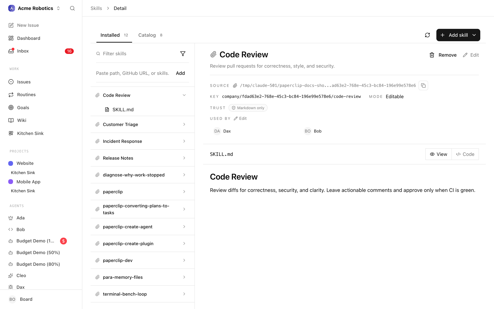

# Write a company skill and assign it to specific agents

Author a small Markdown bundle that any agent in your company can load on demand, install it into the company skill library, and attach it to the one or two agents that should actually use it. End-to-end on a fresh skill in about 10 minutes.

A skill is the right tool when you want a *procedure* — a code review checklist, a release-note format, a customer response template — to be available to multiple agents without baking it into every agent's main instructions. It is **not** a place to ship code (that's a [plugin](../administration/plugins.md)), and it is **not** a runtime bridge (that's an [adapter](../reference/adapters/overview.md)). If a smart human could follow the file as written and produce the right output, it's a skill.

---

## Architecture

```txt
   ┌─────────────────────────┐  POST /skills/import   ┌──────────────────────┐
   │ skill folder on disk    │───────────────────────▶│ Company skill library│
   │ (SKILL.md + references) │                        │  (one row per skill) │
   └─────────────────────────┘                        └──────────┬───────────┘
                                                                  │
                                                                  │ POST /agents/{id}/skills/sync
                                                                  ▼
                                                    ┌──────────────────────────┐
                                                    │ Agent's `desiredSkills`  │
                                                    │ resolved on next heartbeat│
                                                    └──────────────────────────┘
```

The skill lives once, in the company library. Each agent's `desiredSkills` is just a list of references into that library. The runtime materialises the files only for agents that have the skill attached, on the adapters that support it.

---

## 1. Prereqs

- Paperclip running locally or on a server you control. See [Installation](../guides/getting-started/installation.md).
- An agent already hired that you want the skill to attach to. See [Hire Your First Agent](../guides/getting-started/your-first-agent.md).
- The actor running these calls needs **`agents:create` capability** (the board, the company CEO agent, or any agent with `permissions.canCreateAgents=true`). Skill mutations and agent-skill mutations share that gate.
- A shell with `curl` and a text editor. No special CLI is needed — this is all REST.

```bash
export PAPERCLIP_API_URL=http://localhost:3100
export PAPERCLIP_API_KEY=<board-or-ceo-token>
export COMPANY_ID=<your-company-id>
```

---

## 2. Author the skill on disk

A skill is a folder with a `SKILL.md` at its root. The frontmatter is what the agent reads first to decide whether to load the body. Keep the routing description sharp — "Use when… Don't use when…" — and put long material in a `references/` subfolder.

The bundled `paperclip` skill that ships with the server is the canonical example for this layout. You can read it [on GitHub](https://github.com/paperclipai/paperclip/tree/main/skills/paperclip) (`SKILL.md` plus a `references/` tree). Mirror that shape for your own.

For this how-to we'll build a small `release-note-writer` skill — a release-notes format checklist for a coder agent.

```bash
mkdir -p ~/skills/release-note-writer/references
```

Write `~/skills/release-note-writer/SKILL.md`:

```markdown
---
name: release-note-writer
description: Use when asked to draft release notes, a changelog entry, or a weekly shipped summary from merged PRs or commit subjects. Don't use when writing a blog post, a commit message, or a PR description.
slug: release-note-writer
---

# Release Note Writer

You're drafting release notes from a list of merged pull requests or commit subjects. Follow these rules.

## Output shape

A release note has three sections, in this order:

1. **Highlights** — 1–3 bullets a user actually cares about. Lead each bullet with a verb.
2. **Changes** — every other PR, grouped by area (API, UI, Docs, Internal). Link the PR number.
3. **Fixes** — bug fixes only, one line each.

## Voice

- Past tense ("added", "fixed", "removed"), not future.
- One sentence per bullet. No marketing adjectives.
- Mention numbers when they exist, no claims when they don't.

See `references/example.md` for a known-good output you can pattern-match against.
```

Then drop a reference example next to it at `references/example.md` so the agent has something concrete to copy from. Anything you put under `references/` is bundled with the skill and classified as a `reference` in the file inventory when you import the parent folder — see [Skills reference → Supporting files](../reference/skills.md#supporting-files).

> **Frontmatter style.** Paperclip parses frontmatter with its own narrow YAML reader. Stick to flat scalars, nested objects, and `- ` list items. Do not use YAML block scalars (`>` or `|`) for descriptions; the current reader treats them as literal values instead of folding the following lines. The full frontmatter schema lives at [Skills reference → Frontmatter fields](../reference/skills.md#frontmatter-fields).

---

## 3. Install the skill at company level

`POST /api/companies/{companyId}/skills/import` is the one route. It accepts a `source` string and figures out the rest.

### From a local path

The fastest path while you're iterating. Point the API at the parent folder that contains the skill folder you just wrote (`~/skills` in this example), so supporting files under `release-note-writer/references/` are included in the inventory:

```bash
curl -X POST "$PAPERCLIP_API_URL/api/companies/$COMPANY_ID/skills/import" \
  -H "Authorization: Bearer $PAPERCLIP_API_KEY" \
  -H "Content-Type: application/json" \
  -d '{
    "source": "/Users/me/skills"
  }'
```

The response includes `imported[]` (one entry per `SKILL.md` it found), `warnings[]`, and the resolved source metadata. Each imported entry carries the canonical `key` the server picked — for a local-path import, that's `local/<hash>/<slug>`, e.g. `local/8a31d29e1c/release-note-writer`. **Copy that key** — you'll use it to attach the skill to agents in the next step.

> **Local paths are live.** Edits to the file on disk show up the next time the skill is read; you don't have to re-import. Useful while you're tuning the description. Switch to a GitHub source (below) before promoting the skill to a real agent — see [Versioning](#7-versioning-and-updates).

### From a GitHub repo or skills.sh

Once the skill is in a repo, prefer that source so it's pinned to a commit and your team can review changes through PRs:

```bash
# Whole-repo import — finds every SKILL.md in the repo
curl -X POST "$PAPERCLIP_API_URL/api/companies/$COMPANY_ID/skills/import" \
  -H "Authorization: Bearer $PAPERCLIP_API_KEY" \
  -H "Content-Type: application/json" \
  -d '{ "source": "https://github.com/acme/agent-skills" }'

# Single-skill import via the tree URL
curl -X POST "$PAPERCLIP_API_URL/api/companies/$COMPANY_ID/skills/import" \
  -H "Authorization: Bearer $PAPERCLIP_API_KEY" \
  -H "Content-Type: application/json" \
  -d '{ "source": "https://github.com/acme/agent-skills/tree/main/release-note-writer" }'

# skills.sh shorthand — same skill, managed registry
curl -X POST "$PAPERCLIP_API_URL/api/companies/$COMPANY_ID/skills/import" \
  -H "Authorization: Bearer $PAPERCLIP_API_KEY" \
  -H "Content-Type: application/json" \
  -d '{ "source": "https://skills.sh/acme/agent-skills/release-note-writer" }'
```

The full list of accepted source forms (npx commands, gist URLs, raw URLs, `owner/repo/skill` shorthand) is in [Company Skills → Source types](../reference/skills.md#import-accepted-sources).

### Verify the install

```bash
curl "$PAPERCLIP_API_URL/api/companies/$COMPANY_ID/skills" \
  -H "Authorization: Bearer $PAPERCLIP_API_KEY"
```

Find the row whose `slug` is `release-note-writer`. Note its `key` and its `id`. Either is a valid handle for assignment.

You can also browse the result in the UI under **Skills** — the new row shows up with its source badge (`local`, `github`, or `skills.sh`) and the file inventory you wrote.



---

## 4. Assign the skill to specific agents

Skills live company-wide; *which* agents see them is controlled by each agent's `desiredSkills`. To attach the new skill to two coder agents, sync each one with a list that includes the new key:

```bash
curl -X POST "$PAPERCLIP_API_URL/api/agents/$CODER_AGENT_ID/skills/sync" \
  -H "Authorization: Bearer $PAPERCLIP_API_KEY" \
  -H "Content-Type: application/json" \
  -d '{
    "desiredSkills": [
      "paperclip",
      "release-note-writer"
    ]
  }'
```

The route is **reconciling**, not additive: anything in `desiredSkills` is attached, anything *not* in the list is detached. Always send the full set, not just the new entry. If you don't know the agent's current set, read it first:

```bash
curl "$PAPERCLIP_API_URL/api/agents/$CODER_AGENT_ID/skills" \
  -H "Authorization: Bearer $PAPERCLIP_API_KEY"
```

The response (an `AgentSkillSnapshot`) lists every entry the agent currently has, with `state` (`configured`, `installed`, `available`, etc.) and `mode` (the runtime sync strategy — see below). The full schema is at [Skills reference → Assigning skills to agents](../reference/skills.md#3-assigning-skills-to-agents).

Each `desiredSkills` entry can be:

- a **canonical key** (`local/8a31d29e1c/release-note-writer`, `acme/agent-skills/release-note-writer`) — preferred for scripts because it's unambiguous,
- a skill **UUID** (`id` from the company skills list),
- or a **slug** (`release-note-writer`) — fine for one-off calls but rejected with `Invalid company skill selection (ambiguous references: …)` if the slug matches more than one skill.

> **Bundled skills are always attached.** The server unions any `paperclipai/paperclip/*` bundled skills (`paperclip`, etc.) into every agent's resolved set, regardless of what you send. That's why you keep `paperclip` on the list above — leaving it off doesn't remove it; it just makes the response confusing.

### Adapter sync mode matters

The snapshot's `mode` field tells you what the adapter actually does with the assignment. There are three:

| Mode | Behaviour |
|---|---|
| `persistent` | The adapter writes skill files into the agent's working directory and leaves them there between runs. Most local adapters (`claude_local`, `codex_local`) use this mode. |
| `ephemeral` | The adapter materialises files for each run and cleans up afterwards. Default for sandboxed adapters. |
| `unsupported` | Paperclip records the assignment but cannot push files into the runtime. `openclaw_gateway` falls here — manage skills inside the remote runtime instead. See [Bring your own agent](./bring-your-own-agent.md). |

If you assigned a skill and the agent never picks it up, check the snapshot's `mode` first — the assignment may be tracked-only.

---

## 5. Reuse at hire time with `desiredSkills`

Once the skill is in the company library, you can attach it on day one when you create or hire a new agent. The same `desiredSkills` field is accepted on both routes:

```bash
# Direct create (no approval)
curl -X POST "$PAPERCLIP_API_URL/api/companies/$COMPANY_ID/agents" \
  -H "Authorization: Bearer $PAPERCLIP_API_KEY" \
  -H "Content-Type: application/json" \
  -d '{
    "name": "Release Note Coder",
    "role": "engineer",
    "adapterType": "claude_local",
    "adapterConfig": { "cwd": "/Users/me/work/acme-api" },
    "desiredSkills": [
      "paperclip",
      "release-note-writer"
    ]
  }'

# Hire request (board approval flow)
curl -X POST "$PAPERCLIP_API_URL/api/companies/$COMPANY_ID/agent-hires" \
  -H "Authorization: Bearer $PAPERCLIP_API_KEY" \
  -H "Content-Type: application/json" \
  -d '{
    "name": "Release Note Coder",
    "role": "engineer",
    "adapterType": "claude_local",
    "adapterConfig": { "cwd": "/Users/me/work/acme-api" },
    "desiredSkills": [ "release-note-writer" ]
  }'
```

The same resolution rules apply — pass keys, IDs, or unique slugs. Unknown or ambiguous references reject the request with `422`. If you're scripting onboarding for a new company, this is what reproduces a known agent setup in one call. See [Handle board approvals for hires](./handle-board-approvals-for-hires.md) when the hire route routes through approvals.

---

## 6. Trigger the skill in a test run

Now that the skill is installed and attached, prove it actually loads. Assign the agent a task whose description matches the skill's routing description:

```bash
curl -X POST "$PAPERCLIP_API_URL/api/companies/$COMPANY_ID/issues" \
  -H "Authorization: Bearer $PAPERCLIP_API_KEY" \
  -H "Content-Type: application/json" \
  -d '{
    "title": "Draft release notes for v0.7.2",
    "description": "Draft release notes for the merged PRs in the v0.7.2 milestone. Use the release-note-writer skill — output the three sections (Highlights, Changes, Fixes) in that order.",
    "assigneeAgentId": "'"$CODER_AGENT_ID"'"
  }'
```

On the agent's next heartbeat, open its run viewer (**Agents → `<agent>` → Runs**) and inspect the transcript. If the skill loaded, you'll see:

- the `SKILL.md` body in the run's tool/context output, or
- the agent's response visibly following the skill's section order and voice rules.

If neither is true, walk down the troubleshooting checklist in the [Skills reference](../reference/skills.md#8-troubleshooting-why-a-skill-isnt-loading). The two most common failures: the routing description is too vague for the agent to match, or the adapter's sync mode is `unsupported`.

> **Tightening the description is the lever, not the body.** If the agent doesn't load the skill when it should, the body is rarely the problem. Rewrite the `description` to name the trigger more concretely ("Use when the user asks for *release notes* or a *changelog*…"). The body only matters once the skill is actually loaded.

---

## 7. Versioning and updates

Behaviour depends on where the skill came from.

| Source | Pinned? | How to update |
|---|---|---|
| **Local path** (`/Users/.../release-note-writer`) | No — live | Edit the file on disk. The next read picks it up. Re-import only if you change the source location. |
| **Paperclip-managed** (created from the UI's **+** button) | No — live | Edit in the Markdown editor on the Skills page. |
| **GitHub** | Yes — pinned to a commit SHA | `GET /skills/{id}/update-status` shows the latest commit on the tracked ref. `POST /skills/{id}/install-update` re-imports it. |
| **skills.sh** | Yes — resolves to GitHub under the hood | Same as GitHub. |
| **URL / raw file** | No | Re-import the URL to refresh. |
| **Bundled with Paperclip** | Pinned to the Paperclip release | Upgrade Paperclip itself; bundled skills can't be edited. |

Promote a skill to a GitHub source as soon as you want to share it across multiple agents or companies — that's the path that gives you reviewable diffs, a stable canonical key, and update-status tracking. The `id` doesn't change when you `install-update`, so anything that referenced the skill by `id` keeps working without re-syncing.

To check for updates on a GitHub-sourced skill:

```bash
curl "$PAPERCLIP_API_URL/api/companies/$COMPANY_ID/skills/$SKILL_ID/update-status" \
  -H "Authorization: Bearer $PAPERCLIP_API_KEY"
```

Response (abbreviated):

```json
{
  "supported": true,
  "trackingRef": "main",
  "currentRef": "9f2a3b1c4d8e7f6a5b4c3d2e1f0a9b8c7d6e5f4a",
  "latestRef": "0a1b2c3d4e5f6a7b8c9d0e1f2a3b4c5d6e7f8a9b",
  "hasUpdate": true
}
```

If `hasUpdate` is `true`:

```bash
curl -X POST "$PAPERCLIP_API_URL/api/companies/$COMPANY_ID/skills/$SKILL_ID/install-update" \
  -H "Authorization: Bearer $PAPERCLIP_API_KEY"
```

Local-path skills aren't pinned, so they don't expose `update-status` — the response is `{ "supported": false, "reason": "..." }`. Edit the file in place instead.

---

## 8. Scoping rules to keep in mind

- **Company-scoped, not org-scoped.** A skill installed in Company A is invisible to Company B. To share, install the source twice — once into each company.
- **No per-team or per-role gate.** Granularity is `desiredSkills` per agent. Two agents on the same `cwd` can have completely different skill sets.
- **Bundled skills are forced on.** `paperclipai/paperclip/*` skills are unioned into every resolved set; you can't drop them.
- **Adapter sync mode is the runtime gate.** If `mode: "unsupported"`, the assignment exists but no files reach the runtime. Either switch adapters or manage skills in the remote runtime.

The full set of rules — required vs. optional, bundled-required, materialisation strategy, conflict resolution — is at [Skills reference → Scoping rules](../reference/skills.md#4-scoping-rules).

---

## 9. Troubleshooting

**`Missing permission: can create agents`.**
The route requires `agents:create` capability. Run the call as the board user, the CEO agent, or an agent with `permissions.canCreateAgents=true`. The same gate applies to import, scan, sync, and the per-skill detail/files routes.

**`Invalid company skill selection (ambiguous references: <slug>; …)`.**
Two installed skills share the same slug. Switch the call to use the canonical `key` — list `/companies/{id}/skills`, find the row, copy the `key` field, send that.

**`Invalid company skill selection (unknown references: …)`.**
The reference in `desiredSkills` doesn't match any installed skill. Most often a typo or a slug from a different company. List skills first.

**Skill imports but never loads at run time.**
Check the snapshot: `GET /api/agents/{agentId}/skills`. If `mode` is `unsupported`, the adapter (e.g. `openclaw_gateway`) cannot sync; the assignment is metadata-only. If `mode` is `ephemeral`, the files only exist during a run — the workspace looks empty at rest. That is correct behaviour.

**Frontmatter changes don't take effect.**
Paperclip's YAML reader is intentionally narrow. Use spaces (not tabs), `- ` for list items, and plain one-line string values for `name` and `description`. Avoid block scalars (`>` and `|`) because they are not folded by the current parser. If a value still parses incorrectly after you simplify it to the supported subset, file a bug; the in-house parser is documented at [Skills reference → Frontmatter fields](../reference/skills.md#frontmatter-fields).

**`references/example.md` is missing from the imported file inventory.**
Re-import from the parent folder that contains the skill directory (`/Users/me/skills` in this how-to), not the `release-note-writer` folder itself. The parent-folder import walks `release-note-writer/SKILL.md` and the adjacent `references/`, `scripts/`, and `assets/` folders together.

**Bundled skill keeps re-appearing after I delete it.**
That's by design — `paperclip` and the other `paperclipai/paperclip/*` skills are re-imported on every list call. To suppress one, run a forked Paperclip build that doesn't ship it.

For deeper debugging — wrong tool list, sync mode confusion, GitHub pin stuck on an old commit — walk the [full troubleshooting list](../reference/skills.md#8-troubleshooting-why-a-skill-isnt-loading).

---

## See also

- [Skills guide](../guides/org/skills.md) — UI walkthrough, file inventory, write-a-good-skill checklist, trust levels.
- [Skills reference](../reference/skills.md) — file shape, install pipeline, canonical keys, scoping, versioning.
- [Agents API → Skills](../reference/api/agents.md#skills) — request/response shapes for `GET` and `POST /agents/{id}/skills/sync`.
- [Bring your own agent](./bring-your-own-agent.md) — the OpenClaw / HTTP webhook / custom script paths, including the `unsupported` skill-sync caveat.
- [Handle board approvals for hires](./handle-board-approvals-for-hires.md) — when `desiredSkills` lands in an approval workflow rather than direct create.
- [Add an MCP server to an agent](./add-mcp-server-to-agent.md) — the runtime alternative for *executable* tooling that doesn't fit a skill.
